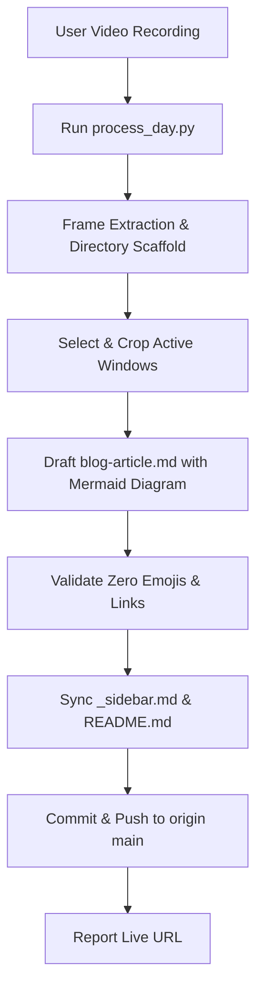

# Azure Daily Lab Documentation Skill

This skill autonomously converts screen recordings of Azure labs into production-grade GitHub Pages documentation and Medium-ready tutorials.

## Workflow Overview

When given a video path (e.g., `Process Day 2: path/to/recording.mp4`):
Execute all steps end-to-end without pausing for unnecessary confirmations.



---

## Step 1: Initialize Day & Extract Frames

Run the bundled pipeline script:
```bash
.venv\Scripts\python.exe scripts/process_day.py --video "<path_to_video>" --day <day_number> --title "<lab_title>"
```
This automatically:
- Creates `day-XX-<slug>/screenshots/raw` and `day-XX-<slug>/screenshots/curated`
- Extracts high-resolution frames every 4 seconds into `raw/`
- Generates `raw/manifest.json` with frame timestamps
- Appends the lab entry to `_sidebar.md` and `README.md`

---

## Step 2: Curate & Crop Screenshots

Inspect the extracted raw frames and select 8 to 16 milestone screenshots that represent the full lab sequence.

### Screenshot Standards (MANDATORY):
1. **Windows Terminal / Command Prompt:**
   - Always crop to the exact terminal window borders.
   - NEVER leave background desktop apps (ChatGPT, private messengers, browser tabs) visible behind terminal windows.
2. **Web Browser (Verification / Errors):**
   - Crop to the browser window so the URL bar (showing the IP/port) and status/error (e.g. `ERR_TIMED_OUT` or `Welcome to nginx!`) are clearly visible.
3. **Azure Portal:**
   - Must be clean and unobstructed.
   - Do NOT capture frames with overlapping Google search windows, taskbar preview popups, or notification flyouts.
4. **Naming Convention:**
   - Save curated images to `day-XX-<slug>/screenshots/curated/` with sequential two-digit prefixes:
     `01_create_resource.png`, `02_configure_networking.png`, etc.

Use Pillow in Python to crop windows cleanly:
```python
from PIL import Image
im = Image.open("path/to/raw.png")
im.crop((left, top, right, bottom)).save("day-XX-<slug>/screenshots/curated/XX_name.png")
```

---

## Step 3: Write Technical Documentation

Draft `day-XX-<slug>/blog-article.md` adhering strictly to this layout:

1. **Title & Subtitle:**
   - `# Day X: <Title>`
   - `*A practical, step-by-step beginner's guide to ...*`
2. **Introduction & What We Are Building:**
   - Bulleted list of practical goals.
3. **Architecture Overview (Mermaid):**
   - Flowchart showing user/browser, public IP, NSG, VNet, Subnet, VM, and application.
4. **Project Specifications Table:**
   - Markdown table specifying Resource Group, VM/Service SKU, Region, OS, Authentication, IPs, and Ports.
5. **Step-by-Step Hands-On Guide:**
   - Clear numbered sections.
   - Code blocks with syntax highlighting (`bash`, `json`, `yaml`).
   - Embed curated screenshots: ``.
6. **Troubleshooting / The "Gotcha":**
   - Highlight a real-world configuration hurdle (e.g., port blocking, propagation delay, firewall rules) and how to diagnose/fix it.
7. **Verification & Testing:**
   - Terminal verification commands (`curl`) and browser confirmation.
8. **Cost Optimization & Resource Cleanup:**
   - Step-by-step teardown via Azure Portal and Azure CLI (`az group delete ...`).
9. **Key Takeaways & Lessons Learned:**
   - 3-5 concise bullet points.

---

## Step 4: Strict Quality Constraints

### Non-Negotiable Zero Emojis Rule
- Under NO circumstances use emojis anywhere:
  - NO emojis in `blog-article.md`
  - NO emojis in `README.md`
  - NO emojis in `_sidebar.md`
  - NO emojis in `index.html`
  - NO emojis in Git commit messages
  - NO emojis in assistant chat messages
- Use standard GitHub markdown alerts for notes:
  `> [!NOTE]`
  `> [!TIP]`
  `> [!IMPORTANT]`
  `> [!WARNING]`

Run validation before committing:
```python
from scripts.process_day import validate_no_emojis
from pathlib import Path
assert validate_no_emojis(Path("day-XX-<slug>"))
```

---

## Step 5: Git Commit & Push

Always commit using the user's verified identity:
- **User Name:** `ShubhamTheDataGuy`
- **Email:** `shubhamnagpal789@gmail.com`

Commit and push:
```bash
git add -A; git commit -m "Add Day X: <Lab Title> documentation and curated screenshots"; git push origin main
```

---

## Step 6: Completion Report

Send the user:
1. Direct link to the live documentation: `https://shubhamthedataguy.github.io/azure-learning-journey/#/day-XX-<slug>/blog-article`
2. Concise summary of the created lab resources and article sections.
3. Reminder to use `Ctrl + Shift + R` or `Ctrl + F5` to bypass browser image cache.\n