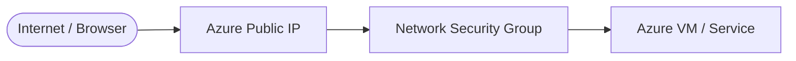

# Day {DAY_NUM}: {TITLE}

*{SUBTITLE}*

---

## Introduction & What We Are Building

In this hands-on guide, we will:
1. {GOAL_1}
2. {GOAL_2}
3. {GOAL_3}

---

## Architecture Overview



---

## Project Specifications

| Parameter | Configuration Value |
| :--- | :--- |
| **Cloud Provider** | Microsoft Azure |
| **Resource Group** | `{RG_NAME}` |
| **Region** | {REGION} |
| **Service / SKU** | {SKU} |

---

## Step 1: {STEP_1_TITLE}

1. {INSTRUCTION_1}


---

## Step 2: {STEP_2_TITLE}

1. {INSTRUCTION_2}


---

## Troubleshooting & The Gotcha

> [!NOTE]
> {GOTCHA_EXPLANATION}

---

## Final Verification

1. {VERIFICATION_STEP}


---

## Cost Optimization & Resource Cleanup

### Option A: Azure Portal
1. Navigate to **Resource groups** > `{RG_NAME}`.
2. Click **Delete resource group** and confirm.

### Option B: Azure CLI
```bash
az group delete --name {RG_NAME} --yes --no-wait
```

---

## Key Takeaways & Lessons Learned

1. {TAKEAWAY_1}
2. {TAKEAWAY_2}
3. {TAKEAWAY_3}\n