# Day 1: Deploying a Linux Virtual Machine on Microsoft Azure & Setting Up Nginx

*A practical, step-by-step beginner's guide to provisioning a cloud VM, connecting via SSH, setting up a web server, and mastering Azure Network Security Groups (NSGs).*

---

## Introduction & What We Are Building

When starting with cloud computing on Microsoft Azure, the most fundamental skill is spinning up compute infrastructure and exposing a workload to the internet. 

In this hands-on guide, we will:
1. Provision an **Ubuntu 24.04 LTS Linux Virtual Machine** using the **Azure Portal**.
2. Connect securely from our local machine using **SSH**.
3. Install and run the **Nginx** high-performance web server.
4. Troubleshoot and solve the classic cloud networking hurdle: **why your server times out despite Nginx running**.
5. Configure **Azure Network Security Group (NSG)** inbound rules for **Port 80 (HTTP)**.
6. Verify live traffic in the browser.

---

## Architecture Overview

The following diagram illustrates how incoming traffic travels from the public internet through Azure's networking stack to our Nginx web server:

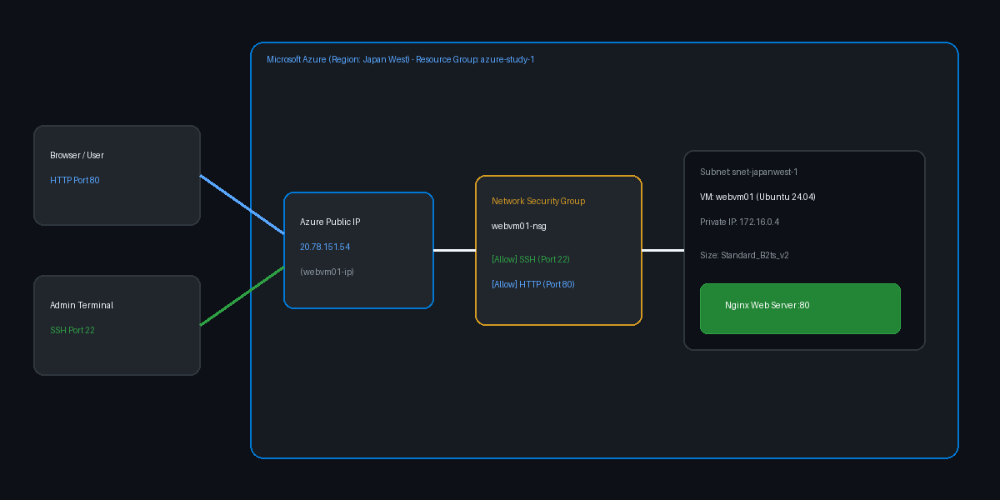

---

## Project Specifications

| Parameter | Configuration Value |
| :--- | :--- |
| **Cloud Provider** | Microsoft Azure |
| **Subscription** | Azure subscription 1 |
| **Resource Group** | `azure-study-1` |
| **Virtual Machine Name** | `webvm01` |
| **Region** | Japan West |
| **Operating System** | Ubuntu Server 24.04 LTS - x64 Gen2 |
| **VM Size** | `Standard_B2ts_v2` (2 vCPUs, 1 GiB RAM) |
| **Authentication Type** | Password |
| **Admin Username** | `azureuser` |
| **Public IP Assigned** | `20.78.151.54` |
| **Allowed Inbound Ports** | Port 22 (SSH), Port 80 (HTTP) |

---

## Step 1: Create a Resource Group & Configure VM Basics

1. Log in to the [Azure Portal](https://portal.azure.com/).
2. In the search bar, search for **Virtual Machines** and click **Create** > **Azure virtual machine**.
3. Under **Project details**:
 - **Subscription**: Select your active subscription (e.g., `Azure subscription 1`).
 - **Resource group**: Click **Create new** and name it `azure-study-1`. Resource groups act as logical containers for all related cloud resources.

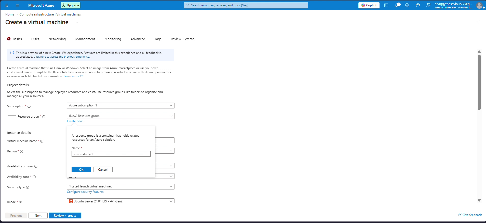

4. Under **Instance details**:
 - **Virtual machine name**: `webvm01`
 - **Region**: `(Asia Pacific) Japan West` (if your preferred region has quota constraints or size restrictions, switch to an adjacent region with available capacity).
 - **Availability options**: `No infrastructure redundancy required`.
 - **Security type**: `Trusted launch virtual machines`.
 - **Image**: `Ubuntu Server 24.04 LTS - x64 Gen2`.
 - **Size**: Select `Standard_B2ts_v2` (cost-effective for testing and small web servers).

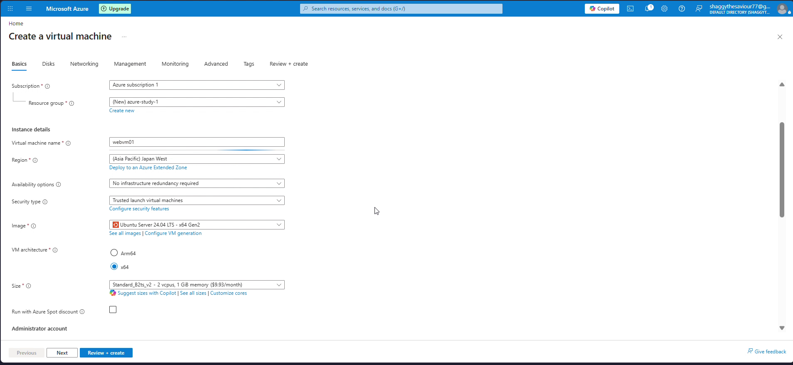

---

## Step 2: Configure Authentication & Initial Port Rules

1. Under **Administrator account**:
 - **Authentication type**: Choose **Password** (or SSH public key).
 - **Username**: `azureuser`
 - **Password**: Enter a strong password (minimum 12 characters, including upper, lower, numeric, and special characters) and confirm it.

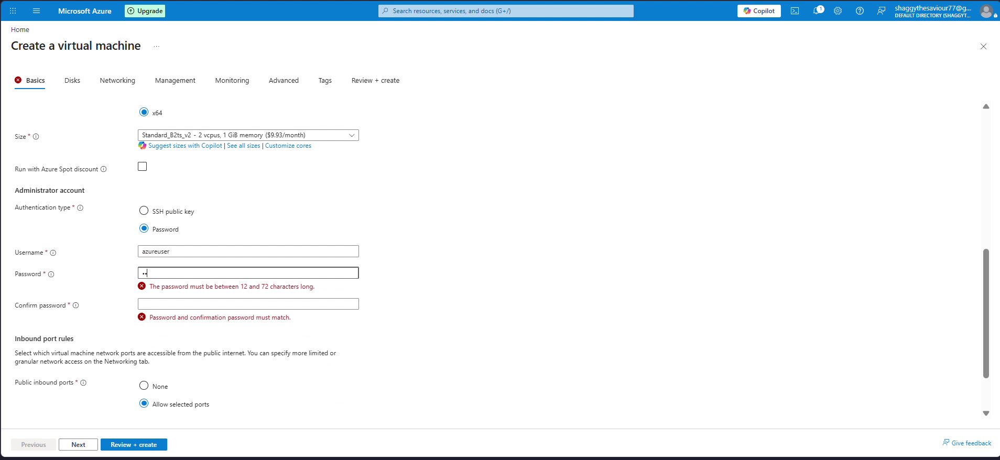

2. Under **Inbound port rules**:
 - **Public inbound ports**: Select **Allow selected ports**.
 - **Select inbound ports**: Check `SSH (22)`.

> [!NOTE]
> Notice we are only allowing **SSH (22)** at this stage. Keep this in mind — we will deliberately observe what happens when we try accessing our web server before opening Port 80!

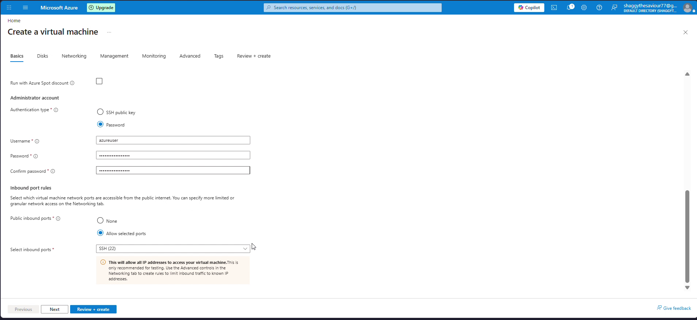

---

## Step 3: Review, Validate & Deploy

1. Click **Review + create** at the bottom of the blade.
2. Azure will run an automated validation check. Ensure you see **Validation passed**.
3. Verify all parameters in the summary table:
 - Resource Group: `azure-study-1`
 - VM Name: `webvm01`
 - Image: `Ubuntu Server 24.04 LTS`
 - Size: `Standard B2ts_v2`
 - Public Inbound Ports: `SSH (22)`
4. Click **Create** to begin provisioning.

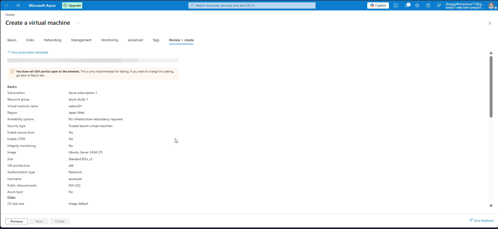

5. Once deployment finishes, navigate to **Resource groups** > `azure-study-1`. Notice the resources created automatically:
 - Virtual Network (`vnet-japanwest-1`)
 - Virtual Machine (`webvm01`)
 - Public IP Address (`webvm01-ip`)
 - Network Security Group (`webvm01-nsg`)
 - Network Interface (`webvm01454`)
 - Managed OS Disk

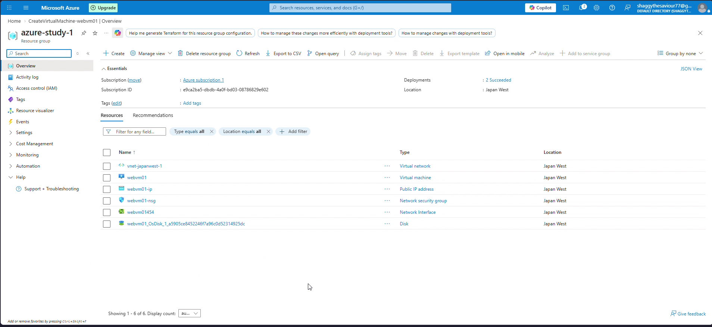

---

## Step 4: Connect to the VM via SSH

1. Click on the `webvm01` virtual machine.
2. In the left navigation menu, go to **Connect** > **Connect**.
3. Under **Native SSH**, locate the **SSH command**:
 ```bash
 ssh azureuser@20.78.151.54
 ```
 *(Replace with your actual public IP)*.

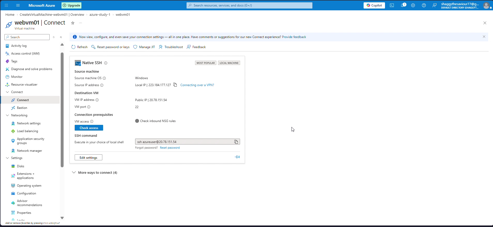

4. Open your local terminal (Command Prompt, PowerShell, or macOS/Linux Terminal) and run:
 ```bash
 ssh azureuser@20.78.151.54
 ```
5. On first connection, SSH prompts to verify the host key fingerprint:
 ```text
 The authenticity of host '20.78.151.54 (20.78.151.54)' can't be established.
 ED25519 key fingerprint is SHA256:aCquxqR3pcmZpAUnq6DiUWeHNvdY0ceE3n83XaIDHFg.
 Are you sure you want to continue connecting (yes/no/[fingerprint])?
 ```
6. Type `yes`, hit **Enter**, and type your admin password.

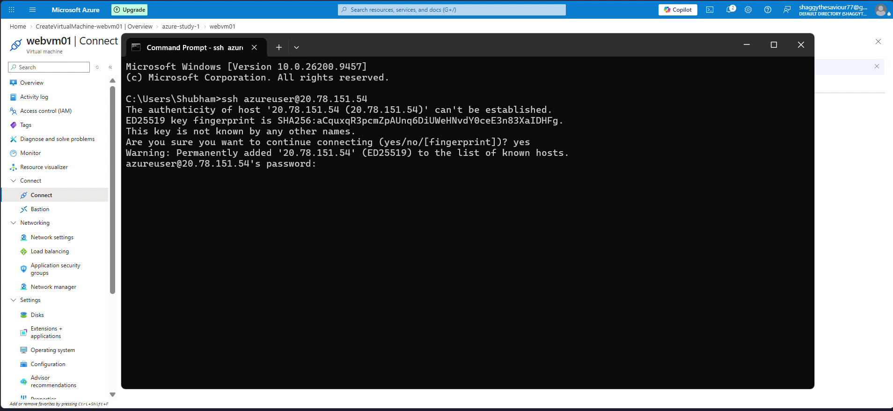

You are now logged into your Ubuntu cloud VM:
```bash
azureuser@webvm01:~$
```

---

## Step 5: Install & Start the Nginx Web Server

With SSH access established, update the package repository index to ensure we fetch the latest secure package versions:

```bash
sudo apt update
```

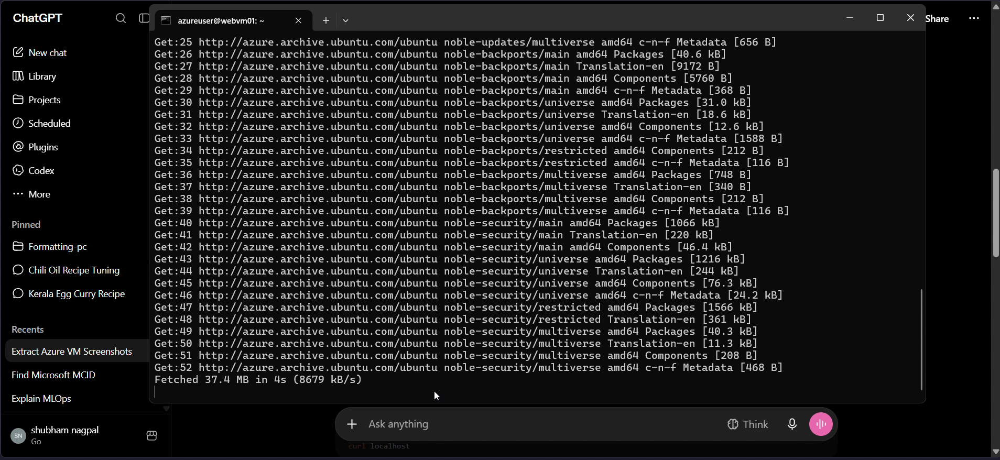

Next, install **Nginx**:

```bash
sudo apt install nginx -y
```

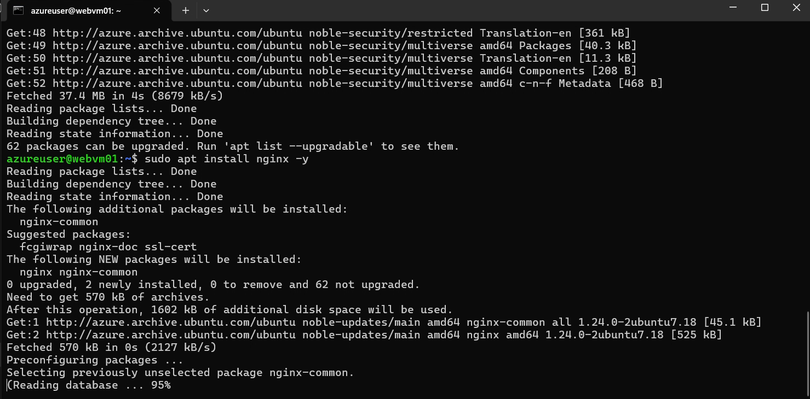

Ubuntu automatically starts Nginx and creates the systemd service symlink:
```text
Created symlink /etc/systemd/system/multi-user.target.wants/nginx.service -> /usr/lib/systemd/system/nginx.service.
* Upgrading binary nginx [ OK ]
```

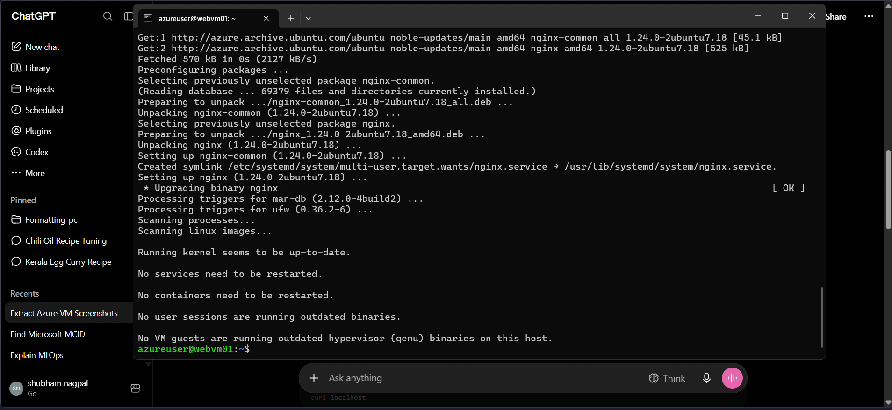

To verify locally on the VM that Nginx is running and listening:
```bash
curl http://localhost
```
You will receive the raw HTML of the default welcome page.

---

## Step 6: The "Gotcha" — Why Does the Public IP Time Out?

Now open a browser on your local machine and paste the Public IP:
```text
http://20.78.151.54
```

Instead of the web page, you are greeted with:
> **This site can’t be reached** 
> `20.78.151.54` took too long to respond. 
> `ERR_TIMED_OUT`

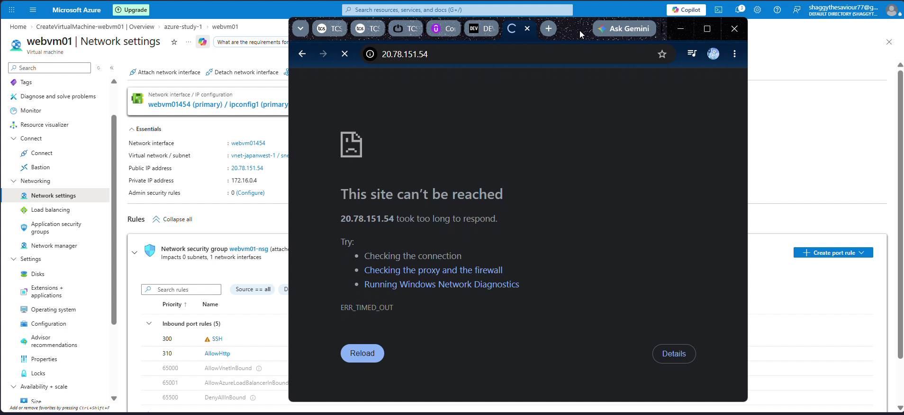

### Why did this happen?
- On the VM, Nginx is active and listening on `0.0.0.0:80`.
- However, **Azure Network Security Group (NSG)** acts as a virtual firewall at the subnet/NIC boundary.
- During initial VM creation, we only opened **Port 22 (SSH)**.
- Azure's default security rule `DenyAllInBound` blocks all other incoming internet traffic!

---

## Step 7: Configure NSG Inbound Port 80 (HTTP) Rule

To allow public web traffic to reach Nginx:

1. Return to the **Azure Portal**.
2. Go to **Virtual machines** > `webvm01` > **Networking** > **Network settings**.
3. Under **Network security group `webvm01-nsg`**, click **+ Create port rule** > **Inbound port rule**.
4. Configure the rule:
 - **Source**: `Any` (or limit to your IP for sensitive environments)
 - **Source port ranges**: `*`
 - **Destination**: `Any`
 - **Service**: Select `HTTP` (automatically sets port to `80` and protocol to `TCP`)
 - **Action**: `Allow`
 - **Priority**: `310` (lower numbers have higher priority; priority 300 is SSH)
 - **Name**: `AllowHttp`
5. Click **Add**.

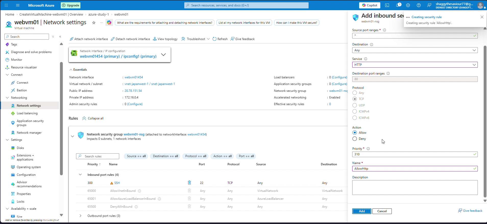

Once created, you will see `AllowHttp` listed under your active inbound rules:

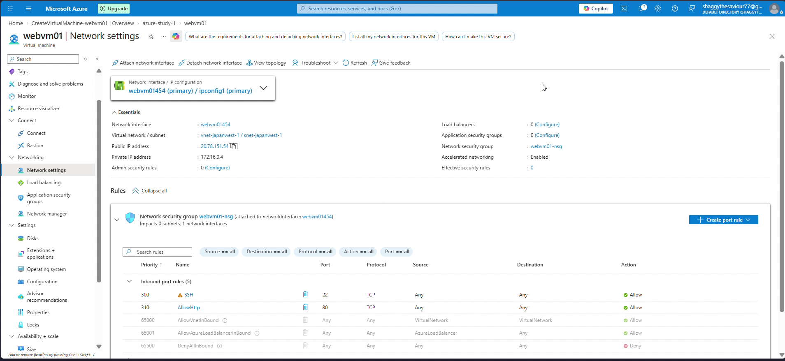

---

## Step 8: Final Verification & "Welcome to nginx!"

Go back to your browser and reload `http://20.78.151.54`.

Immediately, the default Nginx landing page appears:

```text
Welcome to nginx!
If you see this page, the nginx web server is successfully installed and working.
Further configuration is required.
```

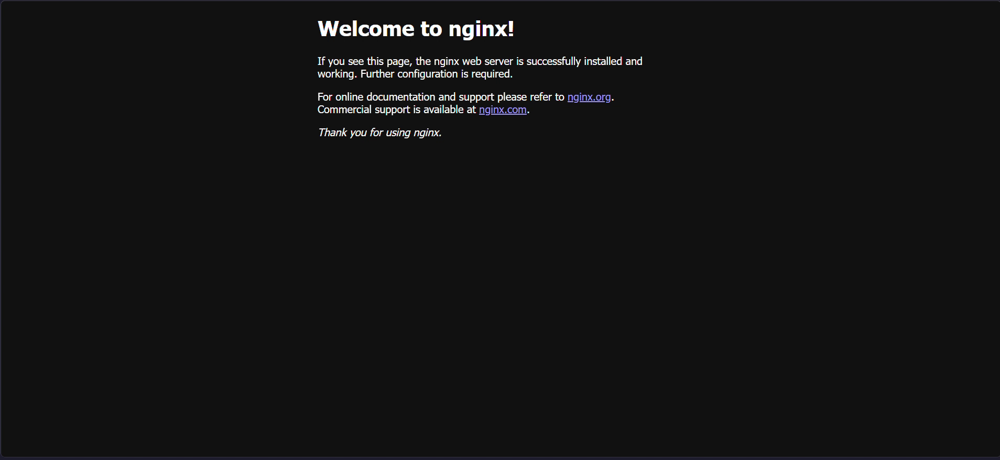

**Success!** Your cloud web server is now officially reachable worldwide.

---

## Cost Optimization & Resource Cleanup

Cloud resources incur charges while running. If you are learning and experimenting:

### Option A: Clean Up via Azure Portal
1. Navigate to **Resource groups** > `azure-study-1`.
2. Click **Delete resource group**.
3. Type `azure-study-1` to confirm and click **Delete**. This tears down the VM, disks, public IP, virtual network, and NSG all at once.

### Option B: Clean Up via Azure CLI
```bash
az group delete --name azure-study-1 --yes --no-wait
```

---

## Key Takeaways & Lessons Learned

1. **Decoupled Security**: Compute (the VM) and perimeter security (the NSG) are decoupled in Azure. An application listening inside the OS cannot receive traffic unless the cloud firewall permits it.
2. **Quota Awareness**: Certain Azure regions have quota limitations or temporary hardware constraints for specific VM sizes. Knowing how to select alternative regions (e.g. Japan West vs Japan East) or comparable VM SKUs (`B2ts_v2`) is essential.
3. **Defense in Depth**: Opening Port 22 to `Any` is fine for quick sandboxes, but production systems should restrict SSH access to specific management IPs, VPNs, or Azure Bastion.
