# Day 2: Azure Windows Server VM, Managed Data Disks, Snapshots, and Cross-VM Disk Migration

*A hands-on engineering guide to provisioning Windows Server 2025 on Microsoft Azure, attaching managed data disks, initializing partitions in Server Manager, taking point-in-time snapshots, restoring to managed disks, and migrating storage to a new VM.*

---

## Introduction & What We Are Building

In enterprise cloud environments, persistent data storage must be decoupled from virtual machine compute lifecycles. Virtual machines are ephemeral entities that may be stopped, resized, rebuilt, or replaced during maintenance and disaster recovery events. To prevent data loss, cloud architects rely on **Azure Managed Disks** and **Disk Snapshots**.

In this hands-on lab, we will:
1. Provision a **Windows Server 2025 Datacenter** Virtual Machine (`webvm02`) using the **Azure Portal**.
2. Identify and resolve a common cloud subscription hurdle: regional SKU quota unavailability (`NotAvailableForSubscription`).
3. Connect securely to Windows Server via **Remote Desktop Protocol (RDP)** on port 3389.
4. Attach an unformatted **4 GiB Premium SSD Managed Data Disk** (`datadisk-webvm02-1`) at LUN 0.
5. Perform in-guest storage initialization using **Server Manager**: bring disk online, initialize with a **GPT** partition style, format as **NTFS**, assign drive letter `E:\`, and write a sample payload file (`data.txt`).
6. Create an Azure **Disk Snapshot** (`webvm02-datadisk-1-snapshot-1`) to capture an exact point-in-time state.
7. Understand the core Azure storage constraint: **why snapshots cannot be attached directly to a VM**, and how to restore a snapshot into an independent **Managed Disk** (`attached-disk-1`).
8. Deploy a destination virtual machine (`webvm03`) and attach the restored disk during provisioning.
9. Connect to `webvm03` via RDP and verify that all file data, permissions, and filesystem structures survived migration intact.

---

## Architecture & Storage Lifecycle Overview

The following architectural diagram illustrates the complete end-to-end lifecycle: attaching a raw data disk to `webvm02`, capturing a point-in-time snapshot, creating an independent managed disk, and attaching it to `webvm03` for verification:

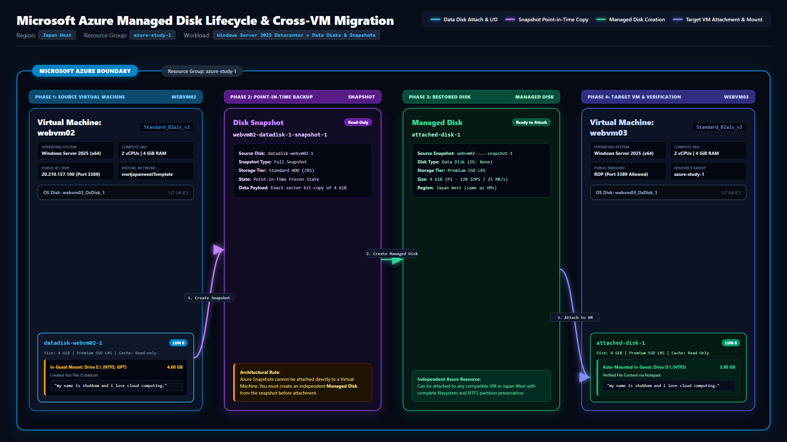

---

## Project Specifications

| Parameter | Source VM (`webvm02`) | Snapshot Stage | Restored Disk (`attached-disk-1`) | Target VM (`webvm03`) |
| :--- | :--- | :--- | :--- | :--- |
| **Resource Group** | `azure-study-1` | `azure-study-1` | `azure-study-1` | `azure-study-1` |
| **Region** | Japan West | Japan West | Japan West | Japan West |
| **Operating System** | Windows Server 2025 Datacenter | N/A | N/A | Windows Server 2025 Datacenter |
| **Compute SKU** | `Standard_B2als_v2` (2 vCPUs, 4 GiB) | N/A | N/A | `Standard_B2als_v2` (2 vCPUs, 4 GiB) |
| **Disk Name** | `datadisk-webvm02-1` | `webvm02-datadisk-1-snapshot-1` | `attached-disk-1` | `attached-disk-1` |
| **Disk Tier / SKU** | Premium SSD LRS | Full Snapshot / Standard HDD | Premium SSD LRS | Premium SSD LRS |
| **Disk Size** | 4 GiB (P1 tier) | 4 GiB bit-copy | 4 GiB (P1 tier) | 4 GiB (P1 tier) |
| **Logical Unit (LUN)** | LUN 0 | N/A | N/A | LUN 0 |
| **Host Caching** | Read-only | N/A | N/A | Read-only |
| **In-Guest Mount** | `E:\ (New Volume)` | N/A | N/A | `D:\ (New Volume)` |
| **Verified Data** | `data.txt` | Read-only frozen state | Preserved NTFS sectors | `data.txt` verified intact |

---

## Step 1: Provision Source VM & Resolve Regional SKU Availability

1. Open the [Azure Portal](https://portal.azure.com/).
2. In the top search bar, navigate to **Virtual machines** and click **Create** > **Azure virtual machine**.
3. Under **Project details**:
   - **Subscription**: Select your active subscription (e.g., `Azure subscription 1`).
   - **Resource group**: Select `azure-study-1` (or click **Create new**).
4. Under **Instance details**:
   - **Virtual machine name**: `webvm02`
   - **Region**: `(Asia Pacific) Japan West`
   - **Availability options**: `No infrastructure redundancy required`
   - **Security type**: `Trusted launch virtual machines`
   - **Image**: `Windows Server 2025 Datacenter - x64 Gen2`

### The SKU Availability Gotcha
When attempting to select `Standard_D2s_v3` (2 vCPUs, 8 GiB memory), the Azure portal flagged an immediate validation error:

> **This size is currently unavailable in japanwest for this subscription: NotAvailableForSubscription.**

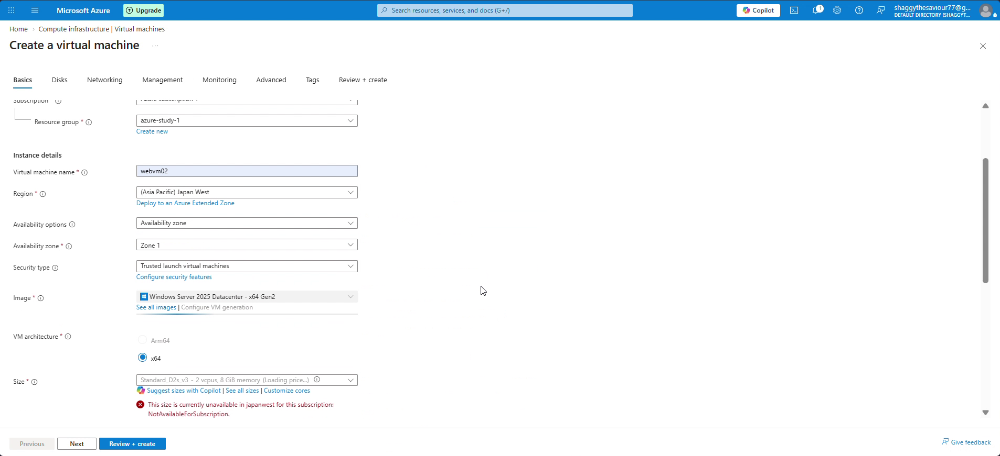

This occurs because specific cloud hardware generations or core quotas may be constrained in certain availability zones or reserved for reserved instance commitments. 

To resolve this, open the size selection picker and choose an available compute family. In this lab, we selected `Standard_B2als_v2` (2 vCPUs, 4 GiB memory, approximately $42.49/month):

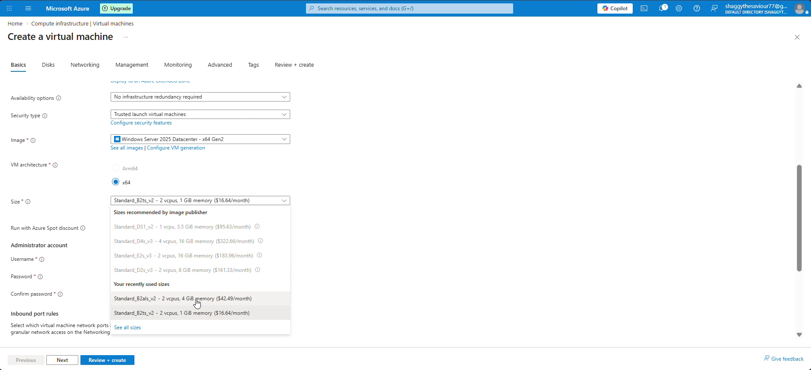

5. Under **Administrator account**:
   - **Username**: `azureuser`
   - **Password**: Enter a complex password (at least 12 characters, including upper, lower, numeric, and special symbols).
6. Under **Inbound port rules**:
   - Select **Allow selected ports** and ensure `RDP (3389)` is checked.
7. Click **Review + create**, verify validation passes, and click **Create**.

---

## Step 2: Connect to Windows Server 2025 via RDP

Once deployment completes:
1. Navigate to the `webvm02` overview blade.
2. Select **Connect** > **Connect** from the left-hand navigation pane.
3. Under **Native RDP**, verify:
   - Destination IP: Public IP address assigned by Azure (e.g., `20.210.157.100`).
   - Port: `3389`.
   - Username: `azureuser`.
4. Click **Download RDP file** and launch the `.rdp` shortcut on your local Windows workstation.

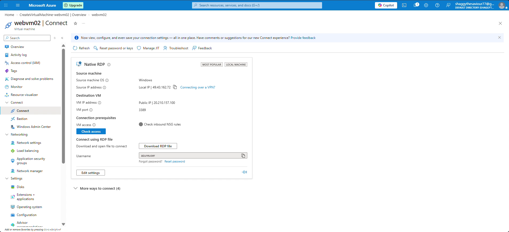

5. When prompted, enter your credentials:
   - Username: `azureuser`
   - Password: `<your-password>`
6. Accept the remote certificate warning to enter the Windows Server 2025 desktop session.

---

## Step 3: Create & Attach a Managed Data Disk in Azure

Azure virtual machines come standard with a root OS disk (`C:\`, typically 127 GiB) and a temporary scratch drive (`D:\`). Persistent business applications should always store data on dedicated Managed Data Disks.

1. In the Azure Portal, open the `webvm02` virtual machine blade.
2. Under the **Settings** menu on the left, click **Disks**.
3. Under the **Data disks** section, click **+ Create and attach a new disk**.
4. Configure the disk parameters:
   - **LUN**: `0` (Logical Unit Number used by the SCSI controller).
   - **Disk name**: `datadisk-webvm02-1`.
   - **Storage type**: `Premium SSD (locally-redundant storage)`.
   - **Size (GiB)**: `4` GiB (Provisioned as P1 tier: 120 IOPS, 25 MB/s throughput).
   - **Host caching**: Select **Read-only**.
5. Click **Apply** at the bottom of the blade to initiate dynamic disk attachment without restarting the VM.

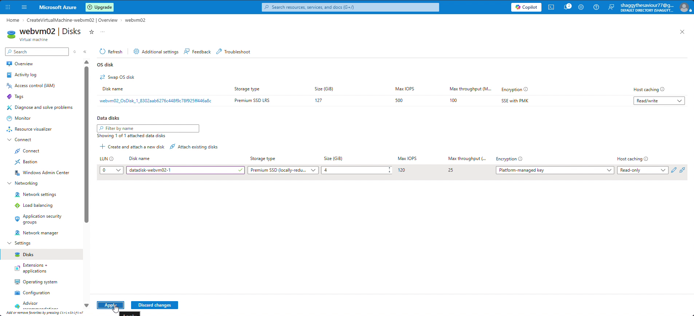

> [!NOTE]
> Azure supports three host caching modes: **None**, **Read-only**, and **Read/write**. For read-heavy workloads or database log separation, Read-only or None is recommended to avoid cache flush overhead.

---

## Step 4: In-Guest Disk Initialization in Windows Server Manager

Attaching a virtual disk in the Azure control plane presents raw storage blocks to the virtual SCSI controller. Inside the Windows operating system, the disk starts in an **Offline** and **Unallocated** state and is not yet visible in File Explorer.

1. Switch to your active RDP session on `webvm02`.
2. Open **Server Manager** (or click the start menu and open Server Manager).
3. In the left navigation pane, select **File and Storage Services** > **Disks**.
4. You will see two physical disks listed:
   - **Disk 0**: 127 GB (Azure OS Disk, Partition Style: GPT).
   - **Disk 1**: 4.00 GB (The newly attached Azure data disk, Unallocated: 3.98 GB).
5. Right-click **Disk 1** and select **New Volume...** (if the disk is offline, click **Bring Online** and **Initialize Disk** first).

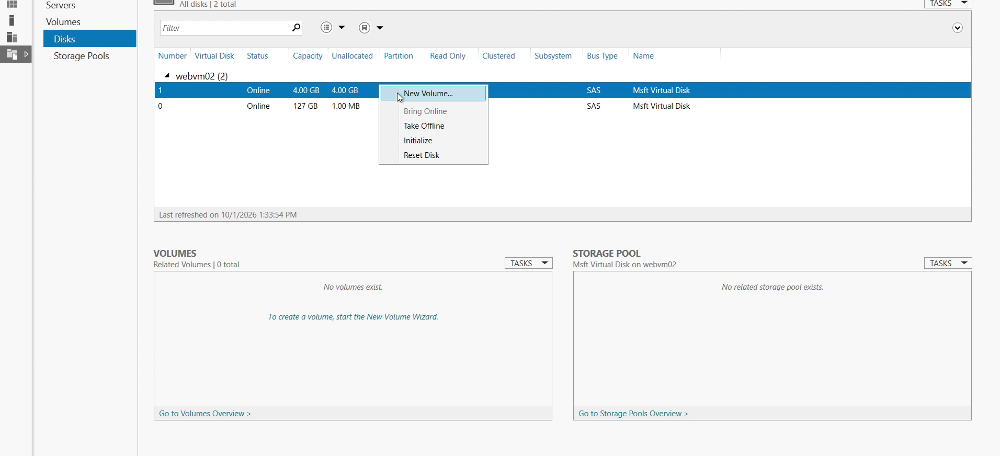

6. The **New Volume Wizard** opens:
   - **Server and Disk**: Select `webvm02` and `Disk 1`.
   - **Size**: Accept the maximum volume size (`3.97 GB`).
   - **Drive Letter**: Assign drive letter `E:\`.
   - **File System Settings**: Select **NTFS**, allocation unit size **Default**, volume label `New Volume`.
   - **Confirmation**: Review the configuration summary.

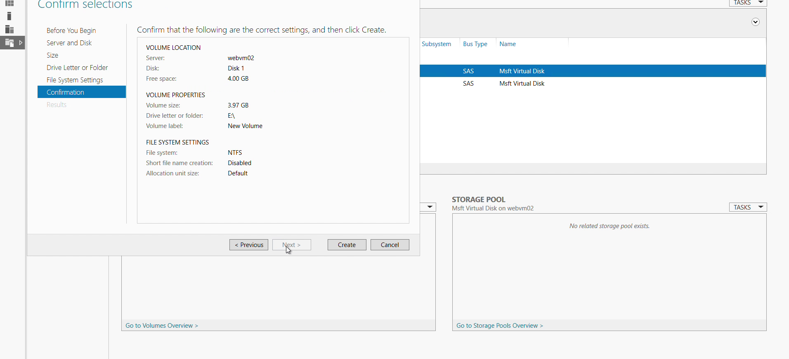

7. Click **Create**. The wizard will:
   - Initialize the disk with a **GPT (GUID Partition Table)**.
   - Create a partition.
   - Format the volume with the NTFS file system.
   - Assign access path `E:\`.

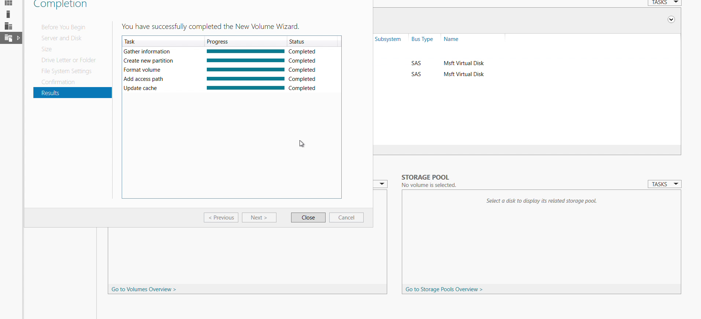

8. Return to Server Manager > Disks. Disk 1 now displays status **Online**, partition style **GPT**, and 0.00 B unallocated space:

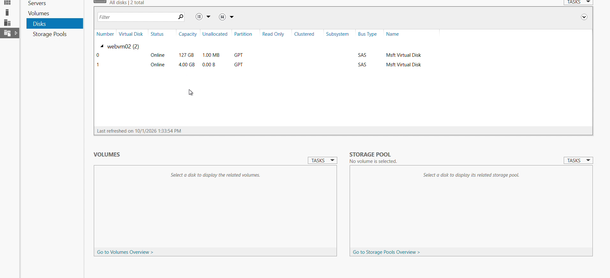

---

## Step 5: Write Test Data to Validate Persistence

To verify storage reliability across snapshots and VM attachments, we write a known data payload to the drive:

1. In the RDP session, open **File Explorer** and click **This PC**.
2. Double-click **New Volume (E:)**.
3. Right-click in the empty folder and select **New** > **Text Document**.
4. Name the file `data.txt`.
5. Open `data.txt` in Notepad and insert the following string:
   ```text
   my name is shubham and i love cloud computing.
   ```
6. Save and close the file.

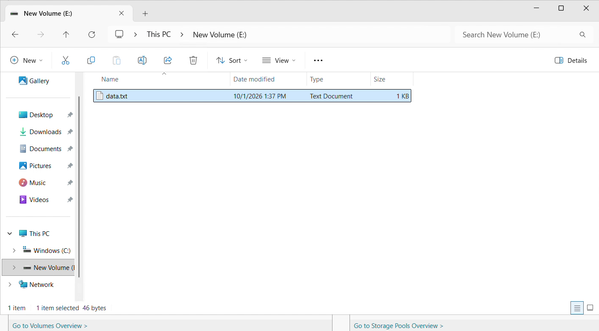

---

## Step 6: Create an Azure Point-in-Time Disk Snapshot

A disk snapshot is a full, read-only copy of a managed disk stored in Azure Storage Fabric. Snapshots serve as baseline backups and enable migration across virtual machines.

1. Return to the **Azure Portal**.
2. In the top search bar, search for **Disks** and select `datadisk-webvm02-1`.
3. In the overview toolbar, click **+ Create snapshot**.
4. Configure the snapshot properties:
   - **Subscription**: `Azure subscription 1`.
   - **Resource group**: `azure-study-1`.
   - **Name**: `webvm02-datadisk-1-snapshot-1`.
   - **Region**: `Japan West` (must match the region of your resources).
   - **Snapshot type**: Select **Full** (creates a complete, standalone point-in-time copy).
   - **Storage type**: Select **Standard HDD (zone-redundant storage)** or Standard SSD to optimize backup costs.
5. Click **Review + create**, and then click **Create**.

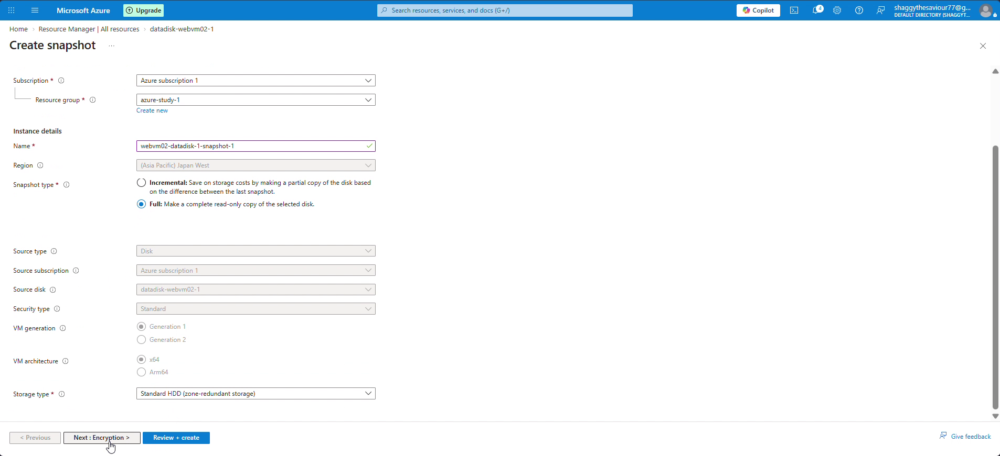

---

## Step 7: The "Gotcha" — Restoring Snapshot to a Managed Disk

> [!IMPORTANT]
> **Key Architectural Rule**: In Microsoft Azure, you **cannot** attach a Snapshot directly to a Virtual Machine. A snapshot is a passive, immutable storage blob. To attach or boot from snapshot data, you must first create an active **Managed Disk** with the snapshot as its source.

1. In the Azure Portal search bar, search for **Snapshots** and select `webvm02-datadisk-1-snapshot-1`.
2. In the toolbar, click **+ Create disk**.
3. Under the **Basics** tab:
   - **Resource group**: `azure-study-1`.
   - **Disk name**: `attached-disk-1`.
   - **Region**: `Japan West`.
   - **Source type**: Pre-populated as `Snapshot`.
   - **Source snapshot**: `webvm02-datadisk-1-snapshot-1`.
   - **OS type**: Select `None (data disk)`.
   - **Size**: `4 GiB` (Provisioned as Premium SSD LRS, P1 tier: 120 IOPS, 25 MB/s).
4. Click **Review + create** and verify the configuration summary:

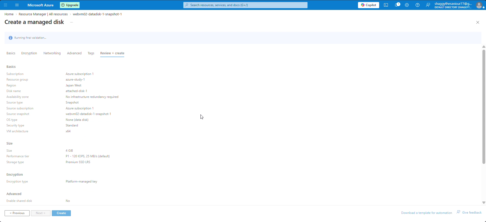

5. Click **Create**. You now have an independent managed disk (`attached-disk-1`) containing the exact NTFS filesystem and file payload captured from `webvm02`.

---

## Step 8: Provision Destination VM & Attach Migrated Disk

We will now provision a secondary virtual machine (`webvm03`) and mount `attached-disk-1` during initial creation.

1. In the Azure Portal, click **Create a resource** > **Virtual machine**.
2. Configure **Basics**:
   - **Virtual machine name**: `webvm03`.
   - **Region**: `Japan West`.
   - **Image**: `Windows Server 2025 Datacenter - x64 Gen2`.
   - **Size**: `Standard_B2als_v2`.
   - **Administrator username**: `azureuser`.
   - **Public inbound ports**: Allow `RDP (3389)`.
3. Click **Next : Disks >**.
4. In the **Data disks** section, click **Attach an existing disk**:
   - **LUN**: `0`.
   - **Disk name**: Select `attached-disk-1` from the dropdown.
   - **Host caching**: Select `Read Only`.
   - Ensure **Delete with VM** is unchecked so the disk remains decoupled from the VM lifecycle.

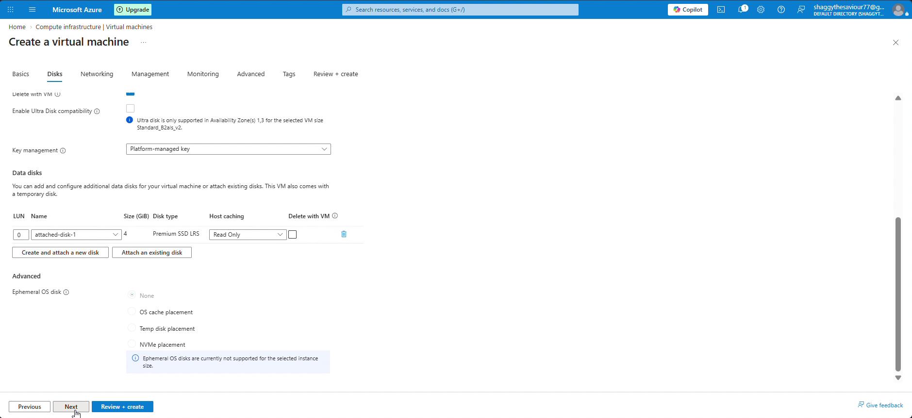

5. Click **Review + create**. Inspect the deployment parameters:
   - VM Name: `webvm03`.
   - Image: `Windows Server 2025 Datacenter`.
   - Size: `Standard B2als_v2`.
   - Inbound Ports: `RDP (3389)`.
   - Attached Data Disk: `attached-disk-1` (4 GiB).

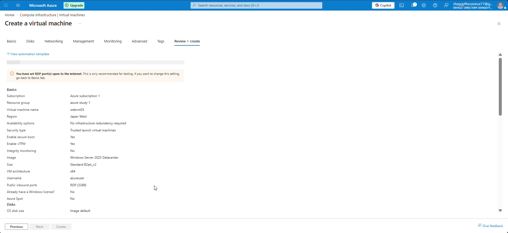

6. Click **Create** and wait for Azure deployment to succeed.

---

## Step 9: In-Guest Verification of Data Persistence

1. Navigate to `webvm03` in the Azure Portal, click **Connect** > **Native RDP**, and download the connection profile.
2. Connect to `webvm03` via Remote Desktop using `azureuser` and your configured password.
3. Open **File Explorer** and select **This PC**:
   - Notice that the restored disk is detected immediately!
   - Because the filesystem, partition table, and formatting were already created on `webvm02`, Windows Server 2025 automatically mounts the disk as **New Volume (D:)** with `3.95 GB free of 3.98 GB`:

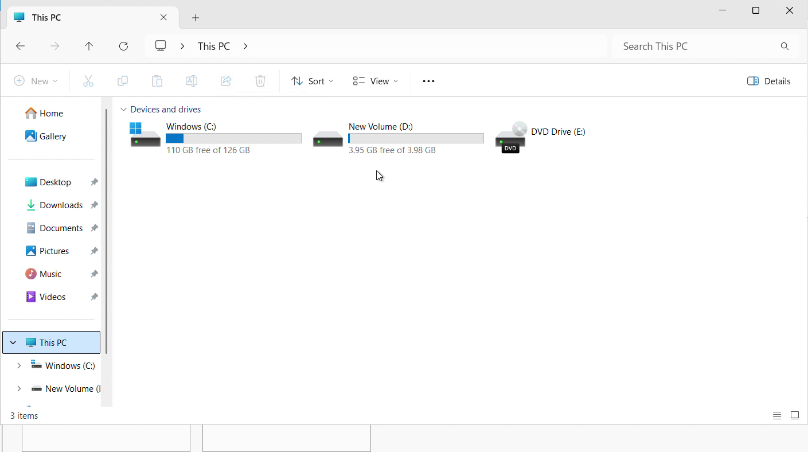

> [!NOTE]
> On `webvm02`, the volume was mounted as `E:\` because a temporary drive occupied `D:\`. On `webvm03`, Windows assigned `D:\` directly to the attached data disk. The drive letter is an operating system convention; the underlying block data and partition headers remain identical.

4. Double-click **New Volume (D:)** and open `data.txt`.
5. Verify the text contents:
   ```text
   my name is shubham and i love cloud computing.
   ```

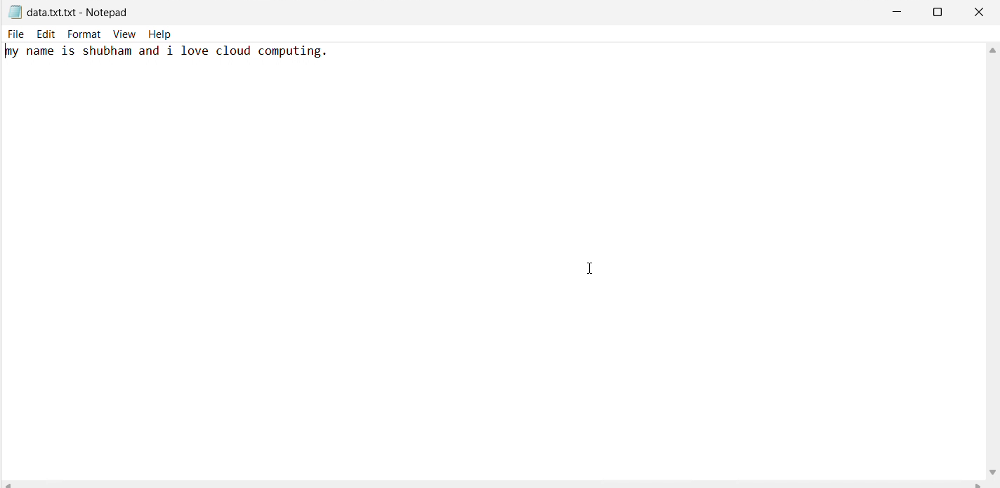

**Verification Complete!** The data successfully transitioned through the full cloud storage lifecycle: `Source VM Disk -> Snapshot -> Managed Disk -> Target VM Mount` with 100% data fidelity.

---

## Cost Optimization & Resource Cleanup

Virtual machines and managed disks incur hourly cloud charges. Premium SSDs and snapshots continue to accrue storage fees even when VMs are deallocated.

When you finish your practice session:

### Method 1: Delete via Azure Portal
1. Navigate to **Resource groups** > `azure-study-1`.
2. Click **Delete resource group**.
3. Enter `azure-study-1` in the confirmation box and click **Delete**. This cleans up `webvm02`, `webvm03`, all network interfaces, public IPs, virtual networks, snapshots, and managed disks simultaneously.

### Method 2: Delete via Azure CLI
Execute this single non-blocking command from PowerShell or Bash:
```bash
az group delete --name azure-study-1 --yes --no-wait
```

---

## Key Takeaways & Lessons Learned

1. **Decoupled Storage Architecture**: Never store critical enterprise application data on the operating system disk or ephemeral temporary drive. Managed data disks allow you to upgrade, destroy, or recreate VMs without risking business data.
2. **Snapshot vs Managed Disk**: A Snapshot is an immutable, read-only backup stored directly within Azure Storage Fabric. It cannot be mounted directly to a VM. To attach a snapshot's data, you must provision a new Managed Disk with the snapshot as its source.
3. **In-Guest Disk Preparation**: Cloud disk attachment is a two-step process: attaching the volume in the Azure control plane, followed by bringing the disk online, initializing GPT partitions, and formatting the filesystem inside the OS.
4. **Capacity & SKU Agility**: Subscription-level SKU restrictions (`NotAvailableForSubscription`) can occur in any cloud region. Cloud engineers must know how to pivot across VM families (e.g., from D-series to B-series) while maintaining workload compatibility.
5. **Portability Across Compute**: An existing formatted disk carries its filesystem across virtual machines. When attached to a secondary VM in the same region, Windows recognizes the existing NTFS structure immediately without requiring reformatting.
