# Day 3: Azure VM Encryption – Server-Side Encryption (CMK) & Azure Disk Encryption (BitLocker)

*A practical, step-by-step hands-on guide to securing Azure virtual machine disks using Customer-Managed Keys (Disk Encryption Sets) and in-guest BitLocker volume encryption backed by Azure Key Vault.*

---

## Introduction & What We Are Building

In enterprise cloud environments, data protection at rest is mandatory for regulatory compliance (HIPAA, PCI-DSS, SOC 2). Azure provides multiple layers of encryption for compute workloads:

1. **Server-Side Encryption (SSE) with Customer-Managed Keys (CMK):** Encrypts data at rest at the Azure storage service level using a Disk Encryption Set (DES) linked to your Azure Key Vault.
2. **Azure Disk Encryption (ADE):** Leverages in-guest OS capabilities (BitLocker on Windows, DM-Crypt on Linux) managed through Azure Key Vault to encrypt both OS and data volumes end-to-end.

In this hands-on lab, we build a defense-in-depth encryption architecture on Azure:
- Provision an **Azure Key Vault** with Azure RBAC authorization.
- Diagnose and resolve the data-plane RBAC permissions hurdle to generate cryptographic keys.
- Generate hardware-backed **RSA 2048-bit encryption keys**.
- Create a **Disk Encryption Set (DES)** and upgrade managed disk encryption from Platform-Managed Keys (PMK) to Customer-Managed Keys (CMK).
- Configure **Azure Disk Encryption (ADE)** on a Windows Server 2025 virtual machine (`webvm03`).
- Verify volume encryption, cipher strength (`XTS-AES 256`), and BitLocker Encryption Key (`BEK`) volumes in-guest via PowerShell.

---

## Architecture Overview

The following architecture illustrates the two complementary encryption paradigms deployed in this lab:

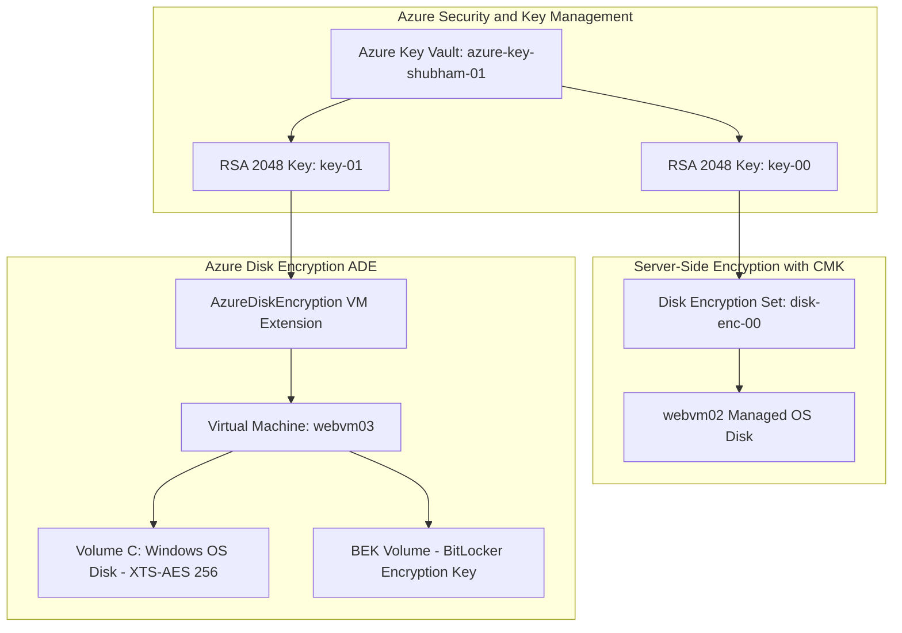

---

## Project Specifications Table

| Component | Resource Name / Configuration | Details / Values |
| :--- | :--- | :--- |
| **Resource Group** | `azure-study` & `webvm03_group` | Centralized lab resource management |
| **Region / Location** | `Central India` | Regional alignment across vault, DES, and VMs |
| **Azure Key Vault** | `azure-key-shubham-01` | Standard SKU, RBAC Authorization, 7-day Soft Delete |
| **Key Type & Size** | `key-00`, `key-01` | RSA, 2048-bit, Enabled |
| **Disk Encryption Set** | `disk-enc-00` | Encryption at-rest with Customer-Managed Key (CMK) |
| **Virtual Machine** | `webvm03` | Windows Server 2025 Datacenter |
| **Compute SKU** | `Standard_B2als_v2` | 2 vCPUs, 4 GiB Memory |
| **Public IP Address** | `20.207.197.126` | Dynamic IPv4 for remote RDP administration |
| **Private IP Address**| `172.16.0.5` | `vnet-centralindia-1` / `snet-centralindia-1` |
| **VM Extension** | `AzureDiskEncryption` | In-guest BitLocker orchestration extension |
| **In-Guest Cipher** | `XTS-AES 256` | 100.0% encrypted volume via `manage-bde` |

---

## Step-by-Step Hands-On Guide

### Phase 1: Provisioning the Azure Key Vault

Azure Key Vault acts as the root of trust, storing and protecting the cryptographic keys used for disk encryption.

1. In the Azure Portal search bar, type **Key vaults** and select **Create key vault**.
2. Configure the **Basics** tab:
   - **Subscription:** Select your active Azure subscription.
   - **Resource Group:** Select `azure-study`.
   - **Key vault name:** `azure-key-shubham-01`.
   - **Region:** `Central India`.
   - **Pricing tier:** `Standard`.
   - **Soft-delete:** Enabled with a retention period of `7` days.
   - **Purge protection:** Disabled (for lab flexibility).

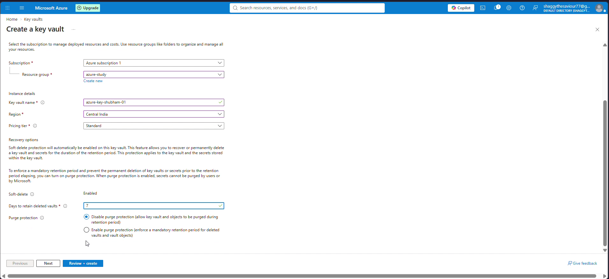

3. Under the **Access configuration** tab:
   - Set **Permission model** to **Azure role-based access control (recommended)**.
   - Leave resource access unchecked initially to observe the role segregation model.
4. Click **Review + create** and deploy the Key Vault.

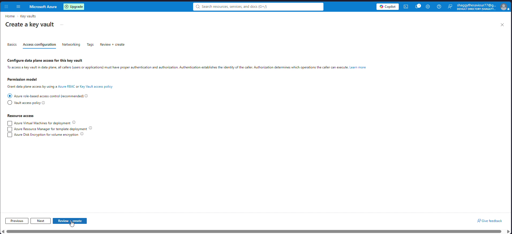

---

### Phase 2: Resolving the RBAC Data Plane Authorization Hurdle

> [!WARNING]
> **The Key Vault Data Plane Gotcha:** Creating a Key Vault grants control plane management permissions (e.g., updating tags or viewing resource properties) but does **NOT** grant data plane permissions to read, create, or encrypt with cryptographic keys.

1. Navigate to the newly deployed Key Vault `azure-key-shubham-01`.
2. Under **Objects**, select **Keys** and click **+ Generate/Import**.
3. Attempting to generate a key triggers an immediate RBAC error:
   - *"The operation is not allowed by RBAC. If role assignments were recently changed, please wait several minutes for role assignments to become effective."*
   - *"You are unauthorized to view these contents."*

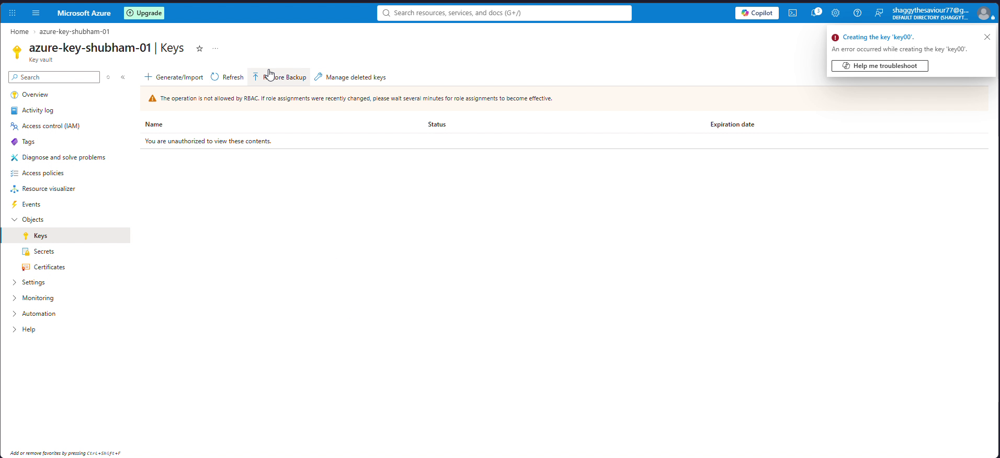

4. **The Fix:**
   - In the Key Vault left menu, click **Access control (IAM)**.
   - Select **+ Add** > **Add role assignment**.
   - Under **Role**, search for and select **Key Vault Administrator**.
   - Under **Members**, assign access to your user account (`shubham nagpal`).
   - Click **Review + assign**.

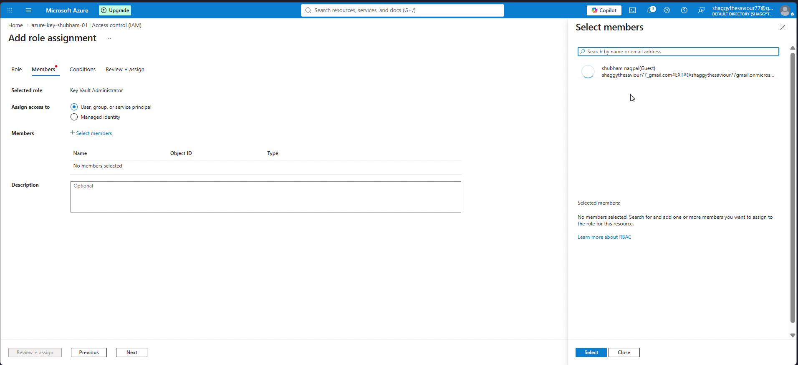

5. Return to **Objects** > **Keys** and click **+ Generate/Import**:
   - **Options:** `Generate`
   - **Name:** `key-00`
   - **Key type:** `RSA`
   - **RSA key size:** `2048`
   - **Enabled:** `Yes`
6. Click **Create**. The key status transitions to **Enabled**.

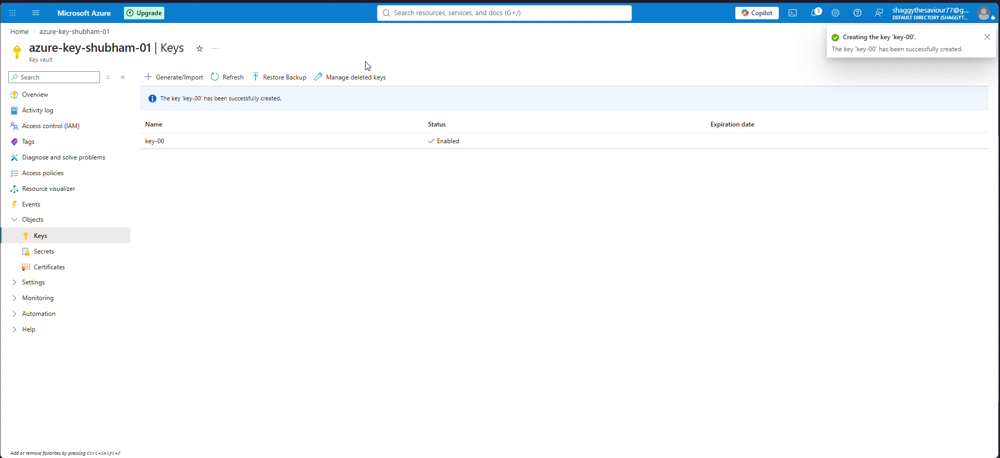

---

### Phase 3: Server-Side Encryption with Customer-Managed Keys (DES)

A **Disk Encryption Set (DES)** is an ARM resource that bridges managed disks to Key Vault keys for Server-Side Encryption (SSE).

1. Search for **Disk Encryption Sets** and click **+ Create**.
2. Configure the instance:
   - **Resource group:** `azure-study`
   - **Disk encryption set name:** `disk-enc-00`
   - **Region:** `Central India` (must match the Key Vault and target managed disks)
   - **Encryption type:** `Encryption at-rest with a customer-managed key`
   - **Key Vault:** `azure-key-shubham-01`
   - **Key:** Select `key-00`
3. Click **Review + create** and finalize deployment.

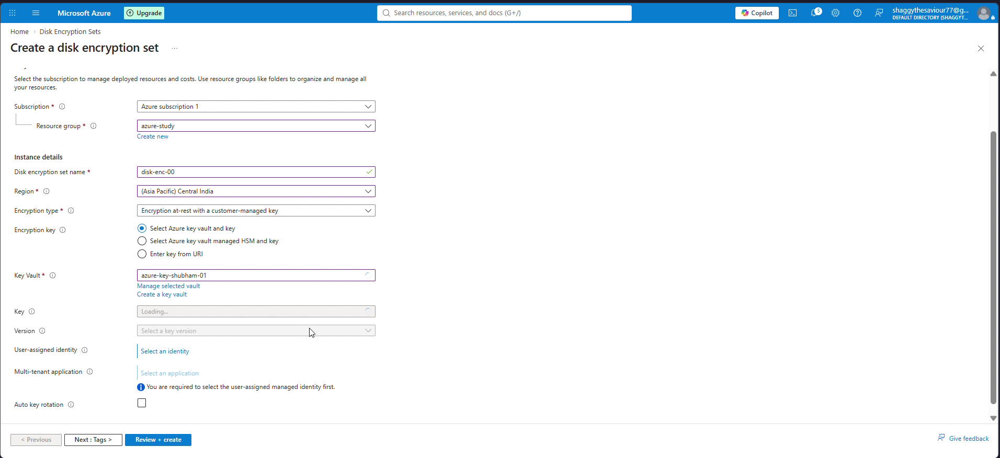

4. **Attach DES to a Managed Disk:**
   - Open **Disks** in the Azure Portal and select `webvm02_OsDisk_1_...`.
   - In the left menu, select **Settings** > **Encryption**.
   - Change **Key management** from `Platform-managed key` to `Customer-managed key: disk-enc-00`.
   - Click **Save**.

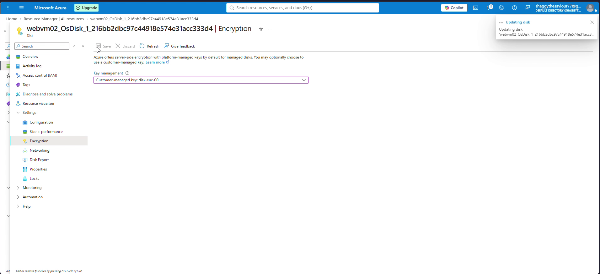

---

### Phase 4: Preparing the Virtual Machine for Azure Disk Encryption

For in-guest volume encryption, we deploy and configure a dedicated Windows Server VM (`webvm03`).

1. Verify the VM specifications:
   - **Resource group:** `webvm03_group`
   - **VM Name:** `webvm03`
   - **Location:** `Central India`
   - **Size:** `Standard_B2als_v2`
   - **OS:** Windows Server 2025
   - **Public IP:** `20.207.197.126`

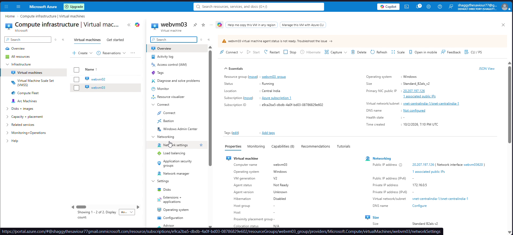

---

### Phase 5: Configuring Key Vault for Azure Disk Encryption (ADE)

> [!IMPORTANT]
> **The ADE Key Vault Prerequisite:** Azure Disk Encryption requires explicit authorization on the Key Vault to permit Azure's compute fabric to store BitLocker Encryption Keys (BEKs).

1. Open Key Vault `azure-key-shubham-01`.
2. Under **Settings**, select **Access configuration**.
3. Under **Resource access**, enable the checkbox:
   - **`Azure Disk Encryption for volume encryption`**
4. Click **Apply**.
5. Generate an additional key named `key-01` (RSA 2048) dedicated to ADE volume wrapping.

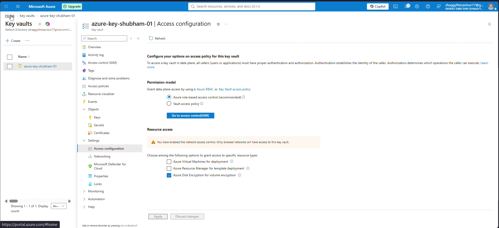

---

### Phase 6: Enabling Azure Disk Encryption on the OS Disk

1. Navigate to Virtual Machine `webvm03`.
2. Under **Settings**, select **Disks** > **Additional settings**.
3. Configure **Disk settings**:
   - **Disks to encrypt:** `OS disk`
   - **Key vault:** `azure-key-shubham-01`
   - **Key:** `key-01`
   - **Version:** Current version (`8061060bcc534553b923c3403d8af533`)
4. Click **Save**.

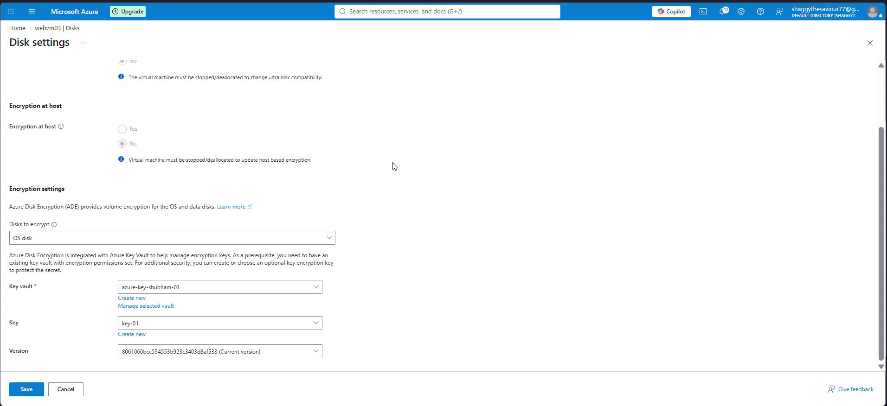

5. Azure orchestrates the deployment of the `AzureDiskEncryption` VM Extension on `webvm03`.

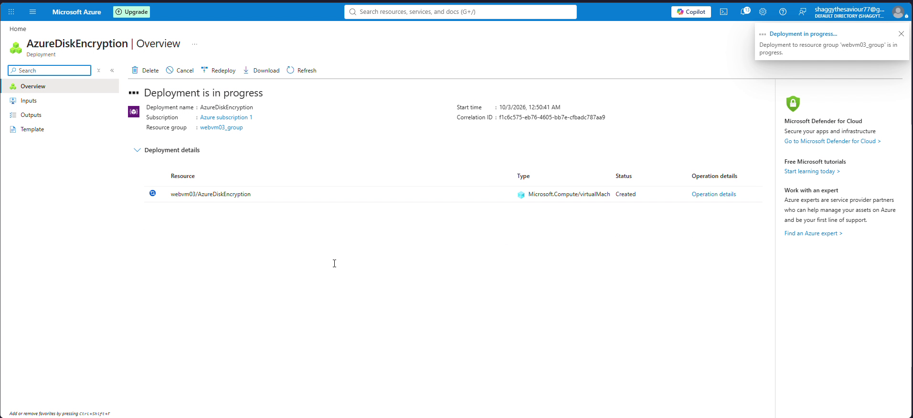

---

## Verification & Testing

### 1. Remote Desktop Connection

Download the RDP connection file from `webvm03` > **Connect** > **RDP** and connect using your administrative credentials (`azureuser`).

### 2. In-Guest BitLocker Status Verification

Inside the Windows Server desktop, open **Windows PowerShell** as Administrator and execute:

```powershell
manage-bde -status
```

#### Verification Output:

```text
PS C:\Windows\system32> manage-bde -status
BitLocker Drive Encryption: Configuration Tool version 10.0.26100
Copyright (C) 2013 Microsoft Corporation. All rights reserved.

Disk volumes that can be protected with
BitLocker Drive Encryption:
Volume C: [Windows]
[OS Volume]

    Size:                 126.45 GB
    BitLocker Version:    2.0
    Conversion Status:    Used Space Only Encrypted
    Percentage Encrypted: 100.0%
    Encryption Method:    XTS-AES 256
    Protection Status:    Protection On
    Lock Status:          Unlocked
    Identification Field: Unknown
    Key Protectors:
        External Key
        Numerical Password

Volume \\?\Volume{e2af13ec-0000-0000-0000-100000000000}\ [Bek Volume]
[Data Volume]

    Size:                 0.04 GB
    BitLocker Version:    None
    Conversion Status:    Fully Decrypted
```

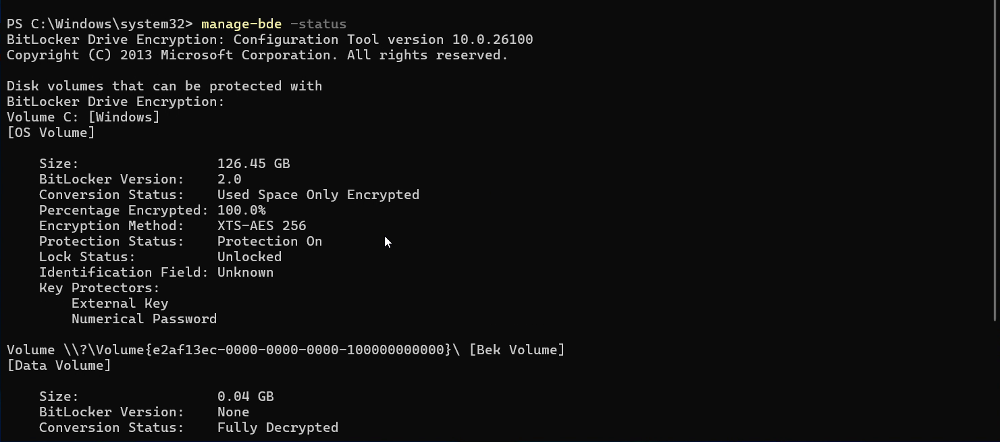

### Key Observations:
- **Volume C: [Windows]:** Fully protected (`Protection Status: Protection On`) with `100.0%` encrypted space.
- **Cipher Strength:** Industry-standard `XTS-AES 256` cipher algorithm.
- **Key Protectors:** Includes both `External Key` (the Key Vault-managed BEK) and `Numerical Password`.
- **BEK Volume:** Azure attaches a synthetic `0.04 GB` volume containing the encrypted BitLocker Encryption Key during the bootstrap sequence.

---

## Troubleshooting / The "Gotchas"

### Gotcha 1: RBAC vs Access Policies on Key Vault
- **The Issue:** Modern Key Vault deployments enforce Azure RBAC rather than legacy Access Policies by default. Even subscription owners cannot generate keys without data plane assignments.
- **The Solution:** Always grant `Key Vault Administrator` or `Key Vault Crypto Officer` via IAM role assignment before attempting cryptographic operations.

### Gotcha 2: Missing ADE Volume Encryption Flag
- **The Issue:** Attempting to enable ADE from VM disk settings fails or does not list the target Key Vault if the vault is not flagged for volume encryption.
- **The Solution:** Ensure Key Vault > `Access configuration` > `Azure Disk Encryption for volume encryption` is checked and applied.

### Gotcha 3: Regional Colocation Requirement
- **The Issue:** Disk Encryption Sets, Key Vaults, and Managed Disks cannot cross regional boundaries.
- **The Solution:** Always deploy Key Vault, DES, and compute instances in the identical region (`Central India`).

---

## Cost Optimization & Resource Cleanup

To prevent unnecessary hourly compute and storage charges, clean up the deployed resources once testing is complete.

### Portal Cleanup:
1. Delete the resource groups `webvm03_group` and `azure-study`.
2. Verify Key Vault soft-delete behavior: deleted vaults enter a soft-delete retention period (7 days). If recreating resources with identical names, purge the soft-deleted vault from **Key Vaults** > **Manage deleted vaults**.

### Azure CLI Cleanup:

```bash
# Delete VM resource group
az group delete --name webvm03_group --yes --no-wait

# Delete Key Vault and DES resource group
az group delete --name azure-study --yes --no-wait

# Purge soft-deleted Key Vault (if reuse is required)
az keyvault purge --name azure-key-shubham-01 --location centralindia
```

---

## Key Takeaways & Lessons Learned

- **SSE vs ADE:** Server-Side Encryption (CMK) operates transparently at the Azure Storage cluster level with zero CPU overhead, while Azure Disk Encryption (ADE) operates inside the VM guest OS via BitLocker/DM-Crypt.
- **Defense in Depth:** Combining SSE with CMK and ADE creates a double-encryption posture suitable for the most stringent compliance standards.
- **RBAC Governance:** Granular Azure RBAC roles on Key Vault ensure strict separation of duties between cloud infrastructure operators and security/crypto administrators.
- **Future-Proofing:** Microsoft plans to retire ADE for VMSS in September 2028 in favor of **Encryption at Host**, making Encryption at Host and SSE with CMK the primary enterprise design pattern moving forward.
