# Day 4: Azure Custom Script Extensions – Automated Provisioning on Windows (IIS) & Linux (NGINX)

*A comprehensive hands-on guide to automating post-deployment configuration and bootstrapping web servers across Windows Server 2025 and Ubuntu Linux 24.04 using Azure Custom Script Extensions and Azure Blob Storage.*

---

## Introduction & What We Are Building

In enterprise cloud administration, deploying virtual machines is only the initial step. Post-provisioning tasks—installing runtimes, configuring web servers, setting firewall rules, and deploying application source files—are where production workloads truly come alive. Performing these steps manually via Remote Desktop (RDP) or Secure Shell (SSH) is time-consuming, unrepeatable, and prone to configuration drift.

Azure provides **VM Extensions** to automate post-deployment configuration and runtime management tasks directly inside Azure virtual machines. Among these, the **Custom Script Extension** is one of the most flexible and widely used tools in cloud engineering. It automatically downloads specified script files from Azure Storage (or any valid GitHub / public URL) and runs them inside the guest operating system during the VM bootstrap sequence.

In this hands-on lab, we build a multi-OS automated web infrastructure on Microsoft Azure:
- Provision a centralized **Azure Storage Account** with a secure private blob container (`scripts`) to host configuration scripts.
- Author and store automated server bootstrap scripts:
  - **PowerShell script (`setup-iis.ps1`):** Installs the Internet Information Services (IIS) web server role, provisions the management tools, and writes a custom `default.html` landing page on Windows Server 2025 (`webvm01`).
  - **Bash script (`setup-nginx.sh`):** Updates the system apt repository, installs NGINX, ensures systemd service persistence, and deploys a custom `index.html` landing page on Ubuntu Linux 24.04 (`webvm02`).
- Attach and configure the **Custom Script Extension** during the Azure virtual machine deployment process using the Azure Portal Advanced configuration tab.
- Configure Network Security Group (NSG) inbound security rules allowing public HTTP (Port 80) traffic.
- Validate zero-touch provisioning end-to-end by accessing both web servers over the public internet without opening an administrative RDP or SSH session.

---

## Architecture Overview

The following diagram illustrates the lab architecture, demonstrating how Azure Virtual Machines securely pull configuration scripts from Azure Blob Storage and execute them via guest agents:

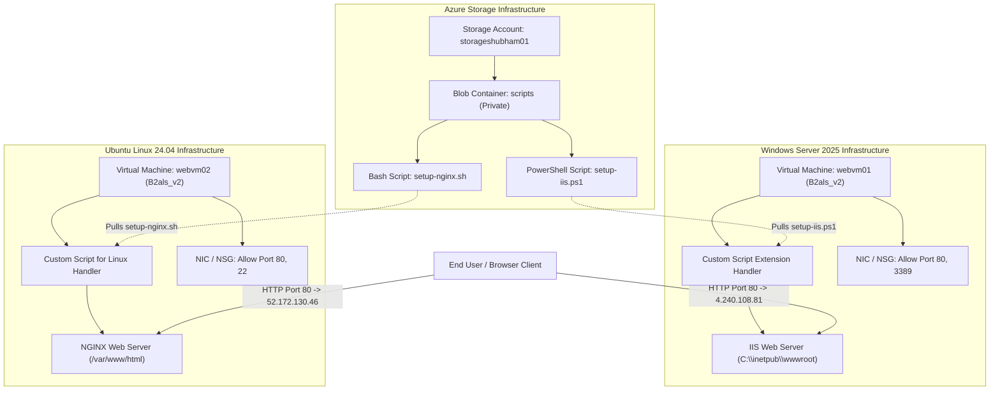

---

## Project Specifications Table

| Component | Resource Name / Configuration | Details / Values |
| :--- | :--- | :--- |
| **Resource Group** | `azure-study` | Centralized resource group for all lab components |
| **Region / Location** | `Central India` | Regional alignment for storage, compute, and networking |
| **Storage Account** | `storageshubham01` | Standard General-Purpose v2, Locally Redundant Storage (LRS) |
| **Blob Container** | `scripts` | Private access level (no anonymous read access) |
| **Windows VM** | `webvm01` | Windows Server 2025 Datacenter - x64 Gen2 |
| **Windows Compute SKU** | `Standard_B2als_v2` | 2 vCPUs, 4 GiB Memory (Availability Zone 1) |
| **Windows Script File**| `setup-iis.ps1` | Automated IIS installation and HTML generation |
| **Windows Public IP** | `4.240.108.81` | Inbound Ports: HTTP (80), RDP (3389) |
| **Linux VM** | `webvm02` | Ubuntu Server 24.04 LTS - x64 Gen2 |
| **Linux Compute SKU** | `Standard_B2als_v2` | 2 vCPUs, 4 GiB Memory |
| **Linux Script File** | `setup-nginx.sh` | Automated apt update, NGINX installation, and index page |
| **Linux Execution Cmd**| `sh setup-nginx.sh` | Shell execution command passed to Linux extension |
| **Linux Public IP** | `52.172.130.46` | Inbound Ports: HTTP (80), SSH (22) |

---

## Step-by-Step Hands-On Guide

### Phase 1: Setting Up Azure Blob Storage for Script Hosting

The Custom Script Extension requires access to script files. Placing scripts in an Azure Storage container allows secure storage and controlled access using Azure storage account access keys handled transparently by the Azure Resource Manager fabric.

#### Step 1: Create the Storage Account

1. In the Azure Portal search bar, type **Storage accounts** and select **Create storage account**.
2. Configure the **Basics** tab:
   - **Subscription:** Select your active subscription.
   - **Resource Group:** Select `azure-study` (or create new).
   - **Storage account name:** `storageshubham01` (globally unique).
   - **Region:** `Central India`.
   - **Primary service:** `Azure Blob Storage or Azure Data Lake Storage`.
   - **Performance:** `Standard`.
   - **Redundancy:** `Locally redundant storage (LRS)`.
3. Click **Review + create** and select **Create**.

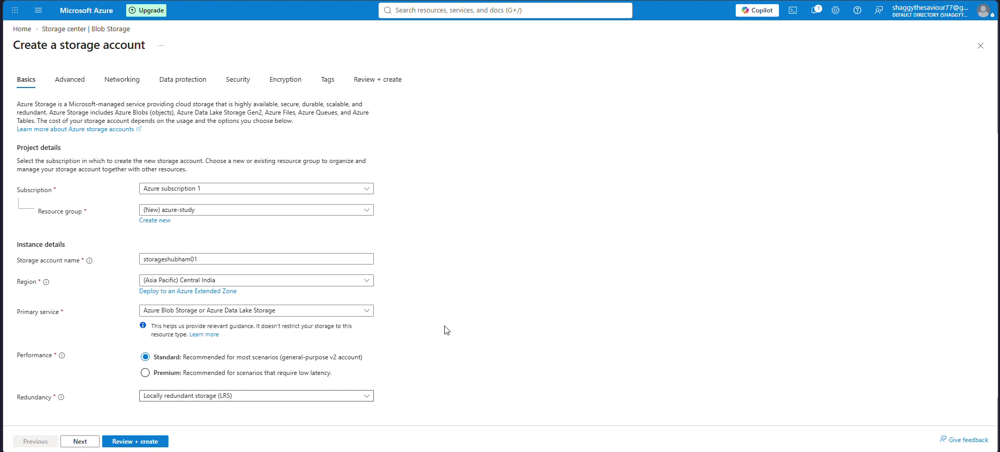

#### Step 2: Create the Private Blob Container

1. Once deployment succeeds, open the storage account `storageshubham01`.
2. In the left navigation menu under **Data storage**, select **Containers**.
3. Select **+ Container**:
   - **Name:** `scripts`.
   - **Anonymous access level:** `Private (no anonymous access)`.
4. Click **Create**.

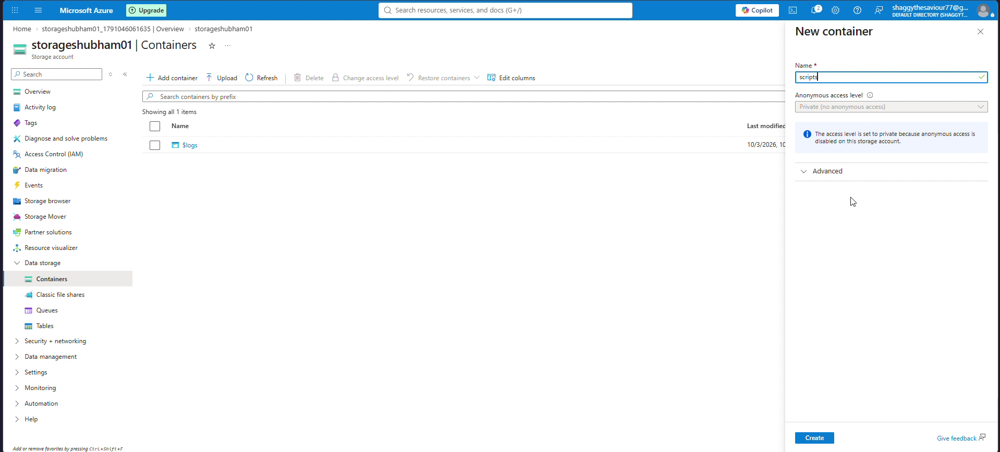

#### Step 3: Prepare the Automation Scripts

Two scripts are prepared for automated deployment across operating systems:

**Windows PowerShell Script (`setup-iis.ps1`):**
```powershell
# Install IIS feature
Install-WindowsFeature -name Web-Server -IncludeManagementTools

# Define IIS root
$path = "C:\inetpub\wwwroot"

# Create simple HTML page
$html = @"
<html>
  <head><title>Custom Script Extensions Demo</title></head>
  <body>
    <h1>We now have Internet Information services running on the machine</h1>
  </body>
</html>
"@

# Save file as default.html
Set-Content -Path "$path\default.html" -Value $html -Force
```

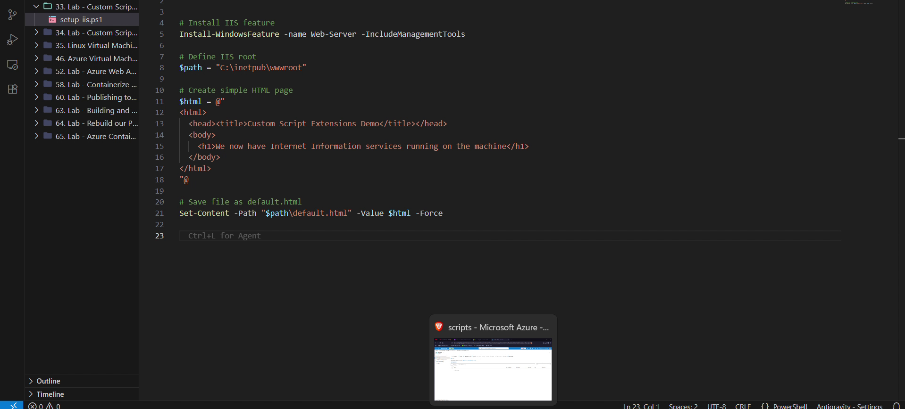

**Linux Bash Script (`setup-nginx.sh`):**
```bash
#!/bin/bash

# Update packages
sudo apt-get update -y

# Install NGINX
sudo apt-get install -y nginx

# Create simple default page
sudo bash -c 'cat > /var/www/html/index.html <<EOF
<html>
  <head><title>Custom Script Extensions Demo</title></head>
  <body>
    <h1>We now have NGINX running as a web server</h1>
  </body>
</html>
EOF'

# Ensure NGINX starts on boot
sudo systemctl enable nginx
sudo systemctl restart nginx
```

#### Step 4: Upload the Scripts to Azure Blob Storage

1. Navigate inside the `scripts` container in the Azure Portal.
2. Select **Upload**.
3. Select and upload both `setup-iis.ps1` and `setup-nginx.sh` as Block Blobs.
4. Verify that both files appear with `Available` lease state.

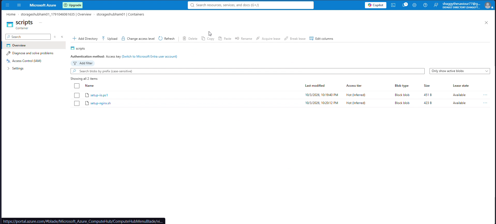

---

### Phase 2: Deploying Windows VM with Custom Script Extension (IIS)

We deploy a Windows Server 2025 instance and attach the Custom Script Extension directly during the provisioning wizard.

#### Step 5: Configure Windows VM Basics

1. In the Azure Portal search bar, type **Virtual machines** and click **Create** > **Azure virtual machine**.
2. Fill out the **Basics** tab:
   - **Resource group:** `azure-study`.
   - **Virtual machine name:** `webvm01`.
   - **Region:** `Central India`.
   - **Availability zone:** `Zone 1` (required for B2als_v2 availability in this region).
   - **Image:** `Windows Server 2025 Datacenter - x64 Gen2`.
   - **Size:** `Standard_B2als_v2` (2 vCPUs, 4 GiB memory).
   - **Administrator account:** Username `azureuser` and set a strong password.
   - **Public inbound ports:** Select `HTTP (80)` and `RDP (3389)`.

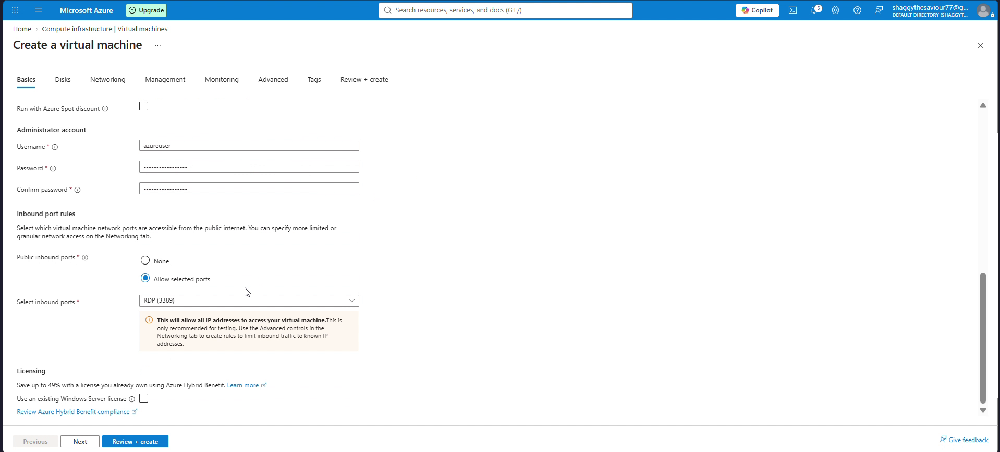

#### Step 6: Select Custom Script Extension in Advanced Tab

1. Navigate to the **Advanced** tab of the VM creation wizard.
2. Under the **Extensions** section, select **Select an extension to install**.
3. In the search box, search for `Custom script`.
4. Choose **Custom Script Extension** (Microsoft Corp.).

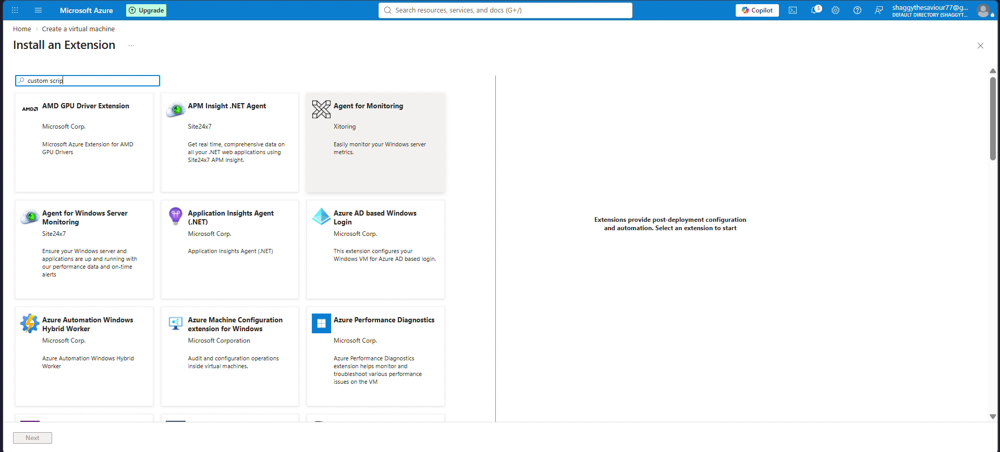

#### Step 7: Configure Windows Script File

1. In the configuration blade:
   - Click **Browse** next to **Script file (Required)**.
   - Select storage account `storageshubham01` > container `scripts` > `setup-iis.ps1`.
   - Leave **Arguments (Optional)** blank.
2. Click **Create** to confirm the extension configuration.

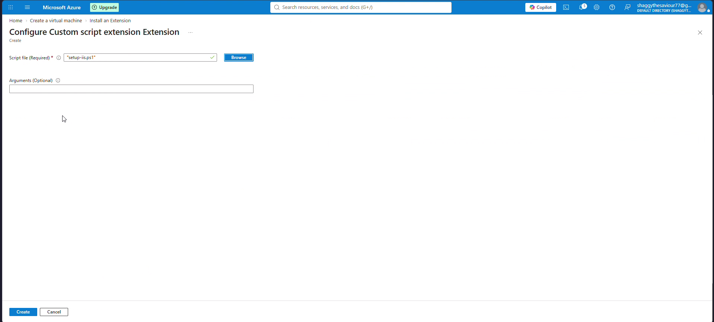

#### Step 8: Review and Launch Windows VM

1. Proceed to the **Review + create** tab.
2. Confirm that `webvm01`, `Standard_B2als_v2`, inbound ports `HTTP (80)` and `RDP (3389)`, and the Custom Script Extension are listed in the deployment configuration.
3. Select **Create** to trigger the deployment.

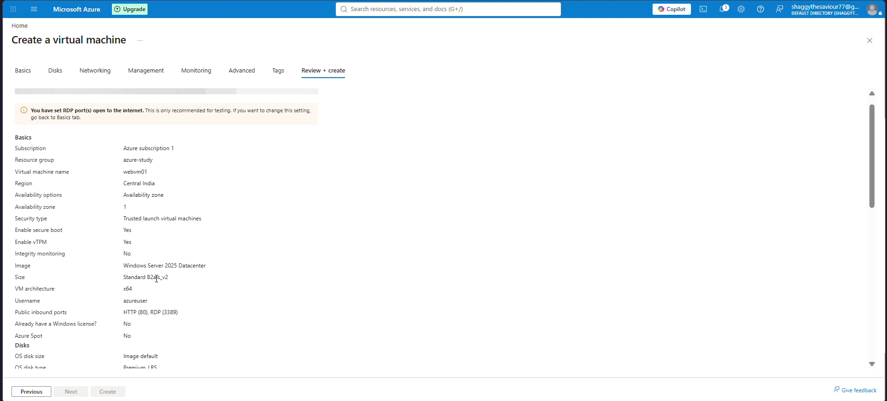

---

### Phase 3: Deploying Linux VM with Custom Script Extension (NGINX)

While `webvm01` provisions in the background, we deploy the Ubuntu Linux VM (`webvm02`) to demonstrate cross-platform capability.

#### Step 9: Configure Linux VM Basics

1. Select **Create a virtual machine** again:
   - **Resource group:** `azure-study`.
   - **Virtual machine name:** `webvm02`.
   - **Region:** `Central India`.
   - **Availability options:** `No infrastructure redundancy required`.
   - **Image:** `Ubuntu Server 24.04 LTS - x64 Gen2`.
   - **Size:** `Standard_B2als_v2` (2 vCPUs, 4 GiB memory).
   - **Authentication type:** `Password` (Username: `azureuser`).
   - **Public inbound ports:** Select `SSH (22)` and `HTTP (80)`.

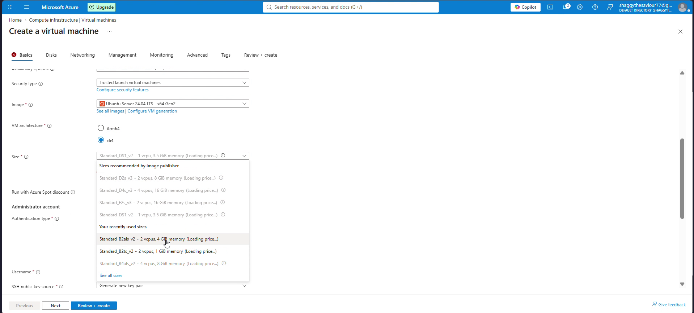

#### Step 10: Select Custom Script for Linux Extension

1. Navigate to the **Advanced** tab > **Extensions** > **Select an extension to install**.
2. Search for `Custom script for linux`.
3. Select **Custom script for linux** (Publisher: Microsoft Corp.) and click **Next**.

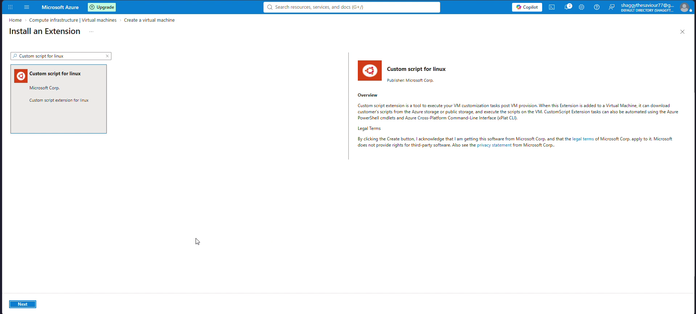

#### Step 11: Configure Script File and Execution Command

Unlike the Windows extension, the Linux Custom Script Extension requires specifying both the script source file and the exact execution command:
1. **Script files:** Click **Browse** > `storageshubham01` > `scripts` > `setup-nginx.sh`.
2. **Command (Required):** Enter `sh setup-nginx.sh`.
3. Click **Create** to stage the extension.
4. Click **Review + create** and launch `webvm02`.

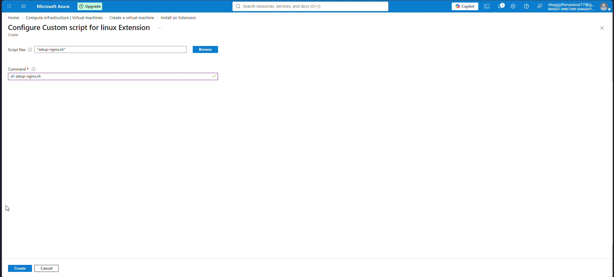

---

### Phase 4: End-to-End Verification & Web Server Validation

Once both virtual machines complete provisioning, the Azure VM Guest Agent triggers the Custom Script Extension handlers in-guest, downloads the scripts from Blob storage, executes them with administrative privileges, and reports completion status back to ARM.

#### Step 12: Verify Linux VM Overview & Public IP

1. Open the virtual machine `webvm02`.
2. Check that **Status** shows `Running` and the Guest Agent reports `Ready`.
3. Note the **Public IP address**: `52.172.130.46`.

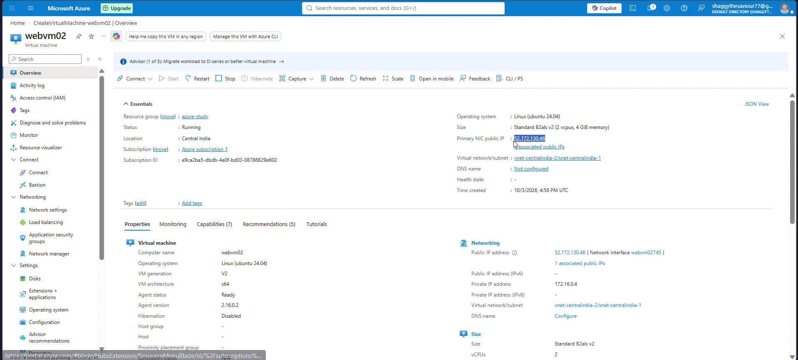

#### Step 13: Verify Linux NGINX Web Server

1. Open a web browser tab on your local computer.
2. Navigate to: `http://52.172.130.46`
3. The page instantly renders the custom HTML heading:
   `We now have NGINX running as a web server`
4. This confirms that the script updated apt packages, installed NGINX, and replaced `/var/www/html/index.html` completely hands-off.


#### Step 14: Verify Windows VM Overview & Public IP

1. Open the virtual machine `webvm01`.
2. Check that **Status** shows `Running` and the Guest Agent reports `Ready`.
3. Note the **Public IP address**: `4.240.108.81`.

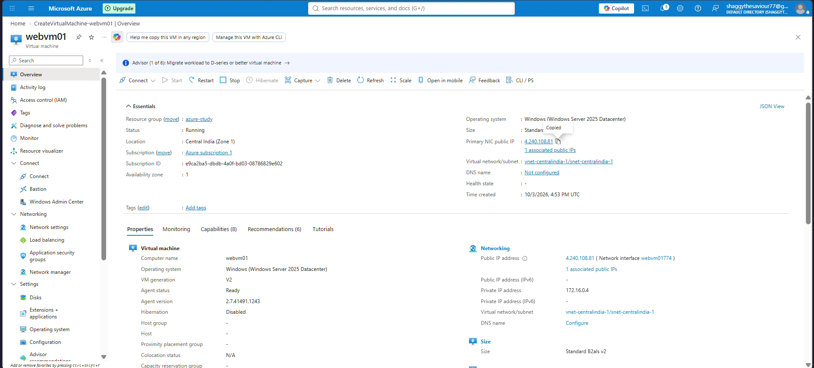

#### Step 15: Verify Windows IIS Web Server

1. Open a browser tab and navigate to: `http://4.240.108.81/default.html`
2. The page loads successfully with the custom text:
   `We now have Internet Information services running on the machine`
3. Automated IIS feature installation, root directory creation, and web publication succeeded without an RDP login.

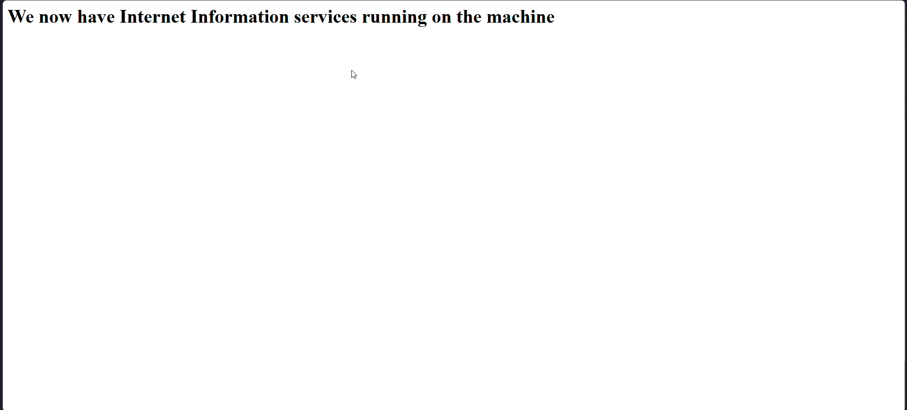

---

## Troubleshooting / The "Gotchas"

### Gotcha 1: IIS Default Document Precedence vs `default.html`
- **The Issue:** Browsing directly to the root URL `http://<Public-IP>/` on Windows Server loaded the default blue IIS splash page (`iisstart.htm`) instead of the custom page.
- **The Cause:** IIS default document resolution evaluates `iisstart.htm` before `default.html` unless modified. The script created `default.html` in `C:\inetpub\wwwroot`, but left `iisstart.htm` intact.
- **The Solution:** Explicitly navigate to `http://<Public-IP>/default.html`, or enhance the PowerShell script to remove the default IIS starter file:
  ```powershell
  Remove-Item "C:\inetpub\wwwroot\iisstart.*" -Force -ErrorAction SilentlyContinue
  ```

### Gotcha 2: Linux Extension Requires Explicit `Command` Field
- **The Issue:** Unlike the Windows extension where the script file itself is executed by default, configuring the Linux Custom Script Extension without specifying `Command` results in a validation error: `CommandToExecute is required`.
- **The Solution:** Always supply the command prefix in the form:
  ```bash
  sh setup-nginx.sh
  # or
  bash setup-nginx.sh
  ```

### Gotcha 3: Regional VM SKU Allocation Constraints
- **The Issue:** During Windows VM provisioning, selecting `Standard_B2als_v2` without an Availability Zone triggered the error: `This size is currently unavailable in CentralIndia for this subscription: NotAvailableForSubscription`.
- **The Solution:** Select an explicit Availability Zone (`Zone 1`) where the required compute hardware is allocated, or select an alternative available size such as `Standard_B2s` or `Standard_D2s_v5`.

### Gotcha 4: Inbound Port 80 Firewall (NSG) Rules
- **The Issue:** Virtual machine is running, the extension succeeded, but browsing to the public IP times out.
- **The Solution:** Ensure an Inbound Security Rule on the Network Security Group (NSG) allows destination port `80` with protocol `TCP` from source `Any` (or your client IP). The VM creation wizard provides this under **Public inbound ports** > `HTTP (80)`.

### Gotcha 5: Storage Access and Extension Authentication
- **The Issue:** The storage container `scripts` was configured with private access (no anonymous access), yet the VM downloaded the script without entering credentials.
- **The Solution:** When you configure the Custom Script Extension through the Azure Portal UI, Azure Resource Manager automatically creates a secure SAS token or utilizes the storage account keys behind the scenes. If automating via Azure CLI or ARM/Bicep templates, you must pass `storageAccountName` and `storageAccountKey` inside `protectedSettings`.

---

## Cost Optimization & Resource Cleanup

To avoid ongoing compute charges for multiple virtual machines and storage accounts, decommission the lab resources when testing concludes.

### Azure Portal Cleanup:
1. Navigate to **Resource groups** in the Azure Portal.
2. Select `azure-study`.
3. Click **Delete resource group**, enter `azure-study` to confirm, and click **Delete**.
4. Both virtual machines (`webvm01`, `webvm02`), their OS disks, network interfaces, public IPs, virtual networks, and the storage account `storageshubham01` will be permanently removed.

### Azure CLI Cleanup:

```bash
# Delete the entire lab resource group and all associated resources
az group delete --name azure-study --yes --no-wait
```

---

## Key Takeaways & Lessons Learned

- **True Zero-Touch Bootstrapping:** Azure Custom Script Extensions eliminate the operational friction of manual server setup, allowing developers to provision ready-to-serve web applications immediately upon VM boot.
- **Multi-OS Consistency:** The same declarative pattern applies across Windows and Linux environments—upload scripts to blob storage, bind the extension to the compute resource, and let Azure manage execution.
- **Production Evolution:** While Custom Script Extensions are ideal for straightforward bootstrapping, production architectures at scale often combine Custom Script Extensions with tools like **Cloud-init** (on Linux), **Azure Image Builder**, and **VM Applications** for complex lifecycle operations.
