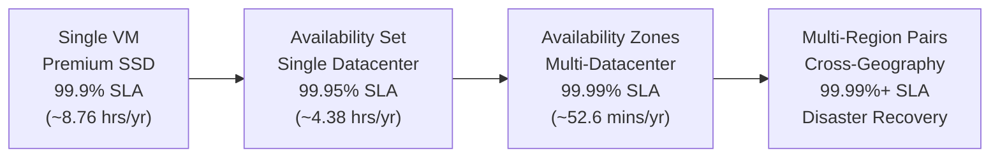
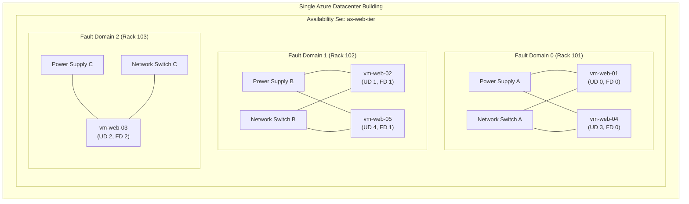
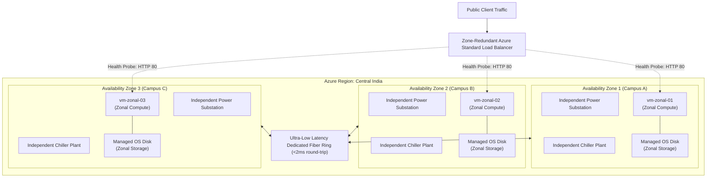
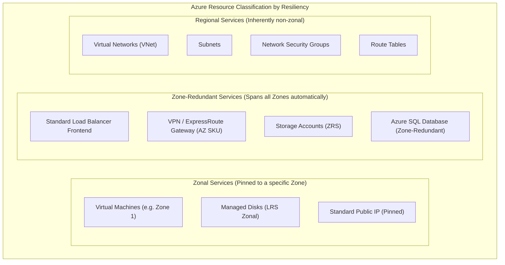
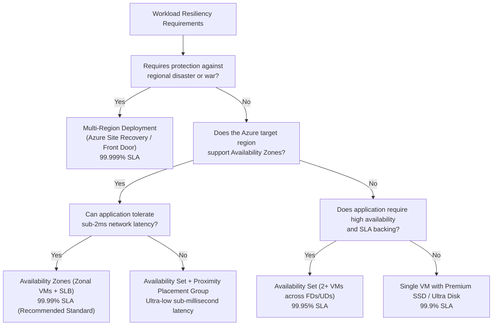
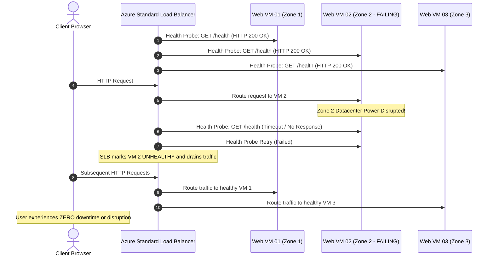

# Day 5: Azure High Availability – Availability Sets vs Availability Zones In-Depth Architecture Guide

*A definitive master guide to architecting fault-tolerant infrastructure on Microsoft Azure: Fault Domains, Update Domains, Zonal vs Zone-Redundant patterns, SLA mechanics, and enterprise deployment blueprints.*

---

## Introduction & Why High Availability Matters

In cloud computing, hardware failure is not an anomaly—it is a statistical certainty. At hyperscale, millions of physical servers, solid-state drives, power supply units (PSUs), top-of-rack (ToR) network switches, and computer room air handlers (CRAHs) operate continuously. Components inevitably degrade, short-circuit, or undergo physical wear and tear.

Beyond hardware breakdowns, cloud platforms undergo constant rolling maintenance: hypervisors receive critical kernel patches, physical host operating systems reboot, and firmware upgrades are applied across switching fabrics.

If an enterprise deploys an application onto a single virtual machine without redundancy, any host crash, power interruption, or hypervisor reboot results in direct application downtime, customer dissatisfaction, and potential financial and contractual breach.

To protect workloads against disruptions, Microsoft Azure provides a structured hierarchy of **High Availability (HA)** features. The two primary pillars for single-region VM redundancy are:

1. **Availability Sets:** Protect workloads against physical hardware, power, network switch, and rolling host maintenance failures **within a single datacenter**.
2. **Availability Zones:** Protect workloads against entire facility-level catastrophes (datacenter power outage, flood, chiller plant collapse) by distributing compute resources across **distinct physical datacenters within a single region**.

This guide is structured as a comprehensive reference to master both concepts, their underlying physical mechanics, architectural trade-offs, and implementation patterns.

---

## The Azure Resiliency Spectrum

High availability in Azure is not an all-or-nothing toggle; it is a spectrum of resiliency tiers balancing architectural complexity, operational cost, and availability guarantees:



### The Mathematics of Availability SLAs

| Availability Tier | Target Architecture | Azure SLA Guarantee | Maximum Allowed Annual Downtime | Maximum Allowed Monthly Downtime |
| :--- | :--- | :--- | :--- | :--- |
| **Single VM (Standard HDD)** | Basic disk, single host | None / Best Effort | Undefined | Undefined |
| **Single VM (Premium SSD/Ultra)**| Premium managed disk | 99.9% | 8 hours, 45 minutes | 43 minutes, 49 seconds |
| **Availability Set** | 2+ VMs across FDs & UDs | 99.95% | 4 hours, 22 minutes | 21 minutes, 54 seconds |
| **Availability Zones** | 2+ VMs across 2+ Zones | 99.99% | 52 minutes, 35 seconds | 4 minutes, 23 seconds |
| **Multi-Region Pair** | Active/Active Traffic Manager | 99.999% (Composite) | 5 minutes, 15 seconds | 26 seconds |

> [!IMPORTANT]
> Azure Service Level Agreements (SLAs) for Availability Sets and Availability Zones apply **only** when two or more redundant VMs are provisioned within the set or across zones, and are properly fronted by a health-probed load balancer capable of routing around offline instances.

---

## Availability Sets Deep Dive (Inside a Single Datacenter)

An **Availability Set** is a logical grouping capability in Azure that isolates virtual machine resources from each other when deployed inside a single datacenter.

When VMs are placed in an Availability Set, the Azure fabric controller guarantees that the instances are distributed across separate physical hardware racks and scheduled maintenance groups.



### 1. Fault Domains (FD) – Hardware Failure Isolation

A **Fault Domain (FD)** represents a physical unit of failure. At the hardware level, an FD corresponds to a distinct physical server rack that shares:
- A common power supply unit (PSU) and Power Distribution Unit (PDU).
- A common cooling airflow channel.
- A common top-of-rack (ToR) network switch.

If a top-of-rack switch blows a capacitor or a PDU trips, every blade server inside that rack loses power or connectivity simultaneously.

- **Fault Domain Count:** Azure supports up to **3 Fault Domains** (FD 0, FD 1, FD 2) in most regions (some smaller regional locations support 2).
- **Distribution Logic:** The Azure fabric controller automatically places VM 1 on FD 0, VM 2 on FD 1, VM 3 on FD 2, and wraps VM 4 back onto FD 0.
- **Storage Cluster Alignment:** When using Azure Managed Disks, the OS and data disks are automatically aligned with the compute fault domain of the VM. This guarantees that your VM compute and underlying storage cluster do not share a single point of failure.

### 2. Update Domains (UD) – Maintenance Isolation

An **Update Domain (UD)** is a logical group of physical hardware nodes that can undergo host-level platform maintenance, hypervisor patching, or rebooting at the same time.

When Microsoft schedules an infrastructure patch:
- Azure pauses and updates the host servers in **UD 0**.
- The fabric controller waits approximately **30 minutes** to allow workloads, health checks, and reboot sequences to stabilize.
- Once UD 0 is validated healthy, Azure proceeds sequentially to **UD 1**, then **UD 2**, and so on.
- Updates are never applied concurrently across multiple Update Domains within the same Availability Set.

- **Update Domain Count:** Configurable from **1 to 20** (default is **5**).
- **Sequential Rolling Window:** If you run 5 web servers distributed across 5 Update Domains, at any given moment during platform maintenance, at least 80% (4 out of 5) of your instances remain active and serving client requests.

### VM Distribution Matrix Across Domains

The table below demonstrates how Azure cyclically assigns 8 virtual machines across 3 Fault Domains and 5 Update Domains:

| Virtual Machine | Assigned Fault Domain (Rack) | Assigned Update Domain (Patch Group) | Physical Isolation Profile |
| :--- | :--- | :--- | :--- |
| **VM 1** | Fault Domain 0 | Update Domain 0 | Rack 1, Patch Cycle 0 |
| **VM 2** | Fault Domain 1 | Update Domain 1 | Rack 2, Patch Cycle 1 |
| **VM 3** | Fault Domain 2 | Update Domain 2 | Rack 3, Patch Cycle 2 |
| **VM 4** | Fault Domain 0 | Update Domain 3 | Rack 1, Patch Cycle 3 |
| **VM 5** | Fault Domain 1 | Update Domain 4 | Rack 2, Patch Cycle 4 |
| **VM 6** | Fault Domain 2 | Update Domain 0 | Rack 3, Patch Cycle 0 |
| **VM 7** | Fault Domain 0 | Update Domain 1 | Rack 1, Patch Cycle 1 |
| **VM 8** | Fault Domain 1 | Update Domain 2 | Rack 2, Patch Cycle 2 |

### Limitations of Availability Sets
- **Single Datacenter Boundary:** All racks reside within the same physical facility. A catastrophic flood, total campus power failure, or fire will take down all Fault Domains simultaneously.
- **Creation-Time Binding:** A virtual machine **cannot** be added to an existing Availability Set after creation, nor can it be removed from one without deleting and recreating the VM resource from its OS disk.
- **Legacy Evolution:** Availability Sets are a mature, legacy construct. For all modern cloud architectures where the region supports it, **Availability Zones** are Microsoft's primary recommended pattern.

---

## Availability Zones Deep Dive (Across Datacenters in a Region)

An **Availability Zone (AZ)** is a high-availability offering that protects applications and data from entire datacenter failures. Availability Zones are distinct physical locations within an Azure region.

Each zone is composed of **one or more datacenters** equipped with:
- Independent high-voltage power feeds and dedicated backup diesel generators.
- Independent industrial water chillers and HVAC cooling infrastructure.
- Redundant optical networking paths connected via high-speed, low-latency private dark fiber rings.



### Latency and Physical Separation
To prevent a single disaster (e.g., plane crash, localized severe storm, substation explosion) from impacting multiple zones, the datacenters are separated by meaningful physical distance (often several kilometers). However, they are close enough to maintain **sub-2 millisecond round-trip latency** over private fiber, enabling synchronous database replication (such as SQL Always On, Cassandra, or MongoDB replicaset clusters).

### Zonal vs Zone-Redundant Resource Models

Understanding the distinction between **Zonal** and **Zone-Redundant** resources is a core requirement for cloud architecture:



#### 1. Zonal Resources
- You explicitly pin the resource to a single zone (e.g., `Zone 1`).
- The resource resides exclusively within that physical datacenter.
- Examples: Virtual Machines, Zonal Managed Disks, Zonal Public IP addresses.
- If Zone 1 suffers a total facility blackout, the zonal VM stops functioning until power and connectivity to Zone 1 are restored.

#### 2. Zone-Redundant Resources
- The Azure platform automatically manages replication and traffic routing across multiple zones (typically all 3) with zero customer configuration.
- If a datacenter in Zone 1 fails, the service experiences zero downtime because instances in Zone 2 and Zone 3 continue serving traffic seamlessly.
- Examples: Zone-Redundant Storage (ZRS), Azure Standard Load Balancer frontends, Zone-Redundant Virtual Network Gateways (ErGw1AZ, VpnGw1AZ), Azure SQL Database with Zone Redundancy enabled.

#### 3. Regional / Non-Zonal Resources
- Certain networking foundational components have no zonal affinity at all.
- **Virtual Networks (VNets) and Subnets are regional constructs.** A single VNet spans across all three Availability Zones within the region.
- You can place a VM pinned to Zone 1, a VM pinned to Zone 2, and a VM pinned to Zone 3 inside the exact same subnet (`10.0.1.0/24`) without any complex cross-VNet peering or routing.

### The Logical vs Physical Zone Mapping Phenomenon

> [!NOTE]
> In Azure, **Zone 1 in your subscription does NOT necessarily correspond to the same physical building as Zone 1 in another customer's subscription.**

To ensure optimal distribution of compute resources and prevent a single physical datacenter from being overwhelmed by everyone selecting "Zone 1", Azure programmatically randomizes logical-to-physical zone mappings at the subscription level:

```
Subscription A: Logical Zone 1 -> Physical Datacenter "centralindia-az-02"
Subscription B: Logical Zone 1 -> Physical Datacenter "centralindia-az-01"
```

If you are designing low-latency cross-subscription architectures (e.g., enterprise hub-and-spoke with shared services), you can inspect the underlying physical mapping using the Azure CLI:

```bash
az rest --method get \
    --uri "/subscriptions/{subscriptionId}/locations/centralindia/checkZonePeers?api-version=2022-12-01"
```

---

## Architectural Comparison: Availability Sets vs Availability Zones

| Evaluation Dimension | Availability Sets | Availability Zones |
| :--- | :--- | :--- |
| **Resiliency Scope** | Single datacenter (intra-building) | Multiple datacenters (intra-region) |
| **Failure Protection** | Server rack, power supply, ToR switch | Datacenter flood, fire, cooling, total utility outage |
| **Maintenance Protection**| Rolling host hypervisor updates (UDs) | Datacenter-level facility maintenance & updates |
| **Availability SLA** | **99.95%** (for 2+ VMs) | **99.99%** (for 2+ VMs across 2+ zones) |
| **Max Redundancy Units**| Up to 3 Fault Domains, up to 20 Update Domains | 3 distinct Availability Zones per region |
| **Inter-Node Latency** | Ultra-low (< 0.5 ms, intra-datacenter) | Very low (< 2.0 ms, fiber optic ring) |
| **Networking Scope** | Bound to datacenter subnet | VNet spans all zones; instances share subnets |
| **Feature Cost** | Free (pay only for VM and disk resources) | Free (pay only for VM and disk resources) |
| **Bandwidth Costs** | Zero inter-VM data transfer costs | Incur inter-zone egress charges (~$0.01/GB) |
| **Load Balancer Support**| Basic Load Balancer (deprecated) or Standard | **Standard Load Balancer required** (Basic unsupported)|
| **Post-Creation Flexibility**| Cannot add existing VM to an Availability Set | Cannot change a VM's zone without recreating from disk|
| **Primary Use Case** | Legacy workloads, regions lacking AZ support | Modern mission-critical enterprise workloads |

---

## Architecture Decision Tree

Use the following flowchart to determine the appropriate high availability pattern for your cloud deployment:



---

## Load Balancing and Traffic Ingress Architecture

Deploying multiple virtual machines in an Availability Set or across Availability Zones provides compute-level redundancy, but client traffic must be directed to healthy instances. A load balancer acts as the single point of entry, using health probes to detect failure and redirect traffic seamlessly.



### The Azure Standard Load Balancer (SLB) Advantage
- **Zone-Redundancy:** The public IP address and frontend IP configuration are configured as `Zone-Redundant` (`zone: 1, 2, 3`), ensuring the ingress endpoint survives even if two datacenters fail simultaneously.
- **Basic Load Balancer Retirement Notice:** Microsoft deprecated the Basic Load Balancer in September 2025. Standard Load Balancer is required for all production zone-aware architectures.

---

## Practical Implementation Walkthrough (Azure CLI)

Below are production-ready Azure CLI automation scripts illustrating both deployment paradigms.

### Blueprint A: Deploying an Availability Set with Aligned Managed Disks

```bash
# 1. Create a dedicated resource group
az group create \
    --name rg-availability-set-demo \
    --location centralindia

# 2. Create the Virtual Network and Subnet
az network vnet create \
    --resource-group rg-availability-set-demo \
    --name vnet-corp \
    --address-prefix 10.0.0.0/16 \
    --subnet-name snet-web \
    --subnet-prefix 10.0.1.0/24

# 3. Create the Availability Set
# Explicitly specifying 3 Fault Domains and 5 Update Domains
az vm availability-set create \
    --resource-group rg-availability-set-demo \
    --name as-web-tier \
    --platform-fault-domain-count 3 \
    --platform-update-domain-count 5 \
    --location centralindia

# 4. Provision VM 1 inside the Availability Set
az vm create \
    --resource-group rg-availability-set-demo \
    --name vm-web-01 \
    --availability-set as-web-tier \
    --image Ubuntu2204 \
    --size Standard_B2s \
    --admin-username azureuser \
    --generate-ssh-keys \
    --vnet-name vnet-corp \
    --subnet snet-web \
    --no-wait

# 5. Provision VM 2 inside the Availability Set
az vm create \
    --resource-group rg-availability-set-demo \
    --name vm-web-02 \
    --availability-set as-web-tier \
    --image Ubuntu2204 \
    --size Standard_B2s \
    --admin-username azureuser \
    --generate-ssh-keys \
    --vnet-name vnet-corp \
    --subnet snet-web

# 6. Audit VM domain assignments
az vm availability-set list-assigned-vms \
    --resource-group rg-availability-set-demo \
    --name as-web-tier \
    --output table
```

---

### Blueprint B: Deploying a Multi-Zone Resilient Web Tier

```bash
# 1. Create a dedicated resource group
az group create \
    --name rg-availability-zones-demo \
    --location centralindia

# 2. Create the regional Virtual Network
az network vnet create \
    --resource-group rg-availability-zones-demo \
    --name vnet-zonal \
    --address-prefix 172.16.0.0/16 \
    --subnet-name snet-workload \
    --subnet-prefix 172.16.1.0/24

# 3. Create a Zone-Redundant Standard Public IP address
az network public-ip create \
    --resource-group rg-availability-zones-demo \
    --name pip-slb-web \
    --sku Standard \
    --tier Regional \
    --zone 1 2 3 \
    --allocation-method Static

# 4. Create the Standard Load Balancer with Zone-Redundant Frontend
az network lb create \
    --resource-group rg-availability-zones-demo \
    --name slb-web \
    --sku Standard \
    --public-ip-address pip-slb-web \
    --frontend-ip-name fe-ip-config \
    --backend-pool-name be-pool-web

# 5. Configure Load Balancer Health Probe and Balancing Rule
az network lb probe create \
    --resource-group rg-availability-zones-demo \
    --lb-name slb-web \
    --name probe-http \
    --protocol Http \
    --port 80 \
    --path "/"

az network lb rule create \
    --resource-group rg-availability-zones-demo \
    --lb-name slb-web \
    --name rule-http-80 \
    --protocol Tcp \
    --frontend-port 80 \
    --backend-port 80 \
    --frontend-ip-name fe-ip-config \
    --backend-pool-name be-pool-web \
    --probe-name probe-http

# 6. Deploy 3 VMs pinned across Zones 1, 2, and 3
for ZONE_ID in 1 2 3; do
    echo "Creating NIC and VM in Availability Zone ${ZONE_ID}..."
    
    az network nic create \
        --resource-group rg-availability-zones-demo \
        --name "nic-web-z${ZONE_ID}" \
        --vnet-name vnet-zonal \
        --subnet snet-workload \
        --lb-name slb-web \
        --lb-address-pools be-pool-web

    az vm create \
        --resource-group rg-availability-zones-demo \
        --name "vm-web-z${ZONE_ID}" \
        --zone "${ZONE_ID}" \
        --nics "nic-web-z${ZONE_ID}" \
        --image Ubuntu2204 \
        --size Standard_B2als_v2 \
        --admin-username azureuser \
        --generate-ssh-keys \
        --no-wait
done
```

---

### Blueprint C: Declarative Infrastructure with Azure Bicep

In enterprise environments, infrastructure is authored declaratively. The following Bicep snippet illustrates how an Availability Zone VM and an Availability Set VM are declared:

```bicep
// Availability Set Declaration
resource availabilitySet 'Microsoft.Compute/availabilitySets@2023-09-01' = {
  name: 'as-backend-tier'
  location: resourceGroup().location
  properties: {
    platformFaultDomainCount: 3
    platformUpdateDomainCount: 5
  }
  sku: {
    name: 'Aligned' // Required for Managed Disks alignment
  }
}

// VM Deployed Inside the Availability Set
resource vmInAvailabilitySet 'Microsoft.Compute/virtualMachines@2023-09-01' = {
  name: 'vm-app-01'
  location: resourceGroup().location
  properties: {
    availabilitySet: {
      id: availabilitySet.id
    }
    hardwareProfile: {
      vmSize: 'Standard_B2s'
    }
    // Storage, OS, and Network profiles omitted for brevity
  }
}

// VM Deployed Inside an Availability Zone (Zone 1)
resource vmInAvailabilityZone 'Microsoft.Compute/virtualMachines@2023-09-01' = {
  name: 'vm-zonal-web-01'
  location: resourceGroup().location
  zones: [
    '1' // Explicitly pinning compute to Availability Zone 1
  ]
  properties: {
    hardwareProfile: {
      vmSize: 'Standard_B2als_v2'
    }
    // Storage, OS, and Network profiles omitted for brevity
  }
}
```

---

## Critical Real-World "Gotchas" & Interview Traps

### 1. Moving an Existing VM into an Availability Set
- **The Trap:** An administrator provisions a VM without an Availability Set. Later, business requirements demand 99.95% SLA. The administrator attempts to edit the VM in the portal to attach an Availability Set.
- **The Reality:** Azure does **not** permit moving an existing running VM into or out of an Availability Set. The VM compute resource must be deleted (preserving the OS and data disks), and a new VM must be deployed referencing the original managed disks and the target Availability Set.

### 2. Mixing Availability Sets and Availability Zones on the Same VM
- **The Trap:** Attempting to specify both an Availability Set and an Availability Zone during VM deployment.
- **The Reality:** They are mutually exclusive high availability models. A virtual machine can either belong to an Availability Set (intra-datacenter rack distribution) OR be pinned to an Availability Zone (cross-datacenter distribution).

### 3. Latency Sensitivity vs Proximity Placement Groups (PPGs)
- **The Trap:** Assuming that placing VMs in an Availability Set guarantees the lowest possible network latency.
- **The Reality:** While an Availability Set keeps VMs within one datacenter, they are purposefully placed on different racks. For extreme high-frequency financial trading or micro-second cluster synchronization, use **Proximity Placement Groups (PPGs)**, which physically co-locate VMs as close together as possible (often within the same spine switch or adjacent racks). However, PPGs reduce hardware fault diversity.

### 4. Cross-Zone Data Transfer Bandwidth Costs
- **The Trap:** Designing an active-active database cluster across 3 Availability Zones and expecting zero network cost.
- **The Reality:** In Azure, ingress and egress data transfer between Availability Zones across the regional fiber ring incurs a minor billing fee (typically $0.01 per GB in both directions). Conversely, data transfer between VMs in the same Availability Set within the same datacenter is completely free.

### 5. VM SKU Quota and Regional Zonal Disparity
- **The Trap:** Assuming all VM sizes (e.g., GPU instances, high-memory M-series) are available across all 3 zones in every region.
- **The Reality:** Hardware footprints vary. Some specialized SKUs are only deployed in Zone 1 and Zone 2 of a given region. Always verify regional SKU zone support prior to deployment using:
  ```bash
  az vm list-skus --location centralindia --zone --output table
  ```

### 6. High Availability vs Disaster Recovery
- **The Trap:** Believing that an Availability Zone deployment protects against regional catastrophes.
- **The Reality:** High Availability (AZs) protects against local hardware and facility failure within a metro region. If a catastrophic flood or military conflict disables an entire geographic region, all three zones could be impacted. True Disaster Recovery (DR) requires a secondary region paired with **Azure Site Recovery (ASR)** or cross-region database replication (e.g., Cosmos DB multi-region writes or Azure SQL Failover Groups).

---

## One-Year Quick Revision Cheat Sheet

Save this high-density mental model for rapid review during certification exams (AZ-104, AZ-305) or system design interviews:

| Concept | Fast Mental Hook | Key Numbers to Remember |
| :--- | :--- | :--- |
| **Fault Domain (FD)** | Physical server rack (shared power & switch) | Up to **3** FDs (FD0, FD1, FD2) |
| **Update Domain (UD)**| Patch group (reboots together during updates) | Configurable **1-20** (default is **5**) |
| **Availability Set** | One building, different racks | SLA: **99.95%** (requires 2+ VMs) |
| **Availability Zone** | Different buildings, separate power/cooling | SLA: **99.99%** (requires 2+ VMs across 2+ zones) |
| **Zone Latency** | Ultra-fast dark fiber ring | Round-trip latency: **< 2 ms** |
| **Zonal Resource** | Pinned to a specific datacenter | Example: Zonal VM, Zonal Managed Disk |
| **Zone-Redundant** | Automatically spans all 3 datacenters | Example: Standard Load Balancer, ZRS Storage |
| **VNet Scope** | Spans the entire region natively | Subnets span all zones; no cross-zone VNet needed |
| **Load Balancer** | Standard SKU is mandatory for Zones | Basic Load Balancer is retired |
| **Single VM SLA** | 99.9% with Premium SSD / Ultra Disk | 0% / No SLA with Standard HDD |
