# Day 6: Azure Virtual Machine Scale Sets (VMSS) & Metric-Based Autoscaling

*A comprehensive hands-on guide to provisioning Uniform VM Scale Sets, configuring Azure Monitor metric-based autoscale rules, resolving Microsoft.Insights registration errors, and simulating CPU stress to trigger automated horizontal scale-out.*

---

## Introduction & What We Are Building

In traditional on-premises and early cloud architectures, capacity planning was a guessing game. System administrators had to provision server fleets sized for anticipated peak demand. Most of the time, those servers sat idle at 10% to 15% CPU utilization, burning infrastructure budget. Conversely, during unexpected traffic spikes, fixed fleets became saturated, causing elevated latency, request timeouts, and cascading outages.

Cloud computing solves this fundamental tension through **horizontal elasticity**—the ability to dynamically provision and deprovision compute resources in direct response to real-time workload fluctuations.

On Microsoft Azure, the foundational service for horizontal elasticity is **Azure Virtual Machine Scale Sets (VMSS)**. VMSS allows you to deploy and manage a group of load-balanced, identical virtual machines. The scale set fabric controller automatically handles VM creation, configuration consistency, availability zone distribution, health monitoring, and scaling.

In this practical hands-on lab, we build, configure, stress-test, and validate an automated elastic compute tier:
- Deploy a **Uniform Virtual Machine Scale Set (`SET0000`)** running Ubuntu Server 24.04 LTS across Availability Zone 1 in Central India.
- Configure virtual networking (`vnet-centralindia-1`), subnet allocation (`snet-centralindia-1`), direct public IP allocation per instance, and Network Security Group (NSG) rules for SSH (Port 22) and HTTP (Port 80).
- Establish an initial baseline capacity of 1 instance (`SET0000_0`), connect via SSH, and verify guest operating system readiness.
- Design and attach an **Azure Monitor Custom Autoscale Profile** with metric-based rules triggered when average CPU utilization exceeds 70% over a 5-minute sampling window.
- Diagnose and resolve a critical real-world cloud deployment roadblock: the `MissingSubscriptionRegistration: microsoft.insights` resource provider error.
- Generate synthetic multi-threaded CPU load inside the scale set instance using the Linux `stress` benchmark utility (`sudo stress --cpu 100`).
- Validate end-to-end automated horizontal scaling as Azure Monitor detects the threshold breach and provisions `SET0000_1` without manual human intervention.

---

## Architecture Overview

The following architecture diagrams illustrate the infrastructure topology and the automated lifecycle loop of Azure Monitor autoscaling:

### Infrastructure Topology

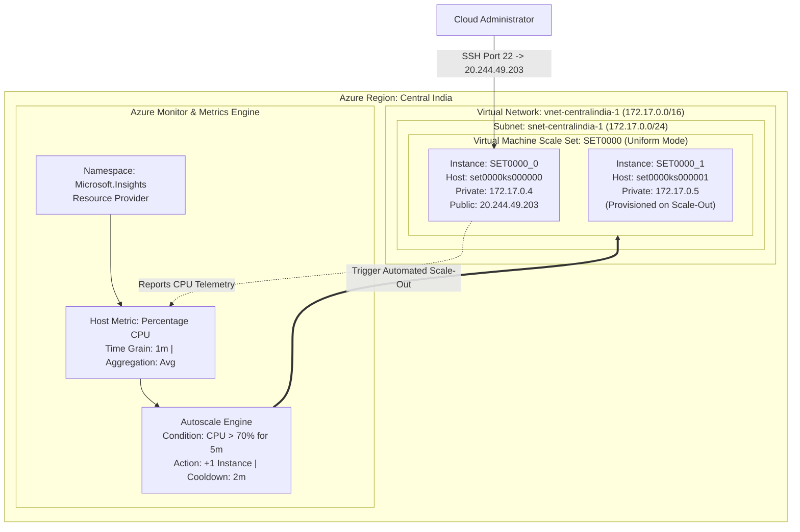

### Autoscale Decision Loop & State Machine

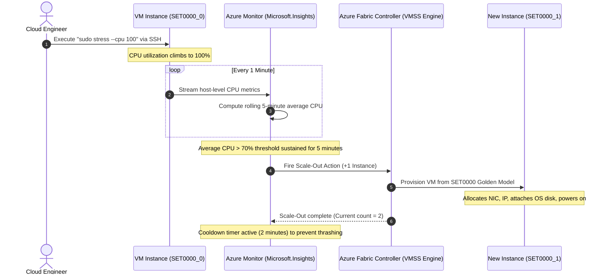

---

## Project Specifications Table

| Component | Resource Name / Configuration | Details / Values |
| :--- | :--- | :--- |
| **Subscription** | `Azure subscription 1` | Primary active cloud subscription |
| **Resource Group** | `azure-study` | Centralized lab resource group |
| **Location / Region** | `Central India` | Regional datacenter location |
| **Availability Zone** | `Zone 1` | Physical datacenter isolation within Central India |
| **Scale Set Name** | `SET0000` | Uniform Virtual Machine Scale Set identifier |
| **Orchestration Mode** | `Uniform` | Optimized for large-scale identical stateless workloads |
| **Security Type** | `Trusted launch virtual machines` | Secure Boot & vTPM enabled |
| **Operating System** | `Ubuntu Server 24.04 LTS - x64 Gen2` | Canonical Ubuntu Linux 64-bit |
| **Compute SKU** | `Standard_B2ts_v2` | 2 vCPUs, 1 GiB Memory ($8.18/month baseline) |
| **Authentication Type**| `Password` | User: `azureuser` |
| **Virtual Network** | `vnet-centralindia-1` | Address space: `172.17.0.0/16` |
| **Subnet** | `snet-centralindia-1` | Subnet range: `172.17.0.0/24` |
| **Network Interface** | `vnet-centralindia-1-nic01` | Primary network configuration |
| **Public IP Address** | `Enabled` (Instance-level) | Assigned to `SET0000_0`: `20.244.49.203` |
| **Inbound Ports** | `HTTP (80)`, `SSH (22)` | Network Security Group basic inbound rules |
| **Autoscale Name** | `SET0000-Autoscale-485` | Custom Azure Monitor autoscale setting |
| **Autoscale Metric** | `Percentage CPU (Average)` | Metric namespace: Virtual Machine Host |
| **Trigger Threshold** | `> 70%` sustained for 5 minutes | Time grain: 1 minute, Time aggregation: Average |
| **Scale Action** | `Increase count by 1` | Horizontal scale-out increment |
| **Cooldown Duration** | `2 minutes` | Scale-out stabilization timer |
| **Instance Limits** | `Min: 1`, `Max: 5`, `Default: 2` | Operational capacity boundaries |
| **Load Tool** | `stress (v1.0.7)` | Multi-worker CPU stress testing utility |
| **Scale-Out Result** | `SET0000_1` provisioned | Computer name: `set0000ks000001`, Status: Running |

---

## Uniform vs Flexible Orchestration Modes

When provisioning an Azure Virtual Machine Scale Set, the most foundational architectural decision you make on the Basics blade is the **Orchestration Mode**. This parameter cannot be altered after deployment.

```
                    Azure Virtual Machine Scale Sets
                                   |
        +--------------------------+--------------------------+
        |                                                     |
  Uniform Mode                                          Flexible Mode
  (Legacy / Pure Scale Sets)                           (Next-Gen Default)
  - Identical VM instances                              - Heterogeneous VMs supported
  - Centralized "model" updates                         - Standalone VM API compatibility
  - Optimized for stateless fleets                      - Mixed Spot and On-Demand in one tier
  - Scales up to 1,000 instances                        - Scales up to 1,000 instances
  - Instance naming: <name>_0, <name>_1                - Individual VM names customizable
```

### 1. Uniform Orchestration Mode
- **Design Philosophy:** Optimized for large-scale, identical, stateless workloads (such as stateless web servers, queue processors, or container clusters).
- **Configuration Consistency:** All virtual machine instances are derived from an immutable scale set configuration model. When you update the image or SKU on the scale set, instances are upgraded automatically or via rolling batches.
- **Instance Identity:** Virtual machines are named systematically based on instance indices (e.g., `SET0000_0`, `SET0000_1`). They do not exist as independent top-level `Microsoft.Compute/virtualMachines` resources in the portal list; they are child resources under `Microsoft.Compute/virtualMachineScaleSets/virtualMachines`.
- **Scaling Throughput:** Capable of scaling up to 1,000 instances when using platform marketplace images, or 600 instances with custom images.

### 2. Flexible Orchestration Mode
- **Design Philosophy:** Combines the scalability of scale sets with the management simplicity and flexibility of standalone virtual machines.
- **Heterogeneous Workloads:** Allows mixing different VM sizes, architectures, operating systems, and pricing models (combining Spot VMs and On-Demand VMs in the same tier) within a single scale set.
- **Standalone Management:** Each virtual machine is an autonomous `Microsoft.Compute/virtualMachines` resource. You can attach, detach, start, stop, and configure individual VMs with standard VM CLI commands.
- **High Availability:** Provides guaranteed fault domain spread across availability zones and fault domains without enforcing identical VM specifications.

> [!NOTE]
> For this lab, we selected **Uniform Orchestration Mode** because our objective is to test pure automated horizontal scaling where Azure provisions an identical node from a single golden specification model.

---

## Step-by-Step Hands-On Guide

### Phase 1: Provisioning the Virtual Machine Scale Set (VMSS)

#### Step 1: Basic Parameters & Orchestration Selection

1. In the Azure Portal global search bar, type **Virtual Machine Scale Sets** and select **Create**.
2. Under **Project details**:
   - **Subscription:** Select `Azure subscription 1`.
   - **Resource group:** Select `azure-study`.
3. Under **Scale set details**:
   - **Virtual machine scale set name:** Enter `SET0000`.
   - **Region:** Select `(Asia Pacific) Central India`.
   - **Availability zone:** Select `Zones 1, 2, 3` (or `Zone 1`).
4. Under **Orchestration**:
   - **Orchestration mode:** Select **Uniform: optimized for large scale stateless workloads**.
   - **Security type:** Select **Trusted launch virtual machines**.

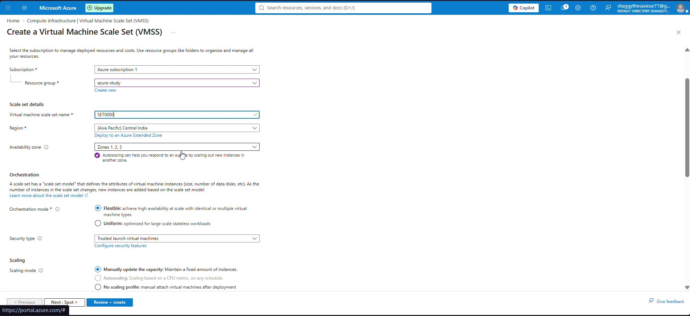

#### Step 2: Selecting Image, SKU Size, and Instance Baseline

1. Under **Scaling**:
   - **Scaling mode:** Select **Manually update the capacity: Maintain a fixed amount of instances**.
   - **Instance count:** Set to `1` (we establish a single-instance baseline to observe scale-out later).
2. Under **Instance details**:
   - **Image:** Select `Ubuntu Server 24.04 LTS - x64 Gen2 (free services eligible)`.
   - **VM architecture:** `x64`.
   - **Size:** Select `Standard_B2ts_v2` (2 vCPUs, 1 GiB memory) to optimize quota and compute cost.
3. Under **Administrator account**:
   - **Authentication type:** Select **Password**.
   - **Username:** `azureuser`.
   - **Password / Confirm password:** Enter a complex alphanumeric administrative password.

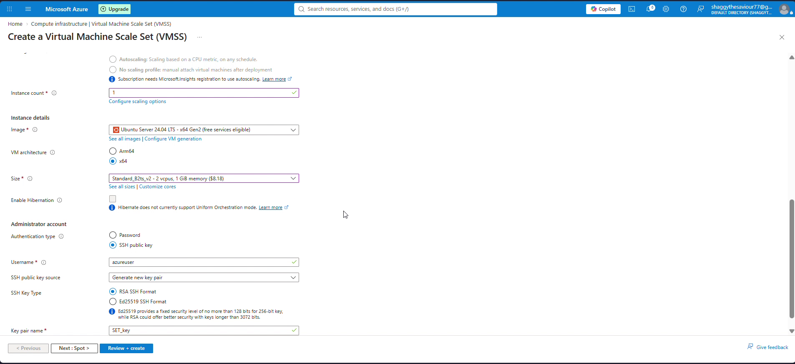

#### Step 3: Configuring Network Interface and Inbound Ports

1. Navigate to the **Networking** tab.
2. Under **Virtual network**, select `vnet-centralindia-1`.
3. Click **Edit network interface** on `vnet-centralindia-1-nic01`:
   - **Subnet:** Select `snet-centralindia-1 (172.17.0.0/24)`.
   - **NIC network security group:** Select **Basic**.
   - **Public inbound ports:** Select **Allow selected ports**.
   - **Select inbound ports:** Check **HTTP (80)** and **SSH (22)**.
   - **Public IP address:** Set to **Enabled**. Enabling public IP per instance allows direct SSH connectivity to each scale set node for diagnostic verification.
4. Click **OK** to commit the network interface configuration.

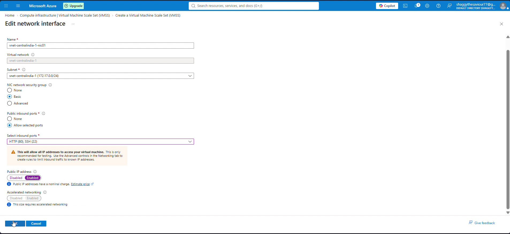

#### Step 4: Validation and Deployment

1. Click **Review + create**.
2. Wait for the Azure Resource Manager fabric to validate the deployment template.
3. Once the green **Validation passed** notification appears, review the configuration summary:
   - Orchestration mode: `Uniform`
   - Image: `Ubuntu Server 24.04 LTS - Gen2`
   - Size: `Standard_B2ts_v2`
   - Instance count: `1`
   - Authentication: `Password`
4. Click **Create** to trigger provisioning.

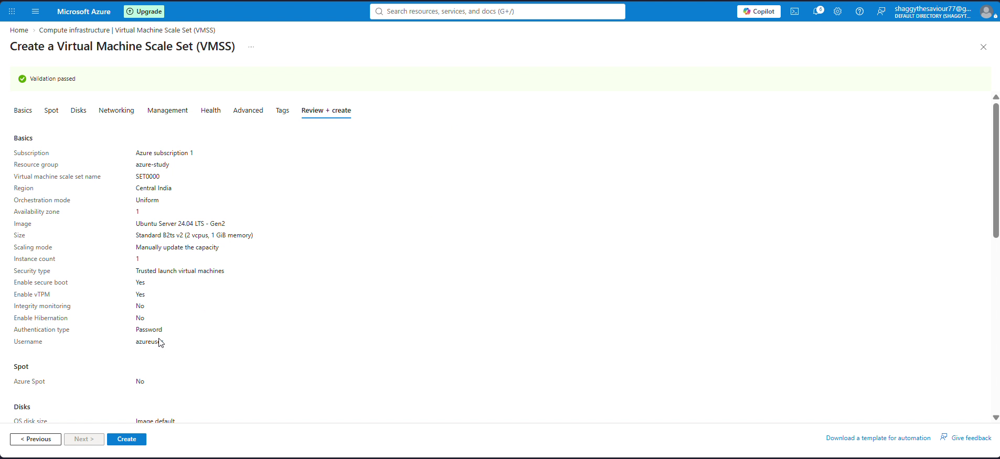

---

### Phase 2: Verifying Initial Scale Set State & SSH Access

#### Step 5: Inspecting VMSS Instance Inventory

1. Once deployment succeeds, open the `SET0000` Virtual Machine Scale Set resource.
2. In the left navigation menu under **Availability + scale**, click **Instances**.
3. Verify that exactly one instance is listed:
   - **Instance:** `SET0000_0`
   - **Computer name:** `set0000ks000000`
   - **Status:** `Running`
   - **Provisioning state:** `Succeeded`
   - **Latest model:** `Yes`
4. Click on `SET0000_0` to open its instance overview.
5. Record the network attributes:
   - **Public IP address:** `20.244.49.203`
   - **Private IP address:** `172.17.0.4`
   - **Fault domain:** `1`

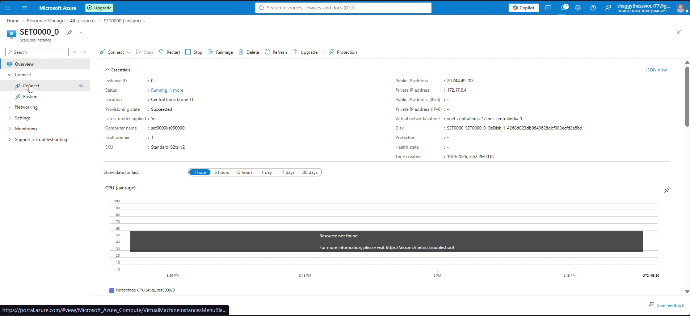

#### Step 6: Connecting via SSH to the VMSS Node

1. Open a local PowerShell or Bash terminal.
2. Initiate an SSH session directly to the instance's public IP:
   ```bash
   ssh azureuser@20.244.49.203
   ```
3. Accept the host key fingerprint (`ED25519`) by typing `yes`.
4. Enter the password configured during VMSS provisioning.
5. Confirm successful login at the guest prompt:
   ```text
   azureuser@set0000ks000000:~$
   ```
6. Update the system package cache to prepare for tool installation:
   ```bash
   sudo apt-get update -y
   ```

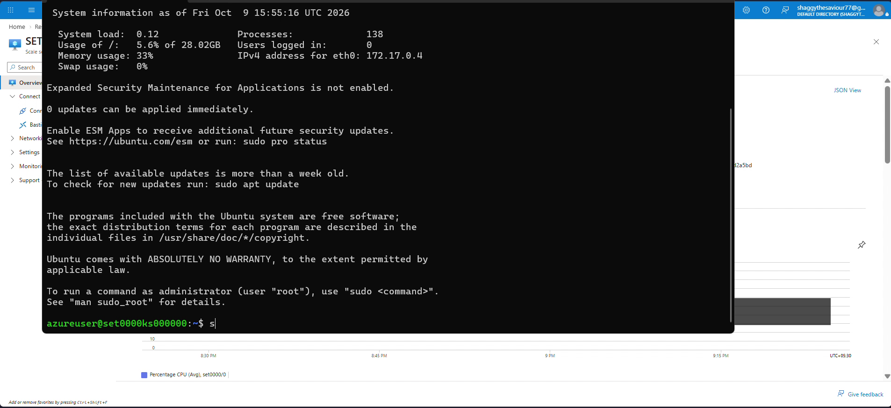

---

### Phase 3: Configuring Azure Monitor Custom Autoscaling

#### Step 7: Accessing the Scaling Blade

1. Return to the Azure Portal on the `SET0000` scale set overview.
2. In the left sidebar under **Availability + scale**, select **Scaling**.
3. Note the two scaling architectures available:
   - **Manual scale:** Maintains a fixed instance count controlled by an administrative slider.
   - **Custom autoscale:** Automatically adjusts capacity based on metric thresholds, schedules, or predictive machine learning models.
4. Select the radio button for **Custom autoscale**.

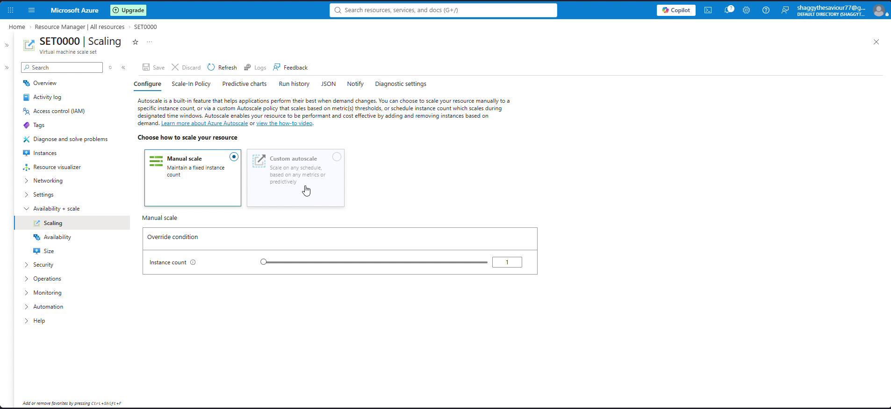

#### Step 8: Creating Custom Metric-Based Scale-Out Rules

1. Under **Custom autoscale**:
   - **Autoscale setting name:** Enter `SET0000-Autoscale-744` (or `SET0000-Autoscale-485`).
   - **Resource group:** `azure-study`.
2. Under the **Default** scale condition:
   - **Scale mode:** Select **Scale based on a metric**.
   - **Instance limits:**
     - **Minimum:** `1`
     - **Maximum:** `5` (or `3`)
     - **Default:** `2` (or `1`)
3. Under **Rules**, click **Add a rule**.
4. Configure the scale-out condition on the right-hand panel:
   - **Metric source:** Current resource (`SET0000`).
   - **Metric namespace:** `Virtual Machine Host`.
   - **Metric name:** `Percentage CPU`.
   - **Operator:** `Greater than`.
   - **Metric threshold to trigger scale action:** `70` %.
   - **Duration (minutes):** `5`.
   - **Time grain statistic:** `Average`.
   - **Time aggregation:** `Average`.
5. Under **Action**:
   - **Operation:** `Increase count by`.
   - **Instance count:** `1`.
   - **Cool down (minutes):** `2` (or `5`).
6. Click **Add** to register the scale rule into the profile.

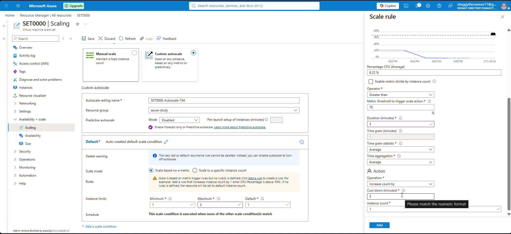

---

### Phase 4: Troubleshooting the `Microsoft.Insights` Registration Failure

#### Step 9: Analyzing the `MissingSubscriptionRegistration` Error

When attempting to save the custom autoscale profile by clicking **Save**, Azure rejected the operation with an explicit error notification:

```json
{
  "error": {
    "code": "MissingSubscriptionRegistration",
    "message": "The subscription is not registered to use namespace 'microsoft.insights'. See https://aka.ms/rps-not-found for how to register subscriptions.",
    "details": [
      {
        "code": "MissingSubscriptionRegistration",
        "target": "microsoft.insights",
        "message": "The subscription is not registered to use namespace 'microsoft.insights'."
      }
    ]
  }
}
```

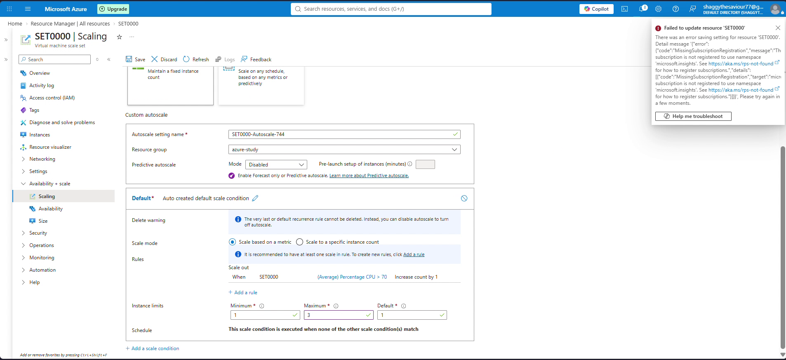

#### Root Cause Analysis
In Microsoft Azure, services are managed by underlying **Resource Providers** (namespaces prefixed with `Microsoft.`, such as `Microsoft.Compute`, `Microsoft.Network`, and `Microsoft.Storage`). When an Azure subscription is freshly provisioned or used only for core compute, specialized management namespaces like `Microsoft.Insights` (which powers Azure Monitor, metric alerts, and autoscale engines) are not always automatically registered.

Until `Microsoft.Insights` is in the `Registered` state, Azure Resource Manager blocks any API calls that attempt to create autoscale settings (`Microsoft.Insights/autoscalesettings`).

#### Resolution Workflow

To resolve this issue, the `Microsoft.Insights` resource provider must be registered on the subscription. This can be done via Azure Portal, Azure CLI, or PowerShell:

**Using Azure CLI:**
```bash
az provider register --namespace Microsoft.Insights
```

To verify the registration status:
```bash
az provider show --namespace Microsoft.Insights --query "registrationState" -o tsv
```

**Using Azure PowerShell:**
```powershell
Register-AzResourceProvider -ProviderNamespace 'Microsoft.Insights'
Get-AzResourceProvider -ProviderNamespace 'Microsoft.Insights' | Select-Object ProviderNamespace, RegistrationState
```

**Using the Azure Portal:**
1. Navigate to **Subscriptions** > Select your active subscription (`Azure subscription 1`).
2. In the left menu under **Settings**, click **Resource providers**.
3. Search for `microsoft.insights`.
4. Click on `microsoft.insights` and click **Register**. Wait 60 seconds until the status changes from `NotRegistered` to `Registered`.

#### Step 10: Committing the Autoscale Settings

1. Once `Microsoft.Insights` registration is active, return to the **SET0000 | Scaling** blade.
2. Confirm the autoscale configuration:
   - Setting Name: `SET0000-Autoscale-485`
   - Rule: `When SET0000 (Average) Percentage CPU > 70 Increase count by 1`
   - Limits: Min `1`, Max `5`, Default `2`
3. Click **Save**.
4. The settings save cleanly and the **Save** button becomes inactive, confirming that Azure Monitor has activated the autoscale monitoring daemon.

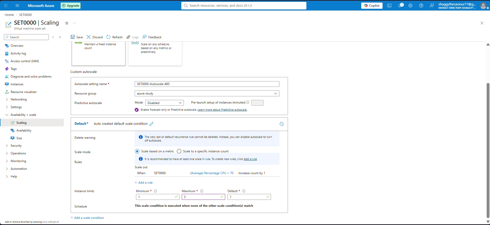

---

### Phase 5: Generating Synthetic Workload & Verifying Horizontal Scale-Out

#### Step 11: Generating 100% CPU Utilization with `stress`

Now that the autoscale rule is live and monitoring the scale set host metrics, we simulate heavy production traffic by pegging the CPU of instance `SET0000_0`.

1. In the active SSH terminal session on `SET0000_0` (`20.244.49.203`), install the `stress` workload generator:
   ```bash
   sudo apt-get install -y stress
   ```
2. Launch a synthetic workload dispatching 100 CPU worker threads to maximize processor load across all available virtual cores:
   ```bash
   sudo stress --cpu 100
   ```
3. Observe the output:
   ```text
   stress: info: [2366] dispatching hogs: 100 cpu, 0 io, 0 vm, 0 hdd
   ```
4. The Linux kernel immediately allocates 100% of CPU cycles to the stress threads. Azure Monitor samples host metrics every 60 seconds and computes the 5-minute rolling average.

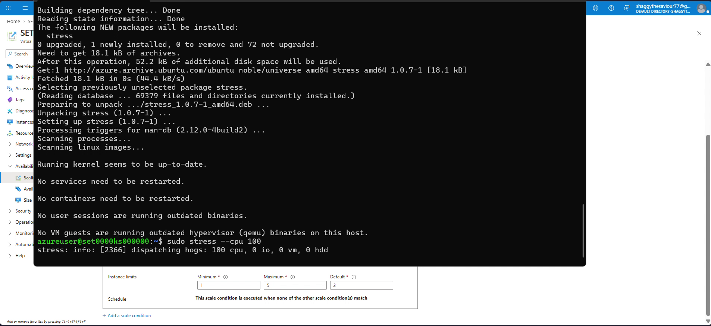

#### Step 12: Observing Automated Horizontal Scale-Out

1. Keep the `stress` process running in the terminal.
2. Return to the Azure Portal on the `SET0000` scale set.
3. In the left navigation menu, click **Instances**.
4. Click **Refresh** after approximately 5 to 7 minutes (5-minute rule duration + metric evaluation interval).
5. Azure Monitor triggers the autoscale engine, which calls the Azure compute fabric to scale out:
   - **Instance `SET0000_0`:** Computer name `set0000ks000000`, Status `Running`, Provisioning state `Succeeded`.
   - **Instance `SET0000_1`:** Computer name `set0000ks000001`, Status `Running`, Provisioning state `Succeeded`.
6. Both instances now appear in the inventory with the latest VMSS configuration applied!
7. The scale-out operation succeeded autonomously without any manual intervention from the administrator.

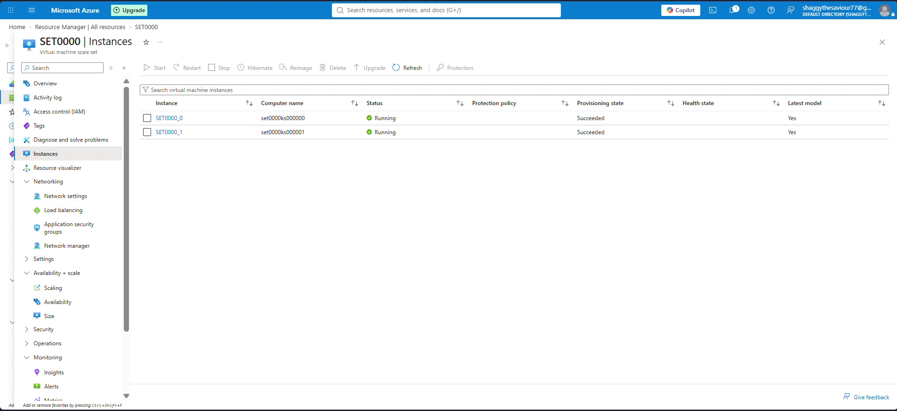

---

## Autoscale Mechanics & Architecture Anatomy

Understanding the underlying mechanics of Azure Monitor autoscale rules is critical to designing resilient production architectures:

### 1. Metric Sampling and Evaluation Windows
Every autoscale metric rule consists of four primary temporal parameters:
- **Time Grain (Duration):** How often metrics are gathered (e.g., 1 minute).
- **Time Grain Statistic:** How metrics within that single minute grain are aggregated (`Average`, `Minimum`, `Maximum`, `Total`).
- **Duration (Lookback Window):** The historical time window over which data is analyzed before triggering an action (e.g., 5 minutes).
- **Time Aggregation:** How the aggregated time grains across the duration window are combined (`Average`, `Minimum`, `Maximum`, `Total`, `Last`).

```text
[Min 1: Avg 98%] + [Min 2: Avg 99%] + [Min 3: Avg 99%] + [Min 4: Avg 100%] + [Min 5: Avg 99%]
------------------------------------------------------------------------------------------------
5-Minute Rolling Aggregated Average: 99.0%  ===> EXCEEDS 70% THRESHOLD ===> TRIGGER SCALE-OUT
```

### 2. The Necessity of Scale-In Rules (Preventing Asymmetric Scaling)
In this lab, we created a single scale-out rule to demonstrate capacity expansion under stress. However, in enterprise production environments, **every scale-out rule must be paired with a corresponding scale-in rule**.

If an autoscale profile only has a scale-out rule, the scale set will expand during high load and remain at peak capacity indefinitely—even after traffic subsides to zero. This leads to massive unexpected cloud billing.

A recommended rule pairing pattern:
- **Scale-Out Rule:** If Average CPU > 70% for 5 minutes -> Increase instance count by 1 (Cooldown: 5 minutes).
- **Scale-In Rule:** If Average CPU < 25% for 10 minutes -> Decrease instance count by 1 (Cooldown: 10 minutes).

### 3. The Cooldown Period (Preventing Metric Flapping)
The **cooldown period** is an enforced pause that starts immediately after an autoscale action completes. During this window, the autoscale engine ignores metric breaches and prevents further scale actions.

**Why is cooldown vital?**
When a new VM instance is provisioned, it requires time to boot the OS, initialize systemd services, mount storage, and warm up its application cache. If the cooldown timer is too short (or zero), the autoscale engine might evaluate the load before the new instance can absorb traffic, triggering unnecessary additional scale-out actions.

Similarly, an asymmetrical cooldown between scale-out and scale-in prevents **flapping (ping-ponging)**—a destructive condition where a system repeatedly scales out and immediately scales in because the thresholds are set too close together.

```
Rule Spread Margin (Hysteresis):
Upper Threshold (Scale-Out): > 70% CPU
[ Safe Operating Band: 25% - 70% ]
Lower Threshold (Scale-In):  < 25% CPU
```

---

## Troubleshooting & Real-World Gotchas

### Gotcha 1: `MissingSubscriptionRegistration: microsoft.insights`
- **Symptom:** Saving custom autoscale settings fails with HTTP 409 / Conflict and error code `MissingSubscriptionRegistration`.
- **Cause:** The `Microsoft.Insights` resource provider namespace is not registered in the subscription.
- **Solution:** Execute `az provider register --namespace Microsoft.Insights` via Azure Cloud Shell or register it in the Azure Portal Subscriptions blade under Resource Providers.

### Gotcha 2: Direct SSH Access vs Load Balancer NAT Rules
- **Symptom:** In production scale sets, VMs frequently do not have individual public IP addresses. How do administrators connect?
- **Standard Pattern:** In production, scale set instances reside in a private subnet behind an **Azure Standard Load Balancer**. Administrative access is handled through:
  - **Inbound NAT Rules:** Maps frontend port `50000` to VM 0 port `22`, port `50001` to VM 1 port `22`.
  - **Azure Bastion:** Provides zero-public-IP browser-based RDP/SSH access directly over TLS.
  - In our lab, we enabled instance-level public IPs directly on the network interface configuration for straightforward direct testing.

### Gotcha 3: The Danger of Metric Flapping
- **Symptom:** Instances are rapidly provisioned and terminated every few minutes.
- **Cause:** Setting scale-out at 60% and scale-in at 50%. When instance count doubles from 1 to 2, CPU drops from 65% to 32%, immediately triggering scale-in. When instance 2 terminates, CPU jumps back to 65%, triggering scale-out again.
- **Solution:** Maintain at least a 35% to 45% hysteresis buffer between scale-out and scale-in thresholds, and set the scale-in evaluation duration to at least 10 minutes.

### Gotcha 4: Statelessness and Ephemeral Storage
- **Symptom:** An application writes user uploads to the local OS disk (`/var/www/uploads`). When the scale set scales in, random instances are terminated and uploaded files vanish.
- **Architecture Rule:** VMSS instances must be treated as **stateless cattle, not pets**. All persistent application state, session data, and media must be externalized to managed services like **Azure Blob Storage**, **Azure SQL Database**, or **Azure Redis Cache**.

---

## Production Best Practices & Automation

### 1. Provisioning VMSS via Azure CLI

To automate the creation of the scale set and autoscale rules in automated CI/CD pipelines:

```bash
# 1. Create Resource Group
az group create --name azure-study --location centralindia

# 2. Register Microsoft.Insights
az provider register --namespace Microsoft.Insights

# 3. Create Uniform Virtual Machine Scale Set
az vmss create \
  --resource-group azure-study \
  --name SET0000 \
  --image Ubuntu2404 \
  --vm-sku Standard_B2ts_v2 \
  --instance-count 1 \
  --admin-username azureuser \
  --admin-password 'P@ssw0rd123456!' \
  --zones 1 \
  --orchestration-mode Uniform \
  --public-ip-per-vm

# 4. Create Autoscale Profile
az monitor autoscale create \
  --resource-group azure-study \
  --resource SET0000 \
  --resource-type Microsoft.Compute/virtualMachineScaleSets \
  --name SET0000-Autoscale \
  --min-count 1 \
  --max-count 5 \
  --count 1

# 5. Add Metric Scale-Out Rule (CPU > 70%)
az monitor autoscale rule create \
  --resource-group azure-study \
  --autoscale-name SET0000-Autoscale \
  --scale out 1 \
  --condition "Percentage CPU > 70 avg 5m" \
  --cooldown 2

# 6. Add Metric Scale-In Rule (CPU < 25%)
az monitor autoscale rule create \
  --resource-group azure-study \
  --autoscale-name SET0000-Autoscale \
  --scale in 1 \
  --condition "Percentage CPU < 25 avg 10m" \
  --cooldown 5
```

### 2. Bootstrapping Applications on Scale-Out with Custom Script Extensions
To ensure that newly scaled instances automatically configure themselves into functional web nodes upon boot, combine VMSS with the custom script extension referencing `setup-scale.sh`:

```bash
az vmss extension set \
  --resource-group azure-study \
  --vmss-name SET0000 \
  --name customScript \
  --publisher Microsoft.Azure.Extensions \
  --version 2.1 \
  --settings '{"commandToExecute": "bash setup-scale.sh"}'
```

---

## Clean Up & Teardown

To avoid ongoing compute charges for running scale set instances, managed disks, and public IPs, clean up the resources at the end of the lab:

```bash
# Delete the entire lab resource group and all associated compute/network resources
az group delete --name azure-study --yes --no-wait
```

Or delete only the VMSS and autoscale settings:
```bash
az monitor autoscale delete --resource-group azure-study --name SET0000-Autoscale-485
az vmss delete --resource-group azure-study --name SET0000
```

---

## Conclusion & Key Takeaways

In Day 6 of the Azure Learning Journey, we explored cloud elasticity by configuring and validating an automated Virtual Machine Scale Set from scratch:

1. **Uniform Scale Sets Provide Deterministic Scale:** Uniform orchestration maintains an immutable golden model across all nodes, enabling lightning-fast horizontal scale-out.
2. **Azure Monitor Powers the Elastic Fabric:** Autoscale rules decouple infrastructure management from human operators by monitoring real-time host metrics like CPU utilization.
3. **Resource Provider Awareness:** Every Azure service relies on registered namespaces; knowing how to register `Microsoft.Insights` prevents pipeline and portal deployment failures.
4. **Stress Testing Validates the Architecture:** Generating synthetic load with `stress` proved that the monitoring agent and scaling engine operate seamlessly under real production pressure.

---

*Authored by ShubhamTheDataGuy `<shubhamnagpal789@gmail.com>`*
