# Day 7: Azure Flexible Virtual Machine Scale Sets – Architecture, Multi-SKU Deployment & VM Attachment

*A comprehensive hands-on guide to architecting Azure VM Scale Sets in Flexible Orchestration Mode: configuring mixed VM sizes, allocation strategies, standalone VM integration, fault domain spreading, and enterprise automation.*

---

## Introduction & What We Are Building

In enterprise cloud architecture, elasticity and high availability must often coexist with workload diversity. While classic scale sets excel at deploying hundreds of identical, stateless nodes, real-world enterprise architectures frequently demand heterogeneous compute:
- Combining general-purpose and compute-optimized virtual machines within the same application tier.
- Blending cost-effective Azure Spot instances with reliable on-demand virtual machines to optimize operational expenditure.
- Managing individual virtual machines with unique network configurations, disk layouts, or custom software packages while retaining centralized high-availability guarantees.

To address these requirements, Microsoft Azure introduced **Flexible Orchestration Mode** for Virtual Machine Scale Sets (VMSS). Flexible orchestration mode represents Microsoft's strategic evolution for scalable compute, uniting the massive scale and fault-domain resiliency of scale sets with the granular management simplicity of standalone virtual machines.

In this practical, hands-on master guide, we build and explore a modern Flexible VM Scale Set architecture:
- Provision a **Flexible Virtual Machine Scale Set (`set0001`)** in the `azure-study` resource group within Central India (Zone 1).
- Configure a **Multi-SKU Profile** supporting up to 5 distinct virtual machine sizes (`Standard_B2ts_v2`, `Standard_B2ats_v2`, and `Standard_B2als_v2`) powered by the **Lowest Price** allocation strategy.
- Configure virtual networking (`vnet-centralindia`), subnet partitioning (`snet-centralindia-1`), and instance-level public IP assignment.
- Deploy the initial baseline virtual machine (`set0001_3c0c7e6d`) and verify its first-class citizen resource representation in the Azure Resource Manager fabric.
- Authoritatively detail all methodologies for **adding virtual machines to an existing Flexible VMSS**:
  - Provisioning and attaching standalone VMs via the Azure Portal.
  - Scaling out capacity using scale set multi-SKU allocation policies.
  - Automating VM creation and scale set attachment using Azure CLI and Azure PowerShell.
  - Spreading compute instances across platform Fault Domains for datacenter rack resilience.

---

## Architecture Overview

The following architecture diagrams illustrate the structural differences between Flexible and Uniform orchestration modes, the multi-SKU allocation logic, and the workflow for attaching virtual machines to an active Flexible scale set:

### Resource Hierarchy: Flexible Mode vs Uniform Mode

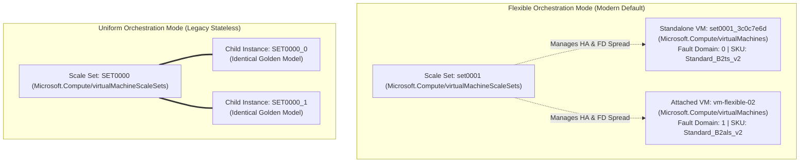

### Multi-SKU Lowest Price Allocation Flow

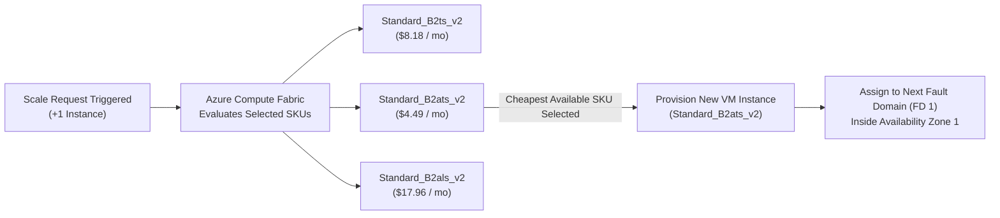

### Standalone VM Attachment Flow

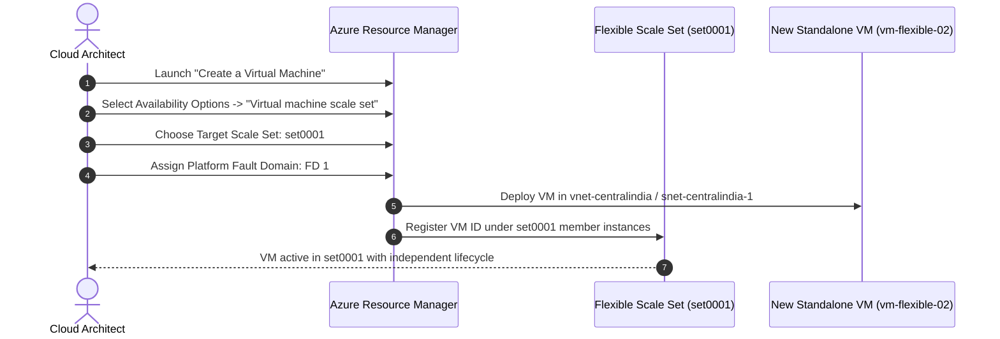

---

## Project Specifications Table

| Component | Resource Name / Configuration | Details / Values |
| :--- | :--- | :--- |
| **Subscription** | `Azure subscription 1` | Primary active cloud subscription |
| **Resource Group** | `azure-study` | Centralized lab resource group |
| **Location / Region** | `Central India` | Regional datacenter location |
| **Availability Zone** | `Zone 1` | Datacenter isolation within Central India |
| **Scale Set Name** | `set0001` | Flexible Virtual Machine Scale Set identifier |
| **Orchestration Mode** | `Flexible` | Supports mixed VM types, standalone APIs, and custom attachment |
| **Security Type** | `Trusted launch virtual machines` | Secure Boot & vTPM enabled |
| **Base Operating System**| `Ubuntu Server 24.04 LTS - x64 Gen2` | Canonical Ubuntu Linux 64-bit |
| **Configured VM SKUs** | Multi-SKU Profile (3 sizes) | `Standard_B2ts_v2`, `Standard_B2ats_v2`, `Standard_B2als_v2` |
| **Allocation Strategy** | `Lowest price` | Azure dynamically deploys the most economical available SKU |
| **Scaling Mode** | `Manually update the capacity` | Capacity managed deterministically |
| **Baseline Instances** | `1` | Initial deployment instance count |
| **Initial VM Identifier**| `set0001_3c0c7e6d` | Autonomous standalone VM resource created in resource group |
| **Authentication Type**| `Password` | User: `azureuser` |
| **Virtual Network** | `vnet-centralindia` | Lab virtual network (`172.16.0.0/16`) |
| **Subnet** | `snet-centralindia-1` | Subnet allocation (`172.16.0.0/24`) |
| **Network Interface** | `vnet-centralindia-nic01` | Primary NIC configuration with basic NSG |
| **Public IP Address** | `Enabled` | Instance-level public IP address generated |
| **Fault Domain Spread** | Up to 5 Fault Domains | Hardware rack isolation within the availability zone |

---

## Uniform vs Flexible Orchestration Modes: In-Depth Comparison

The choice between Uniform and Flexible orchestration determines how virtual machines are deployed, updated, managed, and monitored throughout their cloud lifecycle:

| Dimension | Uniform Orchestration Mode | Flexible Orchestration Mode |
| :--- | :--- | :--- |
| **Primary Use Case** | Large-scale, identical, stateless compute (web farms, batch grids) | Heterogeneous workloads, stateful tiers, microservices, mixed fleets |
| **Azure Resource Type** | Child resource (`.../virtualMachineScaleSets/virtualMachines`) | Top-level resource (`Microsoft.Compute/virtualMachines`) |
| **VM SKU Homogeneity** | Strictly identical SKU across all instances | **Heterogeneous:** Mix up to 5 different VM sizes in a single scale set |
| **Operating System** | Uniform OS image applied to all instances | Can mix multiple OS images (e.g., Linux and Windows nodes) |
| **Pricing Models** | Pure On-Demand or Pure Spot | **Mixed:** Combine Spot VMs and On-Demand VMs in the same tier |
| **Standalone VM Attachment** | Not supported (VMs created strictly by scale set engine) | **Fully Supported:** Attach or detach existing standalone VMs |
| **Individual VM Lifecycle** | Constrained by scale set model updates | Full control: Start, stop, resize, backup, or re-image individual VMs |
| **Availability Set Evolution**| Coexists with Availability Sets | **Official Successor to Availability Sets:** Replaces legacy sets |
| **Fault Domain Management**| Handled internally by scale set | Explicit fault domain assignment (FD 0, FD 1, FD 2, etc.) available |
| **Maximum Fleet Size** | Up to 1,000 instances | Up to 1,000 instances |
| **High Availability SLA** | 99.95% (Multi-FD) / 99.99% (Multi-Zone) | 99.95% (Multi-FD) / 99.99% (Multi-Zone) |

> [!IMPORTANT]
> The Orchestration Mode of a Virtual Machine Scale Set is an **immutable property**. Once a scale set is deployed with Uniform or Flexible orchestration, it cannot be converted. If requirements change, a new scale set must be provisioned.

---

## Step-by-Step Hands-On Guide: Deploying the Flexible VMSS

### Phase 1: Provisioning the Flexible VM Scale Set

#### Step 1: Navigating Marketplace & Basic Parameters

1. In the Azure Portal search bar, type **Virtual machine scale sets** and select **Create virtual machine scale set** (or navigate via **Marketplace**).
2. Under **Project details**:
   - **Subscription:** Select `Azure subscription 1`.
   - **Resource group:** Select `azure-study`.
3. Under **Scale set details**:
   - **Virtual machine scale set name:** Enter `set0001`.
   - **Region:** Select `(Asia Pacific) Central India`.
   - **Availability zone:** Select `Zone 1`.

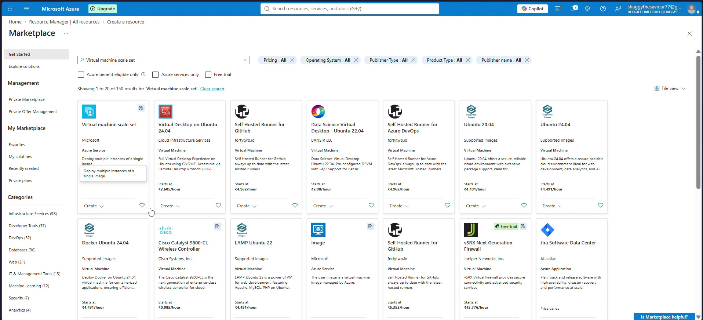

#### Step 2: Selecting Flexible Orchestration Mode

1. Under **Orchestration**:
   - **Orchestration mode:** Select **Flexible: achieve high availability at scale with identical or multiple virtual machine types**.
   - **Security type:** Select **Trusted launch virtual machines** (enabling Secure Boot and vTPM).

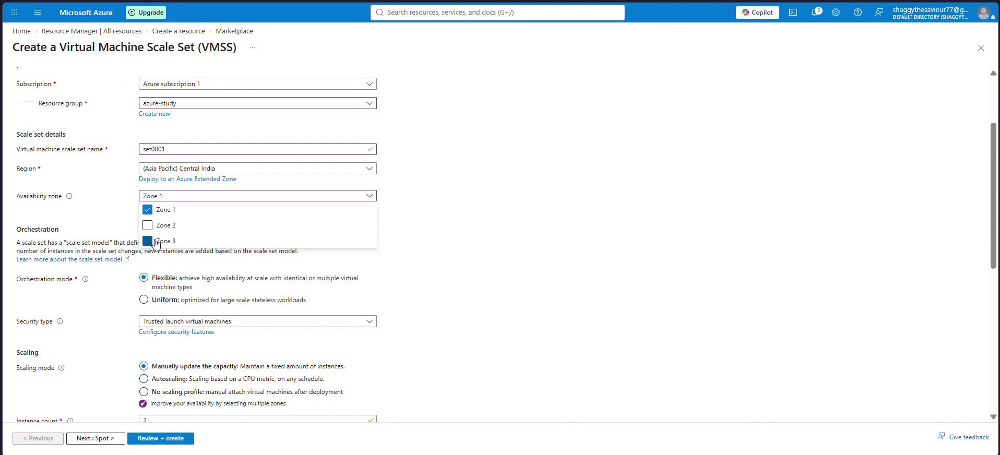

#### Step 3: Analyzing Scaling Mode Options

In Flexible orchestration mode, Azure provides three distinct scaling options:
1. **Manually update the capacity:** Maintain a deterministic instance count.
2. **Autoscaling:** Dynamically scale based on CPU metrics or schedules.
3. **No scaling profile:** Create an empty high-availability container designed specifically for manually attaching standalone virtual machines post-deployment.

For this lab, select **Manually update the capacity**.

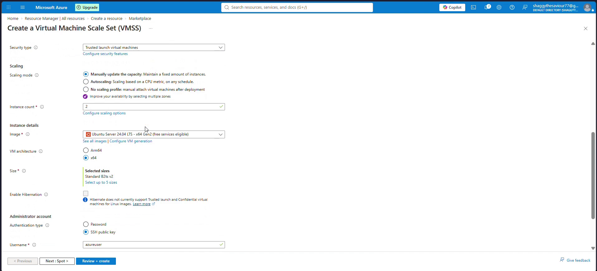

#### Step 4: Establishing Instance Baseline

1. Set **Instance count** to `1`.
2. Under **Instance details**:
   - **Image:** Select `Ubuntu Server 24.04 LTS - x64 Gen2 (free services eligible)`.
   - **VM architecture:** `x64`.

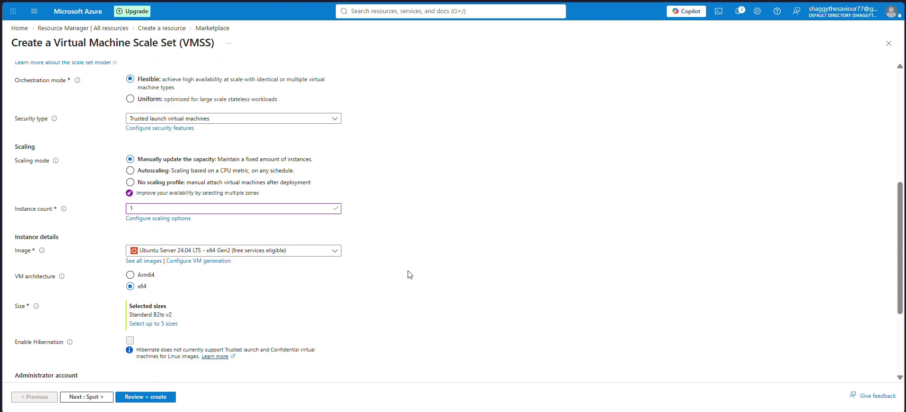

#### Step 5: Configuring Multi-SKU Selection Grid

A standout architectural capability of Flexible mode is the ability to select up to 5 virtual machine sizes:
1. Click **Select up to 5 sizes** under the **Size** property.
2. In the **Select VM sizes** modal, filter for the B-series v2 burstable family.
3. Select three complementary sizes:
   - `Standard_B2ts_v2` (2 vCPUs, 1 GiB memory)
   - `Standard_B2ats_v2` (2 vCPUs, 1 GiB memory)
   - `Standard_B2als_v2` (2 vCPUs, 4 GiB memory)
4. Click **Select** to commit the multi-SKU profile.

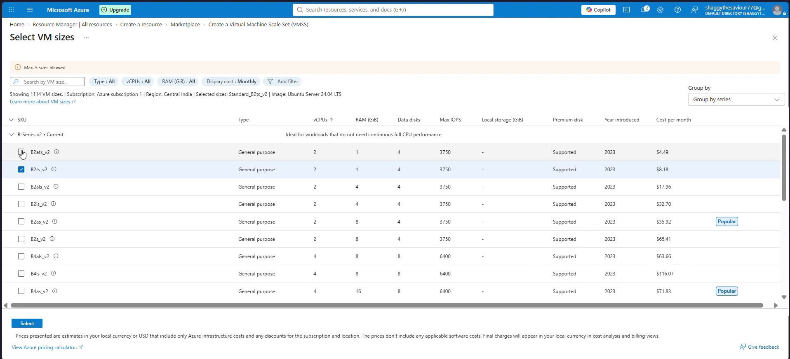

#### Step 6: Choosing Allocation Strategy & Administrator Account

1. Under **Allocation strategy**, select **Lowest price**.
   - In this mode, whenever Azure scales out or launches an instance, it evaluates current regional spot and on-demand pricing across your selected SKUs and deploys the most cost-effective option available.
2. Under **Administrator account**:
   - **Authentication type:** Select **Password**.
   - **Username:** `azureuser`.
   - **Password / Confirm password:** Enter an administrative password meeting Azure complexity requirements.


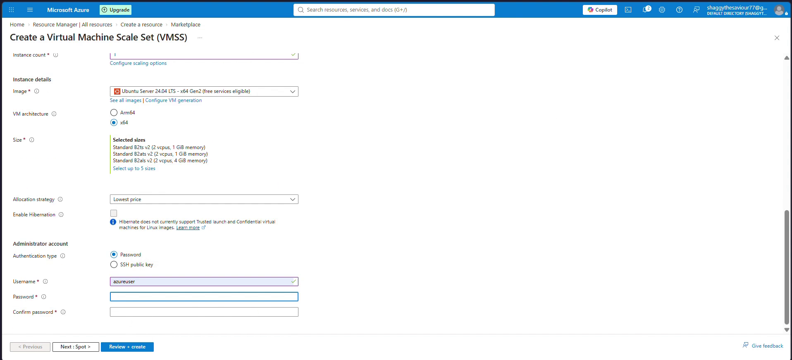

#### Step 7: Configuring Networking & Public IP

1. Select the **Networking** tab.
2. Under **Virtual network**, select `vnet-centralindia`.
3. Under **Subnet**, select `snet-centralindia-1 (172.16.0.0/24)`.
4. Ensure the primary network interface `vnet-centralindia-nic01` has:
   - **Create public IP address:** `Yes`
   - **NIC network security group:** `Basic`
   - **Load balancing options:** `None`
5. Click **OK**.

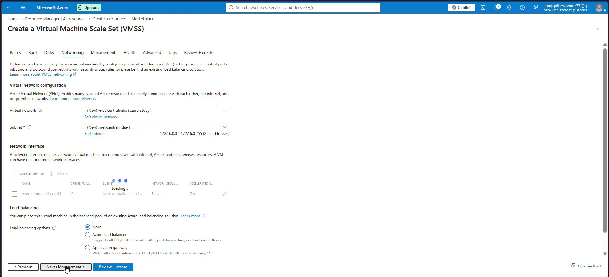

#### Step 8: Validation & Deployment

1. Click **Review + create**.
2. Azure Resource Manager runs template validation. Confirm that the green banner indicates **Validation passed**.
3. Review the summary parameters:
   - Scale set name: `set0001`
   - Orchestration mode: `Flexible`
   - Availability zone: `1`
   - Sizes: `Standard B2ts v2, Standard B2ats v2, Standard B2als v2`
   - Allocation strategy: `Lowest price`
   - Instance count: `1`
4. Click **Create** to begin provisioning.

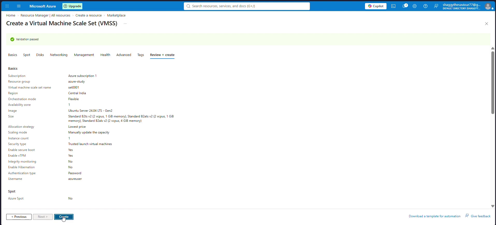

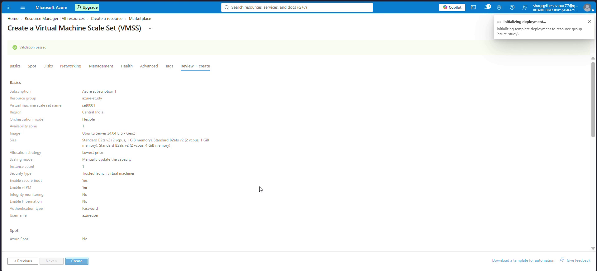

#### Step 9: Verifying Deployment & Inspecting Standalone VM Resource

1. Monitor the deployment overview until **Your deployment is complete** is displayed.
2. Navigate to **Resource Manager | All resources** in the `azure-study` resource group.
3. Observe the generated resources:
   - `set0001` - Virtual machine scale set (Flexible container)
   - `set0001_3c0c7e6d` - **Virtual machine (Standalone top-level resource!)**
   - `set0001_3c0c7e6d_disk1_...` - Dedicated OS disk
   - `vnet-centralindia-nic01-90528c99` - Dedicated network interface
   - `publicIp-vnet-centralindia-nic01-90528c99` - Dedicated public IP address

This confirms the core architectural differentiator: in Flexible mode, scale set instances are real, autonomous virtual machines visible and manageable directly within Azure Resource Manager!

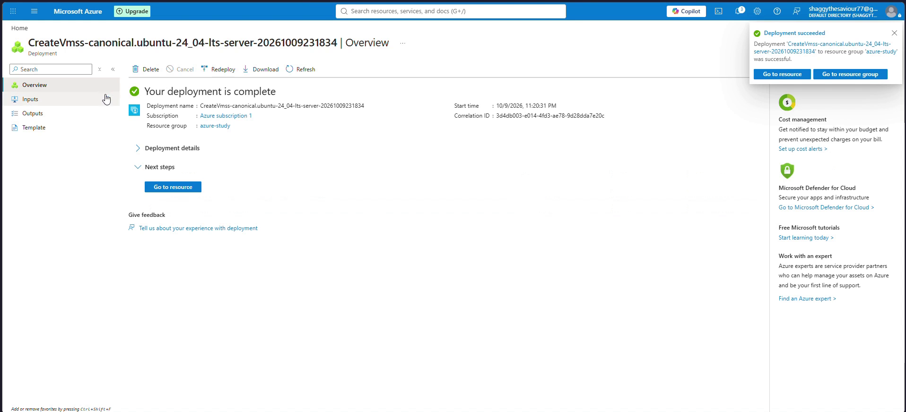

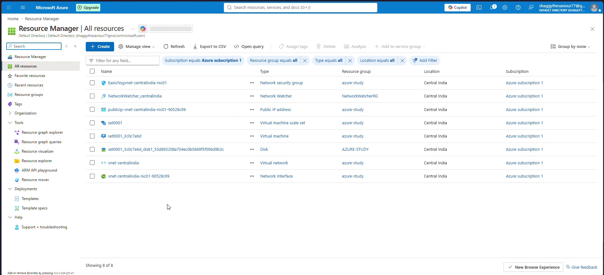

---

## How to Add Virtual Machines to an Existing Flexible VMSS

Once a Flexible VM Scale Set is provisioned, you have multiple production-grade mechanisms to add additional virtual machines into the scale set fleet:

### Method 1: Adding a Virtual Machine via Azure Portal (Standalone VM Creation)

This method is ideal when you want to deploy a specialized virtual machine (e.g., custom configuration, unique sizing, or explicit fault domain placement) and include it inside the Flexible scale set high-availability fabric:

1. In the Azure Portal search bar, type **Virtual machines** and click **Create** > **Azure virtual machine**.
2. In the **Basics** tab:
   - **Subscription:** Select the same subscription (`Azure subscription 1`).
   - **Resource group:** Select `azure-study`.
   - **Virtual machine name:** Enter `vm-flexible-02`.
   - **Region:** Select `(Asia Pacific) Central India` (must match the scale set region).
3. Under **Availability options**:
   - In the dropdown, select **Virtual machine scale set**.
   - Under **Virtual machine scale set**, select your existing Flexible scale set: `set0001`.
   - Under **Fault domain**, select an explicit fault domain (e.g., `Fault domain 1`) to ensure physical rack isolation from your first VM (`set0001_3c0c7e6d`), or leave it to Azure automatic balancing.
4. Under **Instance details**:
   - Choose your preferred OS image (e.g., `Ubuntu Server 24.04 LTS` or `Windows Server 2025`).
   - Choose your preferred VM size (you are not restricted to identical sizes; you can choose any compatible SKU like `Standard_B2als_v2` or `Standard_D2s_v5`).
5. In the **Networking** tab:
   - Select the same virtual network (`vnet-centralindia`) and subnet (`snet-centralindia-1`).
6. Click **Review + create** and **Create**.
7. Once provisioned, open `set0001` > **Instances**. Both `set0001_3c0c7e6d` and `vm-flexible-02` are listed under the scale set inventory, protected by fault domain anti-affinity!

```
Azure Portal VM Creation Wizard:
+-------------------------------------------------------------+
| Availability options: [ Virtual machine scale set         v ]|
| Virtual machine scale set: [ set0001                      v ]|
| Fault domain:              [ Fault Domain 1               v ]|
+-------------------------------------------------------------+
```

---

### Method 2: Scaling Out Capacity via the Existing Scale Set Profile

If you want Azure to automatically provision a new virtual machine using the pre-configured scale set profile and multi-SKU allocation strategy:

1. Navigate to the `set0001` scale set in the Azure Portal.
2. In the left navigation menu under **Availability + scale**, select **Scaling** (or **Operating blade | Capacity**).
3. Change the **Instance count** from `1` to `2`.
4. Click **Save**.
5. The Azure Fabric Controller immediately initiates provisioning:
   - Evaluates the three configured SKUs (`Standard_B2ts_v2`, `Standard_B2ats_v2`, `Standard_B2als_v2`).
   - Selects the cheapest available SKU according to the **Lowest price** strategy.
   - Provisions a new standalone virtual machine (e.g., `set0001_<guid>`).
   - Automatically assigns it to the next available platform fault domain (Fault Domain 1).

---

### Method 3: Automated VM Creation & Attachment via Azure CLI

For automated CI/CD deployments and Infrastructure-as-Code pipelines, use the Azure CLI `az vm create` command with the `--vmss` flag:

```bash
# Deploy a new standalone VM directly into the existing Flexible VMSS
az vm create \
  --resource-group azure-study \
  --name vm-flexible-02 \
  --vmss set0001 \
  --image Ubuntu2404 \
  --size Standard_B2als_v2 \
  --vnet-name vnet-centralindia \
  --subnet snet-centralindia-1 \
  --admin-username azureuser \
  --generate-ssh-keys \
  --platform-fault-domain 1
```

**Key Parameters Explained:**
- `--vmss set0001`: Instructs Azure Resource Manager to bind the new virtual machine directly into the `set0001` Flexible scale set.
- `--platform-fault-domain 1`: Explicitly assigns the VM to Fault Domain 1, guaranteeing physical separation from any instance running on Fault Domain 0.
- `--size Standard_B2als_v2`: Demonstrates heterogeneous compute by provisioning a 4 GiB RAM node alongside existing 1 GiB RAM nodes.

To query all instances currently member of the Flexible scale set:
```bash
az vmss list-instances \
  --resource-group azure-study \
  --name set0001 \
  --output table
```

---

### Method 4: Automated VM Creation & Attachment via Azure PowerShell

In PowerShell automation environments, configure the `VirtualMachineScaleSet` attribute on the VM configuration object before deployment:

```powershell
# 1. Retrieve the existing Flexible VM Scale Set resource
$vmss = Get-AzVmss -ResourceGroupName "azure-study" -VMScaleSetName "set0001"

# 2. Define the Virtual Machine configuration
$vmConfig = New-AzVMConfig `
  -VMName "vm-flexible-03" `
  -VMSize "Standard_B2ts_v2" `
  -PlatformFaultDomain 2

# 3. Associate the VM configuration with the Flexible Scale Set ID
$vmConfig.VirtualMachineScaleSet = @{ Id = $vmss.Id }

# 4. Attach OS disk, network interface, and credentials
$nic = Get-AzNetworkInterface -ResourceGroupName "azure-study" -Name "vnet-centralindia-nic01"
$vmConfig = Add-AzVMNetworkInterface -VM $vmConfig -Id $nic.Id
$vmConfig = Set-AzVMOperatingSystem -VM $vmConfig -Linux -ComputerName "vm-flexible-03" -Credential (Get-Credential)

# 5. Provision the VM into the Scale Set
New-AzVM -ResourceGroupName "azure-study" -Location "centralindia" -VM $vmConfig
```

---

### Method 5: Attaching an Existing Standalone Virtual Machine

Can you take a virtual machine that was already running independently and attach it to an existing Flexible VM Scale Set?

**Yes, under specific architectural prerequisites:**
1. **Regional & Zonal Parity:** The standalone VM must reside in the exact same Azure region and Availability Zone as the Flexible scale set.
2. **Virtual Network Alignment:** The VM must be connected to a subnet within the same Virtual Network.
3. **Flexible Mode Only:** Attaching existing standalone VMs is supported **strictly** in Flexible Orchestration Mode; Uniform mode does not support this.
4. **Availability Set Conflict:** The standalone VM cannot already be a member of an Availability Set or another scale set.

To attach an existing VM using Azure CLI:
```bash
az vm update \
  --resource-group azure-study \
  --name existing-standalone-vm \
  --set virtualMachineScaleSet.id="/subscriptions/<SUB_ID>/resourceGroups/azure-study/providers/Microsoft.Compute/virtualMachineScaleSets/set0001"
```

---

## Fault Domain Spreading Mechanics in Flexible Mode

One of the most powerful reasons cloud architects choose Flexible VMSS over legacy Availability Sets is advanced **Fault Domain Spreading**:

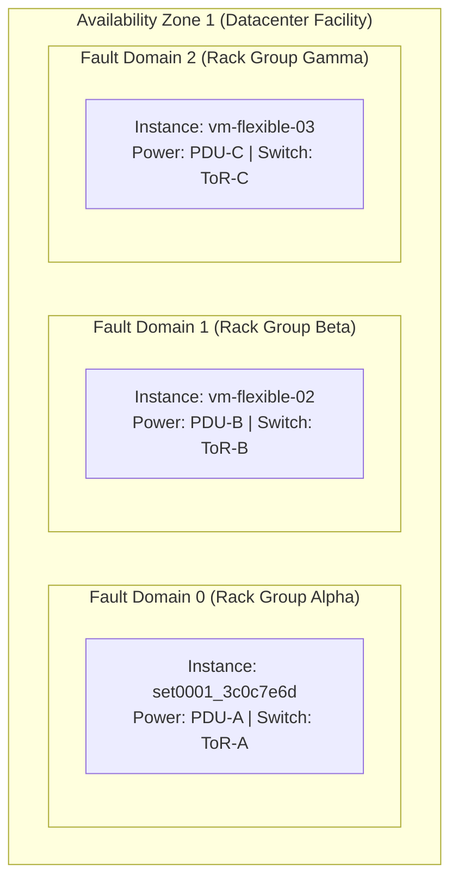

### Why Flexible Mode Replaces Availability Sets
Historically, high availability within a single datacenter was achieved using **Availability Sets**. However, Availability Sets suffered from limitations:
- Could not integrate with modern scale set autoscaling engines.
- Could not mix Spot and On-Demand instances.
- Did not support scaling past 200 virtual machines.

Flexible VMSS natively supports **Platform Fault Domain spread counts from 1 to 5**:
- When deployed across an Availability Zone, Flexible VMSS spreads instances across distinct physical server racks, power units, and network switches within that zone.
- If physical rack hardware in Fault Domain 0 experiences a catastrophic power outage or top-of-rack switch failure, instances on Fault Domain 1 and Fault Domain 2 remain fully operational.
- This architecture qualifies for the Microsoft **99.95% High Availability SLA** within a single zone, and **99.99% SLA** when spanning multiple zones.

---

## Troubleshooting & Real-World Gotchas

### Gotcha 1: Incompatible Network Placement during Attachment
- **Symptom:** When attempting to attach a virtual machine to an existing Flexible scale set via the Portal or CLI, the scale set is grayed out or the deployment fails with `InvalidParameter`.
- **Cause:** The virtual machine is configured in a different virtual network or a different availability zone than the target scale set.
- **Solution:** Verify that the VM's subnet belongs to `vnet-centralindia` and that the VM's availability zone matches the scale set's configured zone (`Zone 1`).

### Gotcha 2: Immutability of Orchestration Mode
- **Symptom:** You have an existing Uniform scale set from Day 6 (`SET0000`) and want to enable multi-SKU selection or attach standalone VMs.
- **Cause:** Azure Resource Manager does not permit in-place switching between Uniform and Flexible orchestration modes.
- **Solution:** Provision a new Flexible scale set (`set0001`), configure multi-SKU policies, migrate traffic using an Azure Load Balancer or Application Gateway, and retire the legacy Uniform set.

### Gotcha 3: Spot Instance Eviction Management
- **Symptom:** In a mixed Spot and On-Demand Flexible scale set, background worker VMs terminate abruptly during regional demand peaks.
- **Cause:** Spot instances are subject to capacity eviction when Azure requires hardware for pay-as-you-go customers.
- **Solution:** Always configure the **Eviction Policy** (`Deallocate` vs `Delete`) and enable the **Scheduled Events API** inside guest operating systems to receive a 30-second pre-eviction notice for graceful shutdown.

---

## Clean Up & Resource Teardown

To avoid ongoing compute charges for running virtual machines, managed OS disks, and public IP allocations, tear down the lab resources when experimentation is complete:

```bash
# Delete the entire resource group and all contained scale set and VM resources
az group delete --name azure-study --yes --no-wait
```

Or delete only the scale set and its attached virtual machines:
```bash
az vm delete --resource-group azure-study --name set0001_3c0c7e6d --yes
az vmss delete --resource-group azure-study --name set0001
```

---

## Conclusion & Key Takeaways

In Day 7 of the Azure Learning Journey, we explored modern enterprise elasticity with Flexible Virtual Machine Scale Sets:

1. **Flexible Mode Unifies Compute:** It delivers the high-availability and scale benefits of scale sets while treating each virtual machine as an autonomous, first-class citizen resource.
2. **Multi-SKU Elasticity Optimizes Costs:** By selecting up to 5 VM sizes paired with the Lowest Price allocation strategy, cloud architects can minimize compute expenditure and bypass single-size capacity bottlenecks.
3. **Versatile VM Attachment:** Virtual machines can be added dynamically via capacity scaling, through the standard Azure Portal VM creation flow, or automated via Azure CLI and PowerShell.
4. **The Modern High Availability Standard:** Flexible orchestration mode officially supersedes legacy Availability Sets, offering superior rack fault-domain spread, mixed sizing, and massive scalability.

---

*Authored by ShubhamTheDataGuy `<shubhamnagpal789@gmail.com>`*
